# Event-Based Solutions - Concepts Cheatsheet

## Overview
Azure provides three main services for event-driven architectures: Event Grid for reactive programming, Event Hubs for big data streaming, and Azure Relay for hybrid connectivity.

## Azure Event Services Comparison


## Event Grid Architecture


## Event Grid Topics Types


## Event Schema (CloudEvents)


## Event Grid Delivery & Retry


## Event Grid Retry Policy


## Event Hubs Architecture


## Event Hubs Partitions

```mermaid
graph TB
    subgraph "Event Hub with 4 Partitions"
        P0[Partition 0<br/>Event 1, 5, 9...]
        P1[Partition 1<br/>Event 2, 6, 10...]
        P2[Partition 2<br/>Event 3, 7, 11...]
        P3[Partition 3<br/>Event 4, 8, 12...]
    end
    
    subgraph "Partition Key"
        Key[Partition Key<br/>deviceId, userId<br/>Same key → Same partition<br/>Ordered within partition]
    end
    
    subgraph "Consumer"
        C1[Consumer 1<br/>Reads P0, P1]
        C2[Consumer 2<br/>Reads P2, P3]
    end
    
    Key --> P0 & P1 & P2 & P3
    P0 & P1 --> C1
    P2 & P3 --> C2
```



## Event Hubs Capture


## Event Hubs Throughput Units


## Consumer Groups


## Checkpoint and Offset Management


## Event Hubs vs Event Grid


## Azure Relay Architecture


## Event-Driven Patterns


## Event Filtering

```mermaid
graph TB
    subgraph "Event Grid Filters"
        Subject[Subject Filter<br/>Prefix/Suffix matching<br/>Example: /blobServices/*/containers/images]
        
        EventType[Event Type Filter<br/>Filter by event type<br/>Example: Microsoft.Storage.BlobCreated]
        
        Advanced[Advanced Filter<br/>Operators: Equals, Contains, In<br/>Number, String, Boolean]
    end
    
    subgraph "Filter Examples"
        Ex1[Subject begins with:<br/>/blobServices/default/containers/images]
        
        Ex2[Event type equals:<br/>Microsoft.Storage.BlobCreated]
        
        Ex3[Data.contentType in:<br/>[image/png, image/jpeg]]
    end
    
    Subject -.Example.-> Ex1
    EventType -.Example.-> Ex2
    Advanced -.Example.-> Ex3
```

## Dead-Letter Configuration


## Security for Event Services


## Key Concepts Summary

### Event Grid
- **Purpose**: Reactive event-driven programming
- **Model**: Push-based, pub/sub
- **Delivery**: At-least-once, 24-hour retention
- **Use Cases**: State changes, serverless workflows, integrations

### Event Hubs
- **Purpose**: Big data streaming and ingestion
- **Model**: Pull-based, multiple consumers
- **Retention**: 1-90 days
- **Use Cases**: Telemetry, logs, IoT, time-series data

### Event Grid Topics
- **System**: Built-in Azure service events
- **Custom**: Application-generated events
- **Partner**: Third-party SaaS events
- **Domain**: Enterprise-scale topic management

### Event Hubs Components
- **Namespace**: Container for Event Hubs
- **Partitions**: Parallel processing (2-32)
- **Consumer Groups**: Independent event views
- **Capture**: Automatic storage to Blob/ADLS

### Event Grid Delivery
- **Retry**: Exponential backoff, up to 30 attempts
- **TTL**: 24-hour event lifetime
- **Dead-Letter**: Failed event storage
- **Filtering**: Subject, event type, advanced filters

### Event Hubs Scaling
- **Throughput Units**: 1-40 TUs (Standard)
- **Processing Units**: 1-16 PUs (Premium)
- **Auto-Inflate**: Automatic scaling
- **Dedicated**: Full cluster isolation

### Consumer Patterns
- **Checkpointing**: Track read position
- **Offset Management**: Resume from last position
- **Multiple Readers**: Via consumer groups
- **Competing Consumers**: Balance partitions

### Best Practices
1. **Use Event Grid** for reactive programming
2. **Use Event Hubs** for high-volume streaming
3. **Implement dead-lettering** for failed events
4. **Use consumer groups** for independent processing
5. **Set appropriate partition count** for parallelism
6. **Implement checkpoint** strategy for Event Hubs
7. **Filter events** at subscription level
8. **Use managed identities** for authentication
9. **Enable capture** for Event Hubs long-term storage
10. **Monitor with Azure Monitor** for insights
