# Message-Based Solutions - Concepts Cheatsheet

## Overview
Azure provides messaging services for reliable asynchronous communication: Service Bus for enterprise messaging with advanced features, and Queue Storage for simple, high-volume queuing.

## Azure Messaging Services Comparison

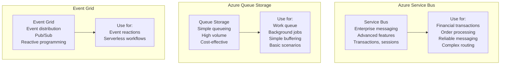
```mermaid
graph TB
    subgraph "Azure Service Bus"
        SB[Service Bus<br/>Enterprise messaging<br/>Advanced features<br/>Transactions, sessions]
        SBUse[Use for:<br/>Financial transactions<br/>Order processing<br/>Reliable messaging<br/>Complex routing]
    end
    
    subgraph "Azure Queue Storage"
        QS[Queue Storage<br/>Simple queueing<br/>High volume<br/>Cost-effective]
        QSUse[Use for:<br/>Work queue<br/>Background jobs<br/>Simple buffering<br/>Basic scenarios]
    end
    
    subgraph "Event Grid"
        EG[Event Grid<br/>Event distribution<br/>Pub/Sub<br/>Reactive programming]
        EGUse[Use for:<br/>Event reactions<br/>Serverless workflows]
    end
    
    SB --> SBUse
    QS --> QSUse
    EG --> EGUse
```

## Service Bus Architecture

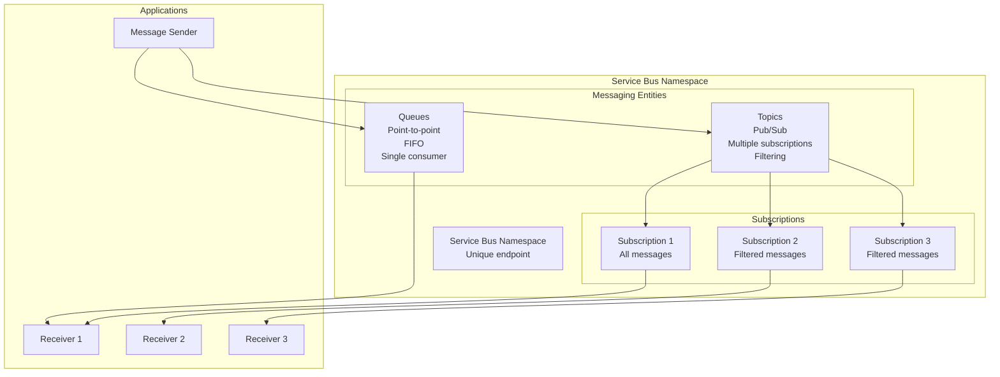
```mermaid
graph TB
    subgraph "Service Bus Namespace"
        Namespace[Service Bus Namespace<br/>Unique endpoint]
        
        subgraph "Messaging Entities"
            Queue[Queues<br/>Point-to-point<br/>FIFO<br/>Single consumer]
            
            Topic[Topics<br/>Pub/Sub<br/>Multiple subscriptions<br/>Filtering]
        end
        
        subgraph "Subscriptions"
            Sub1[Subscription 1<br/>All messages]
            Sub2[Subscription 2<br/>Filtered messages]
            Sub3[Subscription 3<br/>Filtered messages]
        end
    end
    
    subgraph "Applications"
        Sender[Message Sender]
        Receiver1[Receiver 1]
        Receiver2[Receiver 2]
        Receiver3[Receiver 3]
    end
    
    Sender --> Queue
    Queue --> Receiver1
    
    Sender --> Topic
    Topic --> Sub1 & Sub2 & Sub3
    Sub1 --> Receiver1
    Sub2 --> Receiver2
    Sub3 --> Receiver3
```

## Queues vs Topics

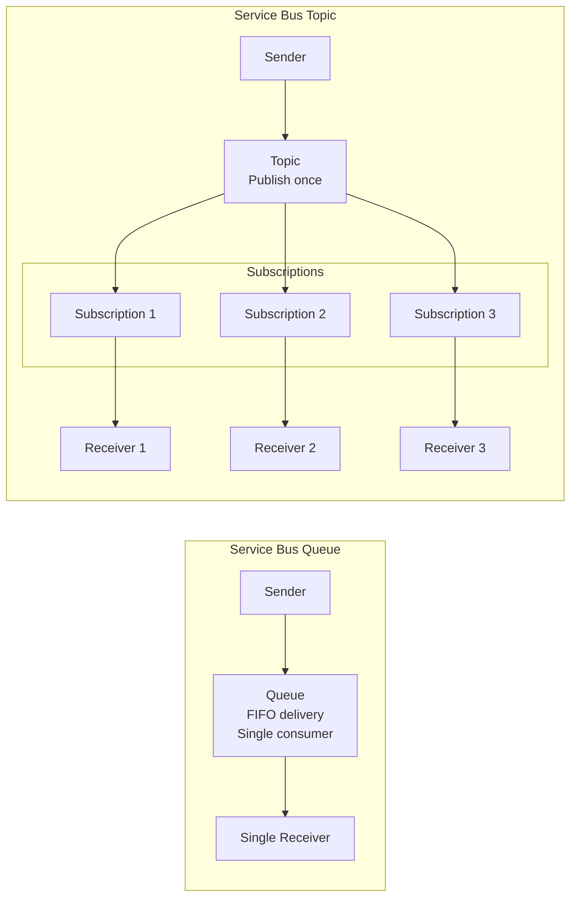
```mermaid
graph LR
    subgraph "Service Bus Queue"
        QSender[Sender]
        Q[Queue<br/>FIFO delivery<br/>Single consumer]
        QReceiver[Single Receiver]
        
        QSender --> Q
        Q --> QReceiver
    end
    
    subgraph "Service Bus Topic"
        TSender[Sender]
        T[Topic<br/>Publish once]
        
        subgraph "Subscriptions"
            S1[Subscription 1]
            S2[Subscription 2]
            S3[Subscription 3]
        end
        
        R1[Receiver 1]
        R2[Receiver 2]
        R3[Receiver 3]
        
        TSender --> T
        T --> S1 & S2 & S3
        S1 --> R1
        S2 --> R2
        S3 --> R3
    end
```

## Service Bus Tiers

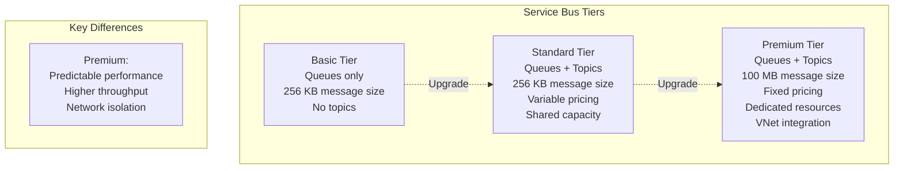
```mermaid
graph TB
    subgraph "Service Bus Tiers"
        Basic[Basic Tier<br/>Queues only<br/>256 KB message size<br/>No topics]
        
        Standard[Standard Tier<br/>Queues + Topics<br/>256 KB message size<br/>Variable pricing<br/>Shared capacity]
        
        Premium[Premium Tier<br/>Queues + Topics<br/>100 MB message size<br/>Fixed pricing<br/>Dedicated resources<br/>VNet integration]
    end
    
    Basic -.Upgrade.-> Standard
    Standard -.Upgrade.-> Premium
    
    subgraph "Key Differences"
        Perf[Premium:<br/>Predictable performance<br/>Higher throughput<br/>Network isolation]
    end
```

## Message Processing Patterns

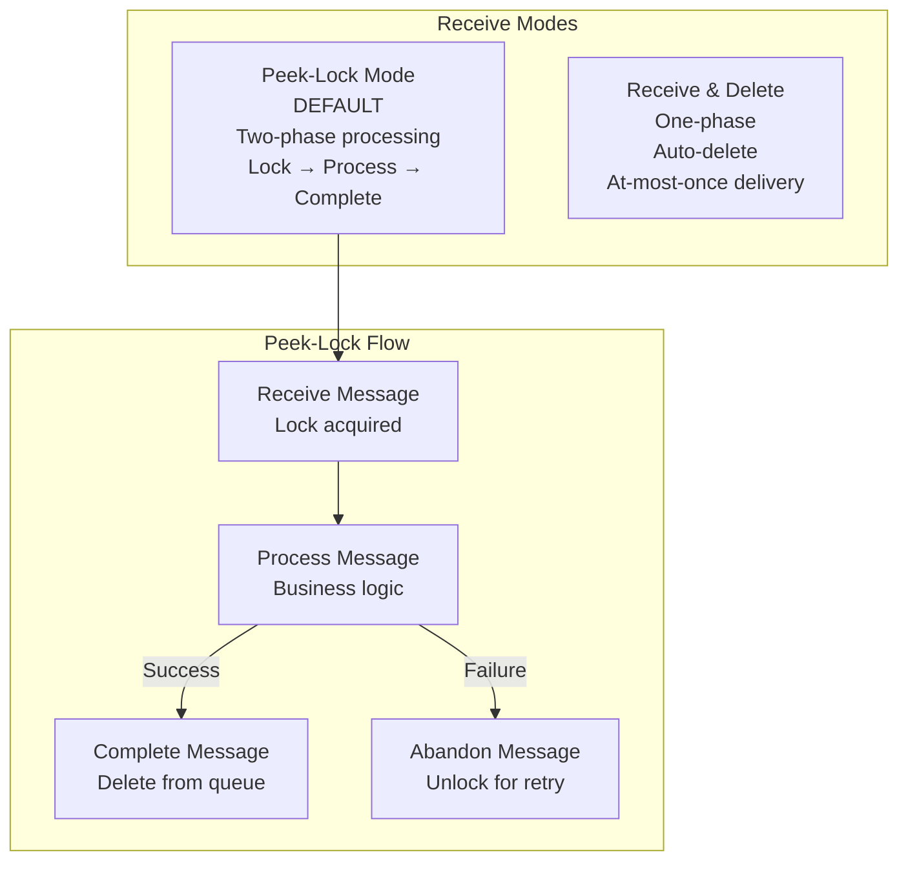
```mermaid
graph TB
    subgraph "Receive Modes"
        PeekLock[Peek-Lock Mode<br/>DEFAULT<br/>Two-phase processing<br/>Lock → Process → Complete]
        
        ReceiveDelete[Receive & Delete<br/>One-phase<br/>Auto-delete<br/>At-most-once delivery]
    end
    
    subgraph "Peek-Lock Flow"
        Receive[Receive Message<br/>Lock acquired]
        Process[Process Message<br/>Business logic]
        Complete[Complete Message<br/>Delete from queue]
        Abandon[Abandon Message<br/>Unlock for retry]
    end
    
    PeekLock --> Receive
    Receive --> Process
    Process -->|Success| Complete
    Process -->|Failure| Abandon
```

## Peek-Lock Message Flow

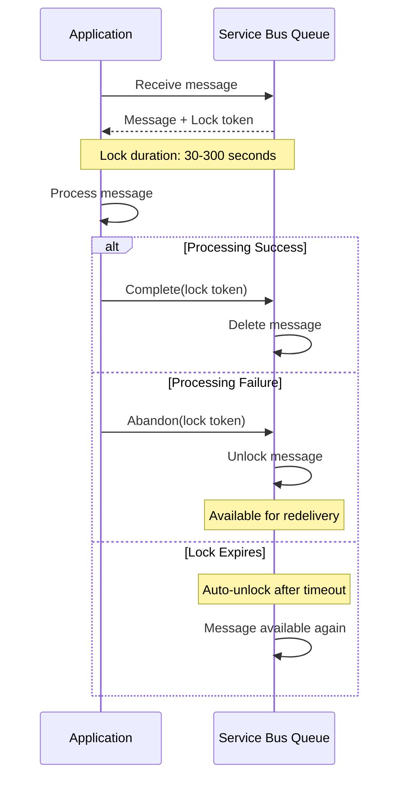
```mermaid
sequenceDiagram
    participant App as Application
    participant Queue as Service Bus Queue
    
    App->>Queue: Receive message
    Queue-->>App: Message + Lock token
    Note over App,Queue: Lock duration: 30-300 seconds
    
    App->>App: Process message
    
    alt Processing Success
        App->>Queue: Complete(lock token)
        Queue->>Queue: Delete message
    else Processing Failure
        App->>Queue: Abandon(lock token)
        Queue->>Queue: Unlock message
        Note over Queue: Available for redelivery
    else Lock Expires
        Note over Queue: Auto-unlock after timeout
        Queue->>Queue: Message available again
    end
```

## Dead-Letter Queue

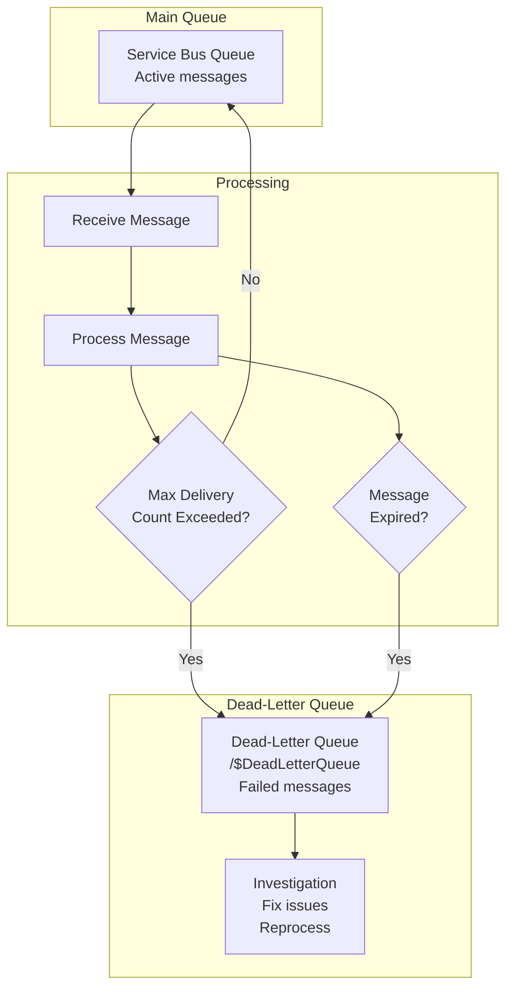
```mermaid
graph TB
    subgraph "Main Queue"
        Queue[Service Bus Queue<br/>Active messages]
    end
    
    subgraph "Processing"
        Receive[Receive Message]
        Process[Process Message]
        MaxRetry{Max Delivery<br/>Count Exceeded?}
        Expired{Message<br/>Expired?}
    end
    
    subgraph "Dead-Letter Queue"
        DLQ[Dead-Letter Queue<br/>/$DeadLetterQueue<br/>Failed messages]
        
        Investigate[Investigation<br/>Fix issues<br/>Reprocess]
    end
    
    Queue --> Receive
    Receive --> Process
    Process --> MaxRetry
    MaxRetry -->|Yes| DLQ
    MaxRetry -->|No| Queue
    Process --> Expired
    Expired -->|Yes| DLQ
    DLQ --> Investigate
```

## Message Sessions

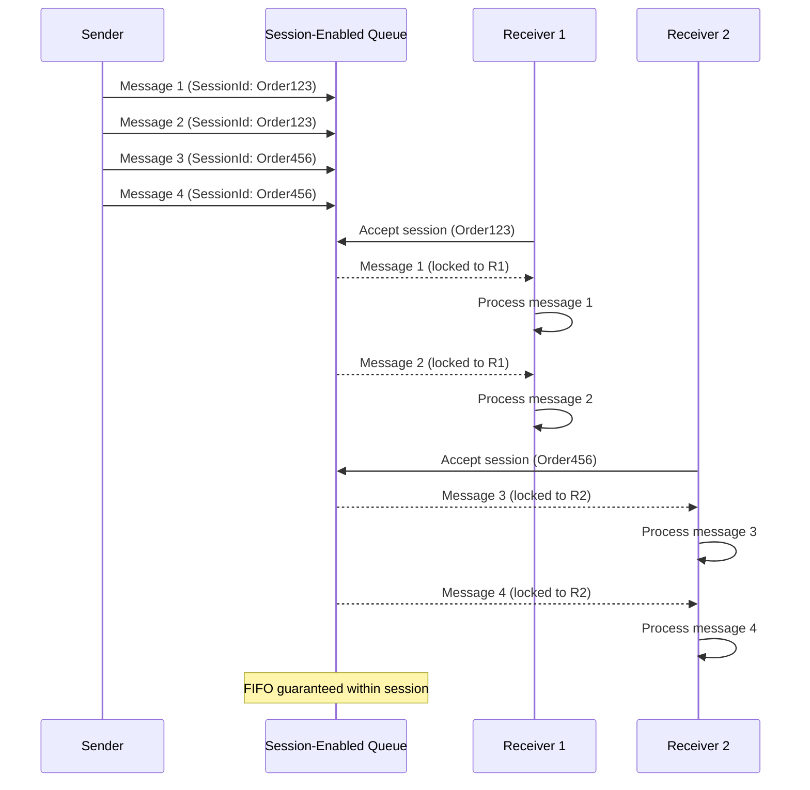
```mermaid
sequenceDiagram
    participant S1 as Sender
    participant Queue as Session-Enabled Queue
    participant R1 as Receiver 1
    participant R2 as Receiver 2
    
    S1->>Queue: Message 1 (SessionId: Order123)
    S1->>Queue: Message 2 (SessionId: Order123)
    S1->>Queue: Message 3 (SessionId: Order456)
    S1->>Queue: Message 4 (SessionId: Order456)
    
    R1->>Queue: Accept session (Order123)
    Queue-->>R1: Message 1 (locked to R1)
    R1->>R1: Process message 1
    Queue-->>R1: Message 2 (locked to R1)
    R1->>R1: Process message 2
    
    R2->>Queue: Accept session (Order456)
    Queue-->>R2: Message 3 (locked to R2)
    R2->>R2: Process message 3
    Queue-->>R2: Message 4 (locked to R2)
    R2->>R2: Process message 4
    
    Note over Queue: FIFO guaranteed within session
```

## Topic Filters and Actions

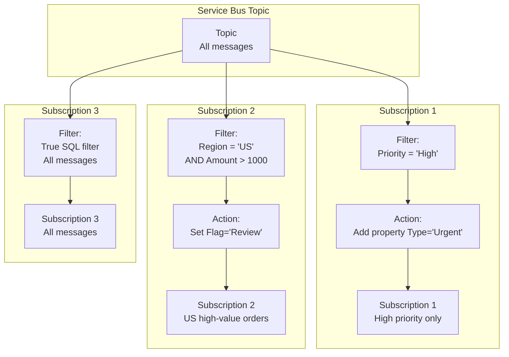
```mermaid
graph TB
    subgraph "Service Bus Topic"
        Topic[Topic<br/>All messages]
    end
    
    subgraph "Subscription 1"
        Filter1[Filter:<br/>Priority = 'High']
        Action1[Action:<br/>Add property Type='Urgent']
        Sub1[Subscription 1<br/>High priority only]
    end
    
    subgraph "Subscription 2"
        Filter2[Filter:<br/>Region = 'US'<br/>AND Amount > 1000]
        Action2[Action:<br/>Set Flag='Review']
        Sub2[Subscription 2<br/>US high-value orders]
    end
    
    subgraph "Subscription 3"
        Filter3[Filter:<br/>True SQL filter<br/>All messages]
        Sub3[Subscription 3<br/>All messages]
    end
    
    Topic --> Filter1 & Filter2 & Filter3
    Filter1 --> Action1 --> Sub1
    Filter2 --> Action2 --> Sub2
    Filter3 --> Sub3
```

## Filter Types

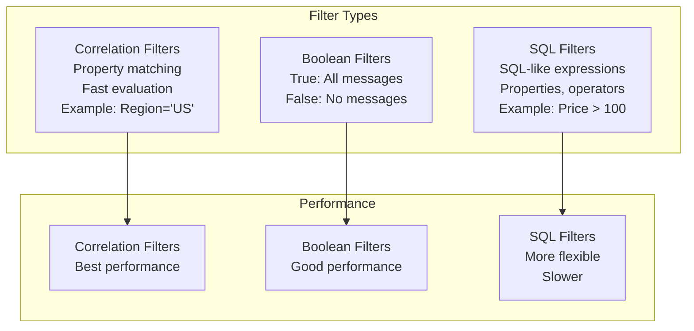
```mermaid
graph TB
    subgraph "Filter Types"
        Boolean[Boolean Filters<br/>True: All messages<br/>False: No messages]
        
        SQL[SQL Filters<br/>SQL-like expressions<br/>Properties, operators<br/>Example: Price > 100]
        
        Correlation[Correlation Filters<br/>Property matching<br/>Fast evaluation<br/>Example: Region='US']
    end
    
    subgraph "Performance"
        Fastest[Correlation Filters<br/>Best performance]
        Medium[Boolean Filters<br/>Good performance]
        Slower[SQL Filters<br/>More flexible<br/>Slower]
    end
    
    Correlation --> Fastest
    Boolean --> Medium
    SQL --> Slower
```

## Transactions

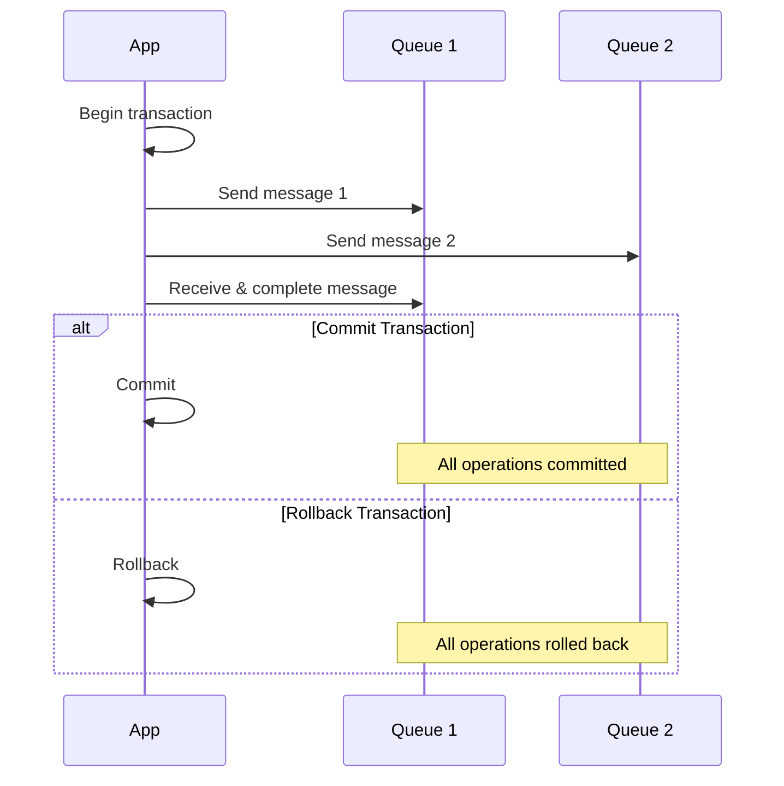
```mermaid
sequenceDiagram
    participant App
    participant Queue1 as Queue 1
    participant Queue2 as Queue 2
    
    App->>App: Begin transaction
    
    App->>Queue1: Send message 1
    App->>Queue2: Send message 2
    App->>Queue1: Receive & complete message
    
    alt Commit Transaction
        App->>App: Commit
        Note over Queue1,Queue2: All operations committed
    else Rollback Transaction
        App->>App: Rollback
        Note over Queue1,Queue2: All operations rolled back
    end
```

## Queue Storage Architecture

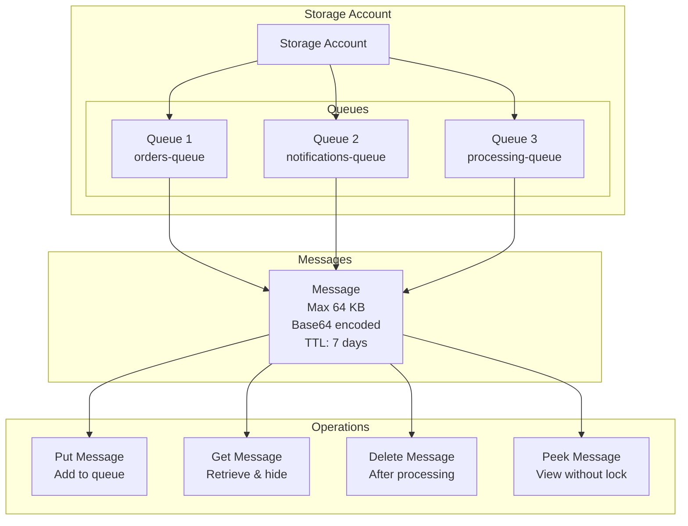
```mermaid
graph TB
    subgraph "Storage Account"
        Account[Storage Account]
        
        subgraph "Queues"
            Q1[Queue 1<br/>orders-queue]
            Q2[Queue 2<br/>notifications-queue]
            Q3[Queue 3<br/>processing-queue]
        end
    end
    
    subgraph "Messages"
        Msg[Message<br/>Max 64 KB<br/>Base64 encoded<br/>TTL: 7 days]
    end
    
    subgraph "Operations"
        Put[Put Message<br/>Add to queue]
        Get[Get Message<br/>Retrieve & hide]
        Delete[Delete Message<br/>After processing]
        Peek[Peek Message<br/>View without lock]
    end
    
    Account --> Q1 & Q2 & Q3
    Q1 & Q2 & Q3 --> Msg
    Msg --> Put & Get & Delete & Peek
```

## Queue Storage Processing

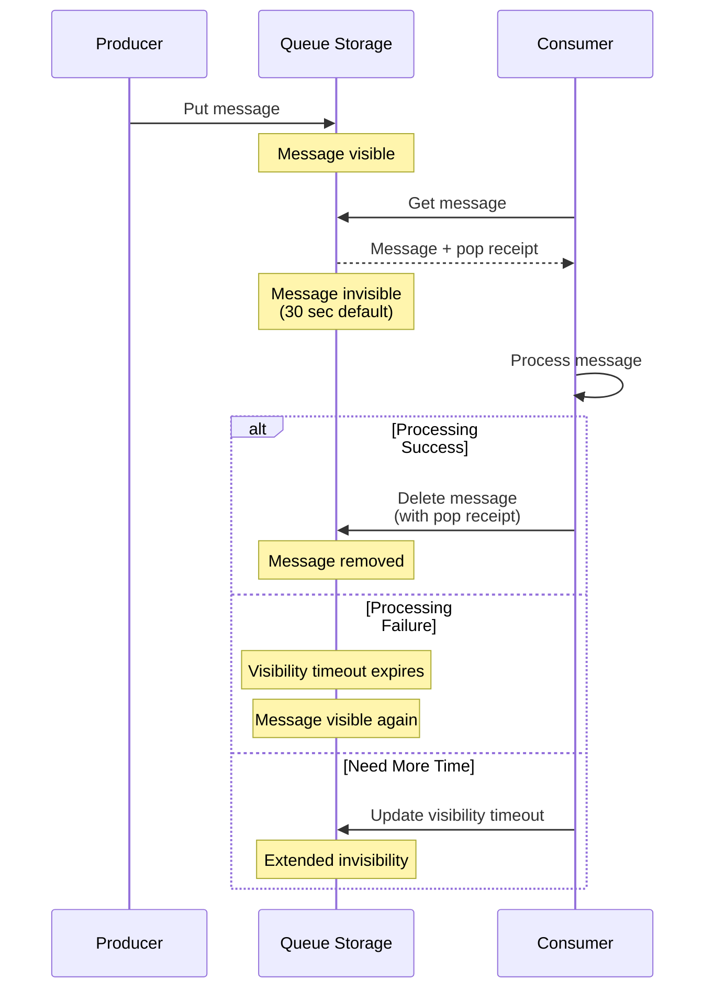
```mermaid
sequenceDiagram
    participant Producer
    participant Queue as Queue Storage
    participant Consumer
    
    Producer->>Queue: Put message
    Note over Queue: Message visible
    
    Consumer->>Queue: Get message
    Queue-->>Consumer: Message + pop receipt
    Note over Queue: Message invisible<br/>(30 sec default)
    
    Consumer->>Consumer: Process message
    
    alt Processing Success
        Consumer->>Queue: Delete message<br/>(with pop receipt)
        Note over Queue: Message removed
    else Processing Failure
        Note over Queue: Visibility timeout expires
        Note over Queue: Message visible again
    else Need More Time
        Consumer->>Queue: Update visibility timeout
        Note over Queue: Extended invisibility
    end
```

## Service Bus vs Queue Storage

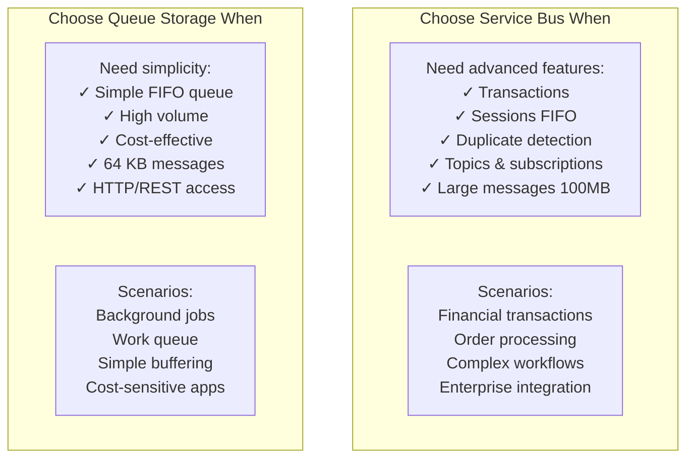
```mermaid
graph TB
    subgraph "Choose Service Bus When"
        SBFeatures[Need advanced features:<br/>✓ Transactions<br/>✓ Sessions FIFO<br/>✓ Duplicate detection<br/>✓ Topics & subscriptions<br/>✓ Large messages 100MB]
        
        SBScenarios[Scenarios:<br/>Financial transactions<br/>Order processing<br/>Complex workflows<br/>Enterprise integration]
    end
    
    subgraph "Choose Queue Storage When"
        QSFeatures[Need simplicity:<br/>✓ Simple FIFO queue<br/>✓ High volume<br/>✓ Cost-effective<br/>✓ 64 KB messages<br/>✓ HTTP/REST access]
        
        QSScenarios[Scenarios:<br/>Background jobs<br/>Work queue<br/>Simple buffering<br/>Cost-sensitive apps]
    end
```

## Message Properties

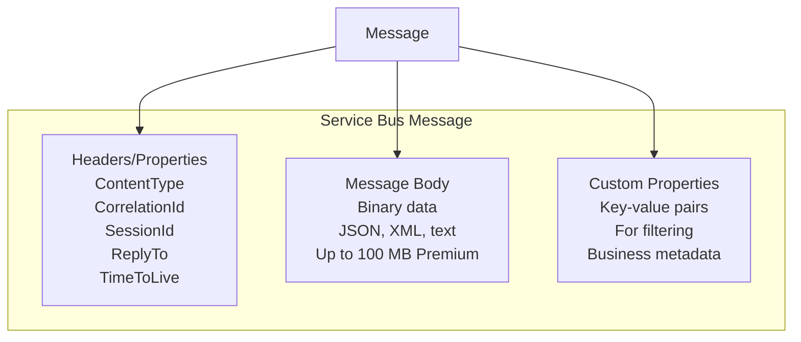
```mermaid
graph TB
    subgraph "Service Bus Message"
        Headers[Headers/Properties<br/>ContentType<br/>CorrelationId<br/>SessionId<br/>ReplyTo<br/>TimeToLive]
        
        Body[Message Body<br/>Binary data<br/>JSON, XML, text<br/>Up to 100 MB Premium]
        
        CustomProps[Custom Properties<br/>Key-value pairs<br/>For filtering<br/>Business metadata]
    end
    
    Message[Message] --> Headers & Body & CustomProps
```

## Duplicate Detection

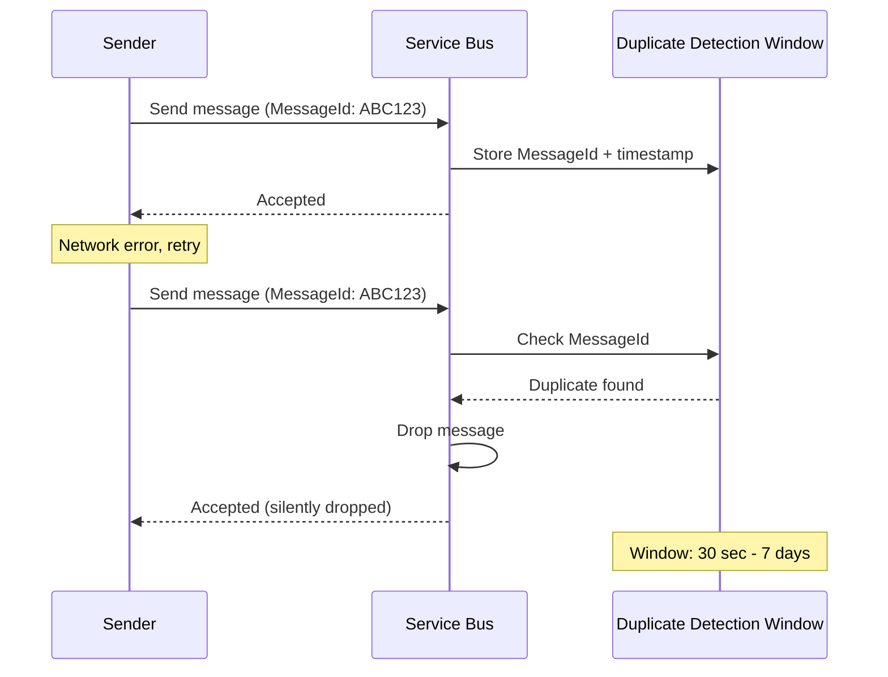
```mermaid
sequenceDiagram
    participant Sender
    participant ServiceBus as Service Bus
    participant DupWindow as Duplicate Detection Window
    
    Sender->>ServiceBus: Send message (MessageId: ABC123)
    ServiceBus->>DupWindow: Store MessageId + timestamp
    ServiceBus-->>Sender: Accepted
    
    Note over Sender: Network error, retry
    
    Sender->>ServiceBus: Send message (MessageId: ABC123)
    ServiceBus->>DupWindow: Check MessageId
    DupWindow-->>ServiceBus: Duplicate found
    ServiceBus->>ServiceBus: Drop message
    ServiceBus-->>Sender: Accepted (silently dropped)
    
    Note over DupWindow: Window: 30 sec - 7 days
```

## Auto-Forward Pattern

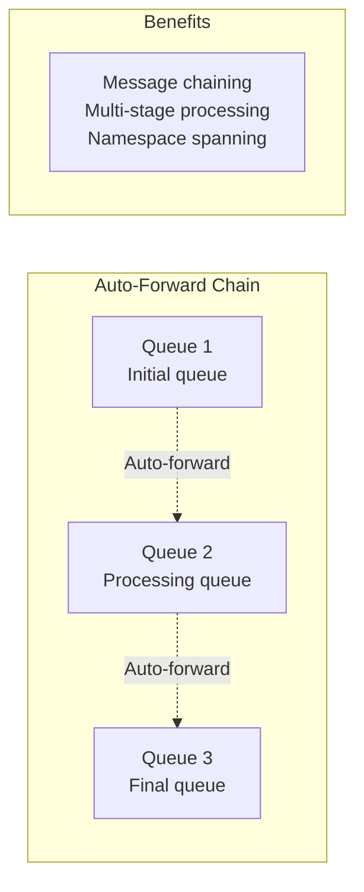
```mermaid
graph LR
    subgraph "Auto-Forward Chain"
        Q1[Queue 1<br/>Initial queue]
        Q2[Queue 2<br/>Processing queue]
        Q3[Queue 3<br/>Final queue]
        
        Q1 -.Auto-forward.-> Q2
        Q2 -.Auto-forward.-> Q3
    end
    
    subgraph "Benefits"
        Chain[Message chaining<br/>Multi-stage processing<br/>Namespace spanning]
    end
```

## Message Deferral

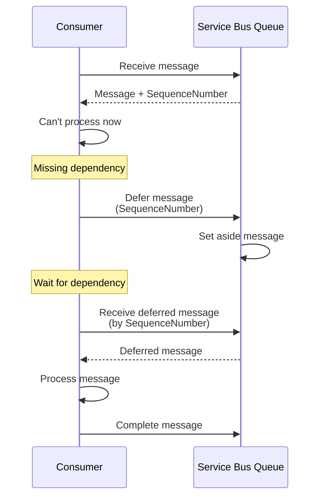
```mermaid
sequenceDiagram
    participant Consumer
    participant Queue as Service Bus Queue
    
    Consumer->>Queue: Receive message
    Queue-->>Consumer: Message + SequenceNumber
    
    Consumer->>Consumer: Can't process now
    Note over Consumer: Missing dependency
    
    Consumer->>Queue: Defer message<br/>(SequenceNumber)
    Queue->>Queue: Set aside message
    
    Note over Consumer: Wait for dependency
    
    Consumer->>Queue: Receive deferred message<br/>(by SequenceNumber)
    Queue-->>Consumer: Deferred message
    Consumer->>Consumer: Process message
    Consumer->>Queue: Complete message
```

## Scheduled Messages

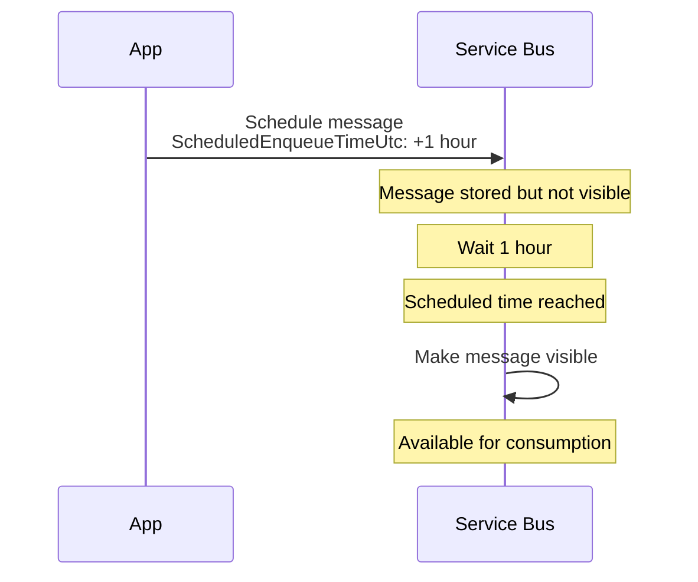
```mermaid
sequenceDiagram
    participant App
    participant ServiceBus as Service Bus
    
    App->>ServiceBus: Schedule message<br/>ScheduledEnqueueTimeUtc: +1 hour
    Note over ServiceBus: Message stored but not visible
    
    Note over ServiceBus: Wait 1 hour
    
    Note over ServiceBus: Scheduled time reached
    ServiceBus->>ServiceBus: Make message visible
    
    Note over ServiceBus: Available for consumption
```

## Poison Message Handling

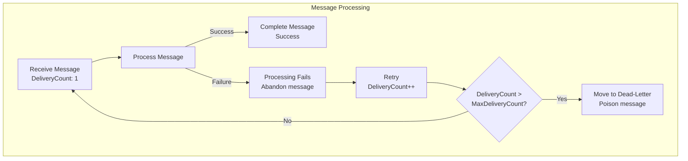
```mermaid
graph TB
    subgraph "Message Processing"
        Receive[Receive Message<br/>DeliveryCount: 1]
        
        Process[Process Message]
        
        Fail[Processing Fails<br/>Abandon message]
        
        Retry[Retry<br/>DeliveryCount++]
        
        MaxDelivery{DeliveryCount ><br/>MaxDeliveryCount?}
        
        DLQ[Move to Dead-Letter<br/>Poison message]
        
        Success[Complete Message<br/>Success]
    end
    
    Receive --> Process
    Process -->|Success| Success
    Process -->|Failure| Fail
    Fail --> Retry
    Retry --> MaxDelivery
    MaxDelivery -->|Yes| DLQ
    MaxDelivery -->|No| Receive
```

## Service Bus Client Patterns

```mermaid
graph TB
    subgraph "Sender Patterns"
        SingleSend[Single Send<br/>Send one message]
        BatchSend[Batch Send<br/>Send multiple messages<br/>Better throughput]
        ScheduledSend[Scheduled Send<br/>Future delivery]
    end
    
    subgraph "Receiver Patterns"
        PeekReceive[Peek & Lock<br/>Safe processing]
        ProcessMessage[Process Message<br/>Event-driven]
        SessionProcessor[Session Processor<br/>Ordered processing]
    end
    
    subgraph "Best Practices"
        Singleton[Singleton Client<br/>Reuse connections]
        AsyncProcessing[Async Processing<br/>Non-blocking]
        ErrorHandling[Error Handling<br/>Retry with backoff]
    end
```

## Security Features

```mermaid
graph TB
    subgraph "Authentication"
        SAS[Shared Access Signature<br/>Send, Listen, Manage<br/>Time-limited]
        
        ManagedID[Managed Identity<br/>Passwordless auth<br/>Recommended]
        
        ConnectionString[Connection String<br/>Legacy approach]
    end
    
    subgraph "Authorization"
        RBAC[Azure RBAC<br/>Data Owner<br/>Data Sender<br/>Data Receiver]
    end
    
    subgraph "Network Security"
        Firewall[IP Firewall<br/>Allowed IPs]
        
        VNet[Virtual Network<br/>Service endpoints<br/>Private endpoints]
    end
    
    ManagedID & SAS --> RBAC
    Firewall & VNet --> NetworkSecurity[Network Protection]
```

## Key Concepts Summary

### Service Bus Queues
- **Purpose**: Point-to-point messaging
- **Delivery**: FIFO, at-least-once
- **Features**: Transactions, sessions, duplicate detection
- **Use Cases**: Order processing, task distribution

### Service Bus Topics
- **Purpose**: Pub/Sub messaging
- **Subscriptions**: Multiple independent consumers
- **Filters**: SQL, correlation, boolean filters
- **Use Cases**: Event broadcasting, notifications

### Message Processing
- **Peek-Lock**: Two-phase, safe processing (default)
- **Receive-Delete**: One-phase, at-most-once
- **Sessions**: FIFO within session, stateful
- **Transactions**: Atomic operations across entities

### Advanced Features
- **Dead-Letter**: Failed message handling
- **Duplicate Detection**: Prevent duplicate processing
- **Auto-Forward**: Message chaining
- **Deferral**: Postpone processing
- **Scheduled**: Future delivery

### Queue Storage
- **Purpose**: Simple, scalable queue
- **Size**: 64 KB per message
- **TTL**: Up to 7 days
- **Access**: HTTP/REST, Storage SDK

### Service Bus Tiers
- **Basic**: Queues only, 256 KB messages
- **Standard**: Queues + Topics, shared capacity
- **Premium**: 100 MB messages, dedicated, VNet

### Message Sessions
- **FIFO**: Guaranteed order within session
- **State**: Session state storage
- **Locking**: Session locked to one receiver
- **Use Cases**: Related message processing

### Filters and Subscriptions
- **Boolean**: Match all or none
- **Correlation**: Fast property matching
- **SQL**: Complex expressions
- **Actions**: Modify message properties

### Best Practices
1. **Use Managed Identity** for authentication
2. **Implement peek-lock** for safe processing
3. **Set appropriate MaxDeliveryCount** for poison messages
4. **Use sessions** when order matters
5. **Batch messages** for better throughput
6. **Monitor dead-letter queues** regularly
7. **Use correlation filters** over SQL for performance
8. **Implement retry logic** with exponential backoff
9. **Reuse Service Bus clients** (singleton pattern)
10. **Set appropriate message TTL** to prevent queue bloat
