# Azure Cosmos DB - Concepts Cheatsheet

## Overview
Azure Cosmos DB is a globally distributed, multi-model NoSQL database with guaranteed low latency, elastic scalability, and comprehensive SLAs.

## Cosmos DB Architecture

```mermaid
graph TB
    subgraph "Global Distribution"
        Region1[Region 1<br/>Primary]
        Region2[Region 2<br/>Replica]
        Region3[Region 3<br/>Replica]
        Region4[Region 4<br/>Replica]
    end
    
    subgraph "Cosmos DB Account"
        Account[Database Account]
        
        subgraph "Databases"
            DB1[Database 1]
            DB2[Database 2]
        end
        
        subgraph "Containers"
            C1[Container 1]
            C2[Container 2]
            C3[Container 3]
        end
        
        subgraph "Items"
            Items[JSON Documents]
        end
    end
    
    Region1 & Region2 & Region3 & Region4 -.Replicate.-> Account
    Account --> DB1 & DB2
    DB1 --> C1 & C2
    DB2 --> C3
    C1 & C2 & C3 --> Items
```

## Resource Hierarchy

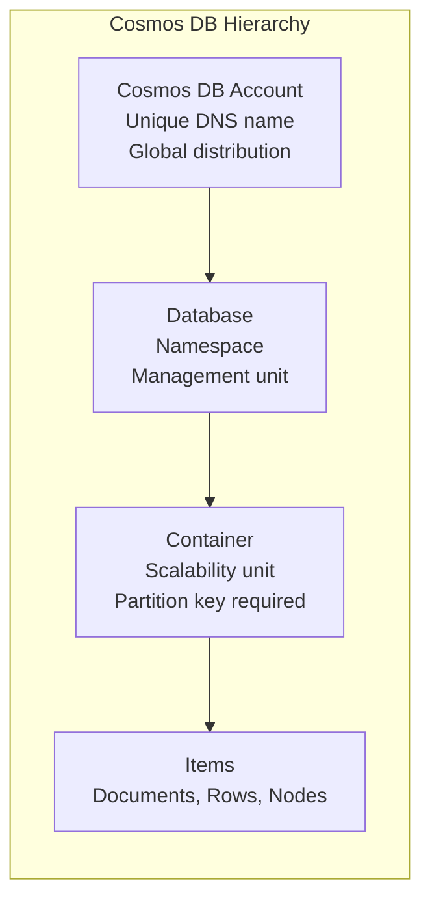

## Consistency Levels

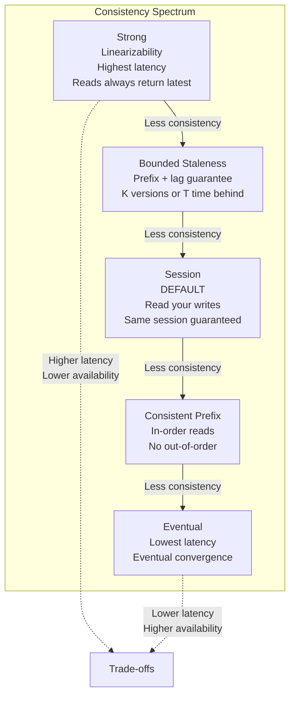

## Consistency Levels Visualization

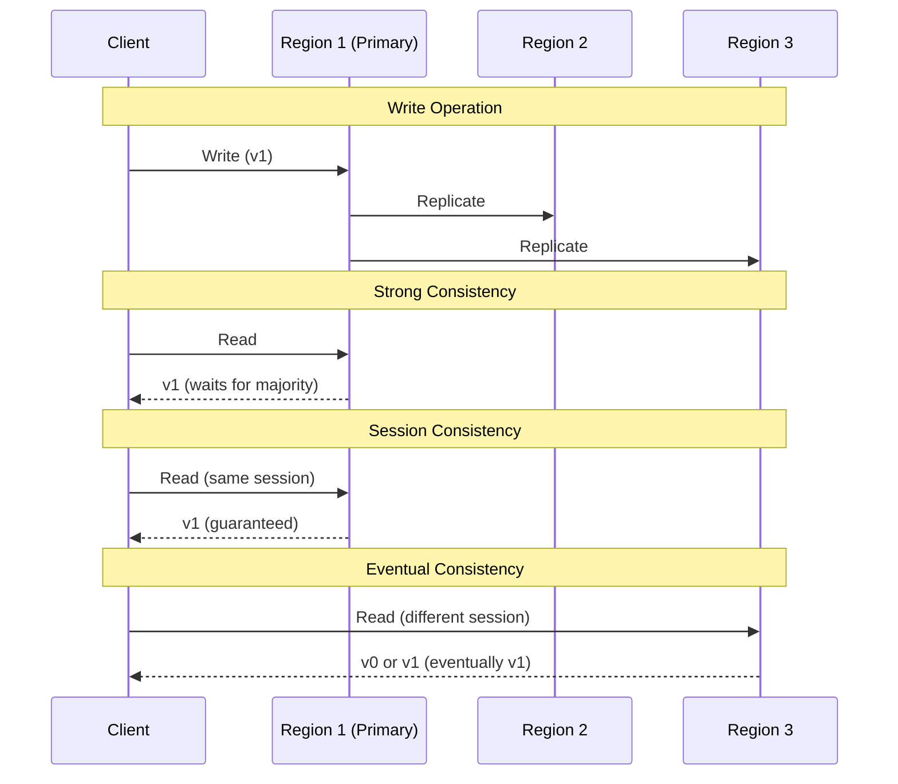

## Partitioning Strategy

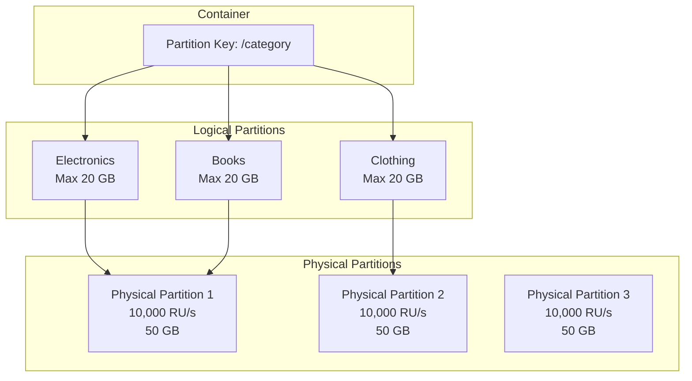

## Request Units (RU) Model

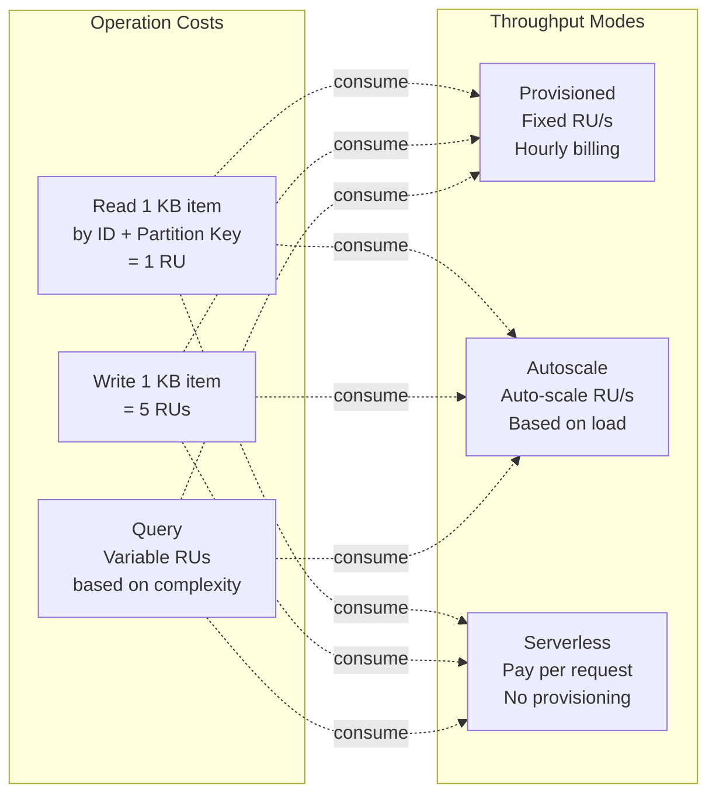

## Throughput Models Comparison

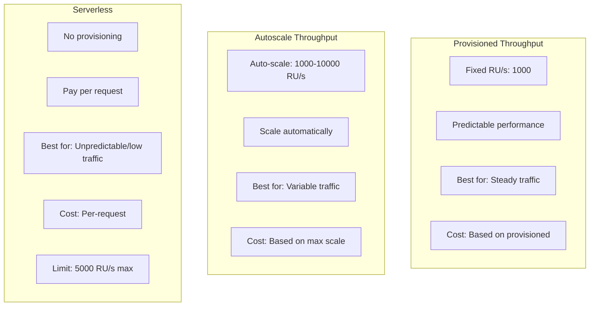

## Partition Key Selection

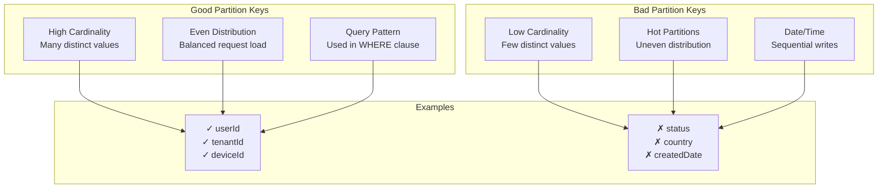

## Query Optimization

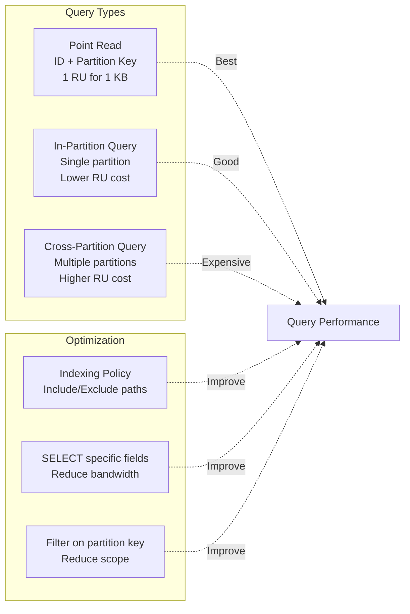

## Indexing Policy

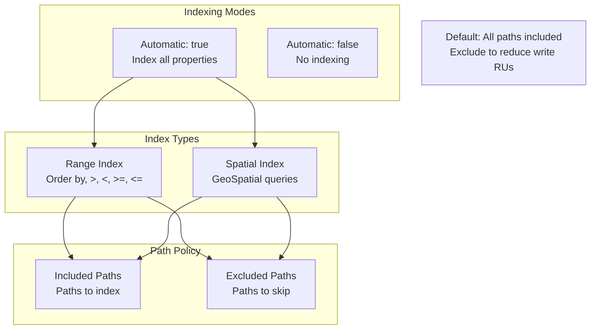

## Change Feed Pattern

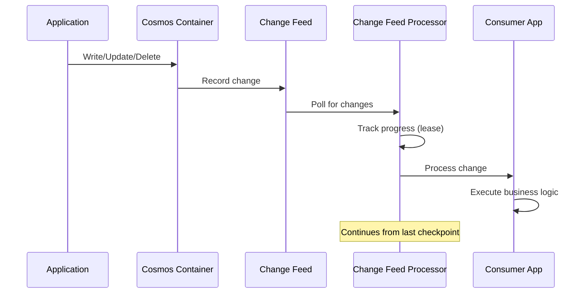

## Change Feed Use Cases

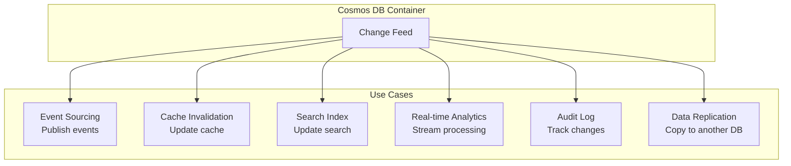

## Multi-Region Write Configuration

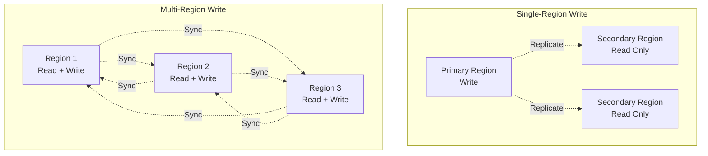

## Cosmos DB APIs

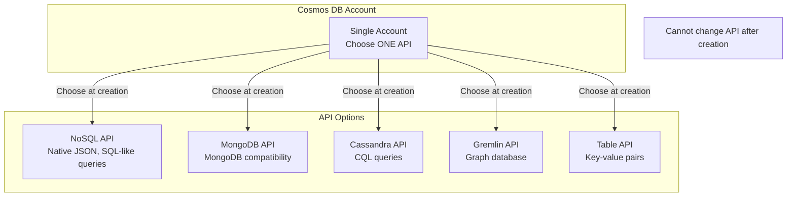

## Stored Procedures & Triggers

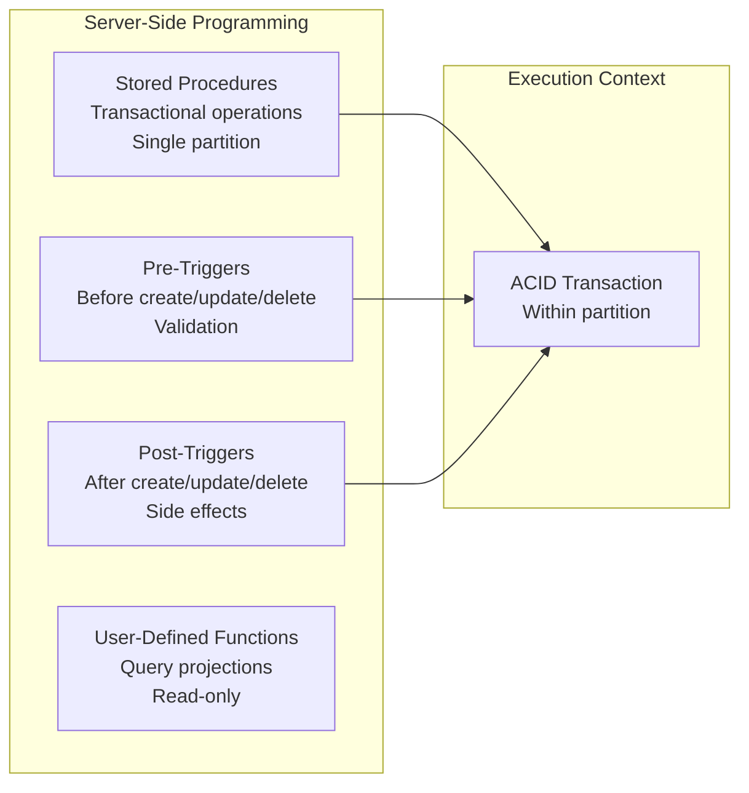

## Time to Live (TTL)

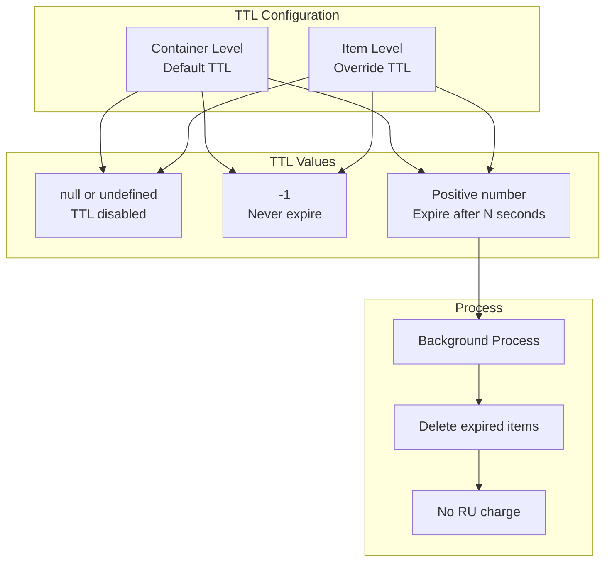

## Backup and Restore

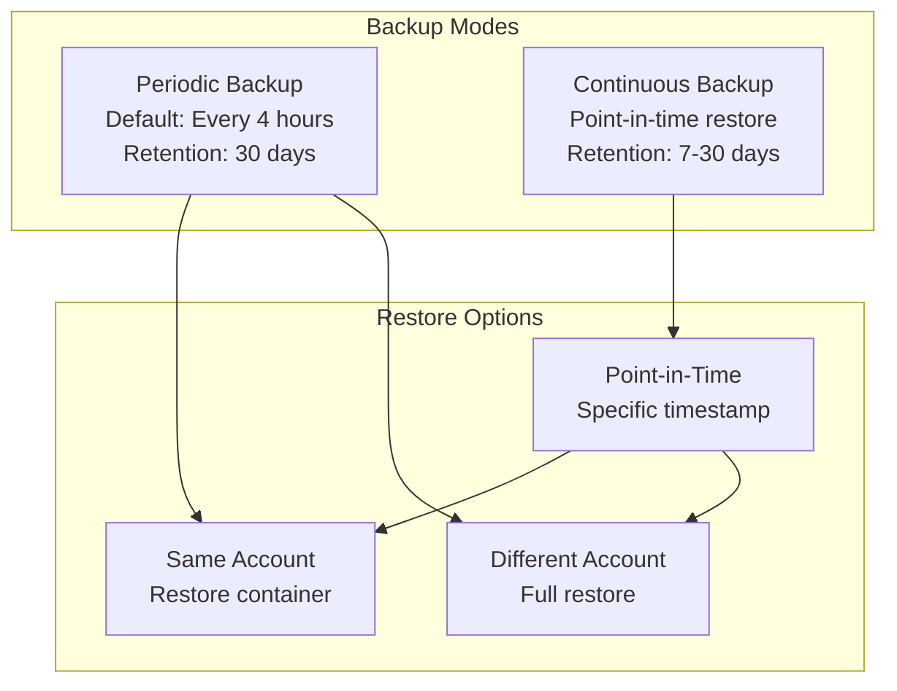

## Security Features

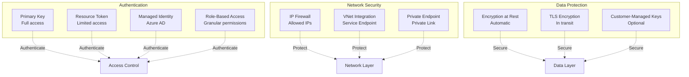

## SDK Operations

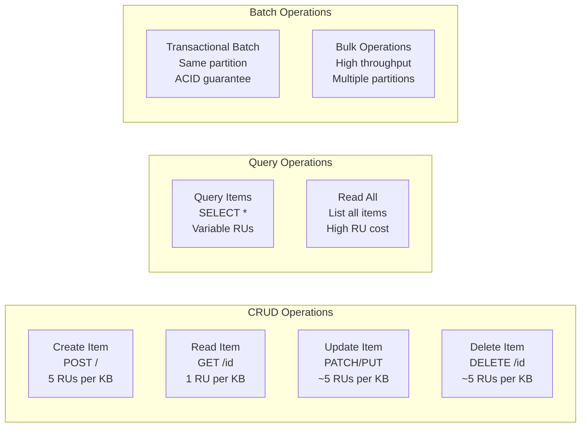

## Key Concepts Summary

### Global Distribution
- **Multi-Region**: Add/remove regions anytime
- **Replication**: Automatic multi-master replication
- **Failover**: Automatic or manual failover
- **SLA**: 99.999% availability for multi-region

### Consistency Levels
- **Strong**: Linearizability guarantee
- **Bounded Staleness**: Lag by K versions or T time
- **Session**: Read-your-writes (default)
- **Consistent Prefix**: No out-of-order reads
- **Eventual**: Lowest latency, eventual convergence

### Partitioning
- **Logical Partition**: Max 20 GB per partition key value
- **Physical Partition**: Max 10,000 RU/s and 50 GB
- **Partition Key**: Cannot be changed after container creation
- **Hot Partitions**: Avoid with good partition key design

### Request Units
- **Read**: 1 RU per 1 KB (point read)
- **Write**: ~5 RUs per 1 KB
- **Query**: Variable based on complexity
- **Factors**: Item size, indexing, consistency level

### Throughput Modes
- **Provisioned**: Fixed RU/s, hourly billing
- **Autoscale**: Auto-scale between min/max
- **Serverless**: Pay-per-request, 5000 RU/s max

### Change Feed
- **Ordered**: Changes in order per partition key
- **Persistent**: All changes retained
- **Push Model**: Processors push to consumers
- **Use Cases**: Event sourcing, cache invalidation, search index

### Best Practices
1. **Choose partition key carefully** - high cardinality, even distribution
2. **Use point reads** when possible (ID + partition key)
3. **Avoid cross-partition queries** - use partition key in WHERE
4. **Tune indexing policy** - exclude unused paths
5. **Use session consistency** for most scenarios
6. **Implement retry logic** with exponential backoff
7. **Use bulk operations** for high-throughput scenarios
8. **Monitor RU consumption** and optimize queries
9. **Use TTL** to auto-delete expired data
10. **Enable continuous backup** for critical data
