# Azure Blob Storage - Concepts Cheatsheet

## Overview
Azure Blob Storage is Microsoft's object storage solution for the cloud, optimized for storing massive amounts of unstructured data like text, binary data, images, videos, and backups.

## Blob Storage Architecture

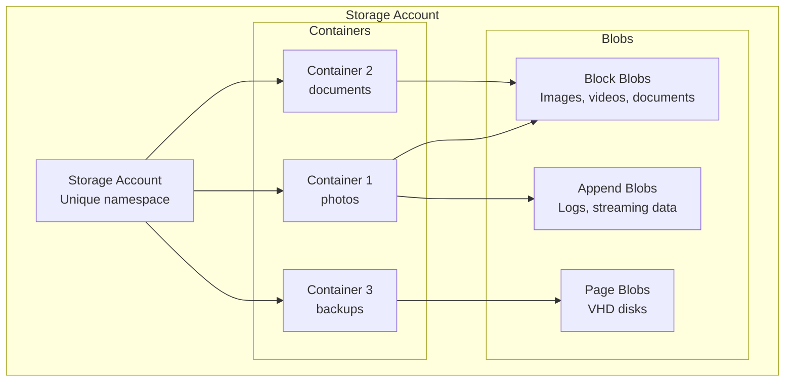

## Storage Account Tiers

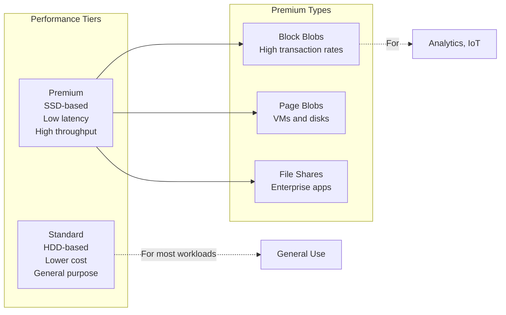

## Blob Types Comparison

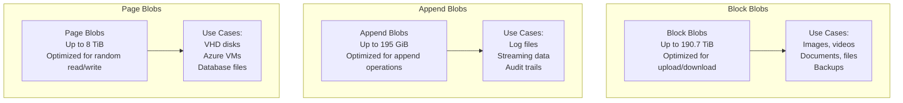

## Access Tiers

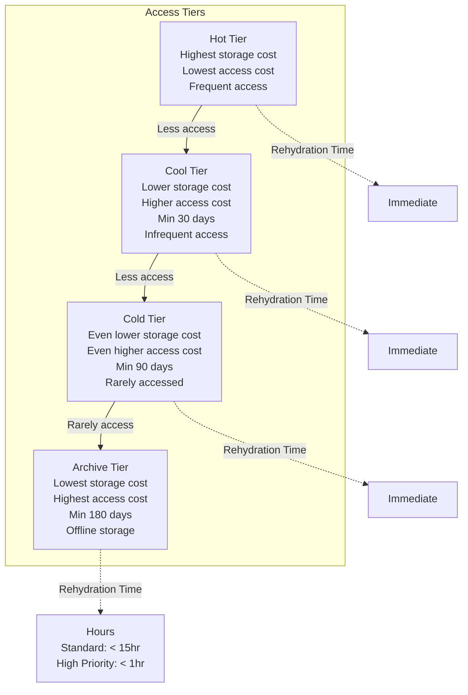

## Lifecycle Management

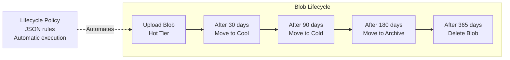

## Lifecycle Policy Example

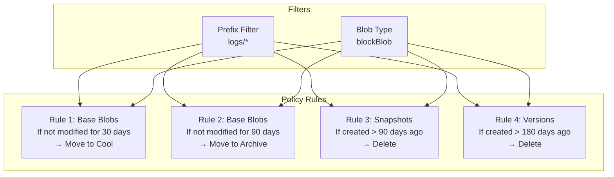

## Blob Versioning & Snapshots

```mermaid
graph TB
    subgraph "Blob Versions"
        Current[Current Version<br/>v3 (latest)]
        V2[Previous Version<br/>v2]
        V1[Previous Version<br/>v1]
        
        Current -.Modify.-> NewVersion[New Current v4]
        NewVersion -.Demotes.-> Current
    end
    
    subgraph "Blob Snapshots"
        Base[Base Blob<br/>Original]
        Snap1[Snapshot 1<br/>Point-in-time copy]
        Snap2[Snapshot 2<br/>Point-in-time copy]
        
        Base -.Create snapshot.-> Snap1
        Base -.Create snapshot.-> Snap2
    end
    
    Note1[Versions: Automatic<br/>on overwrites]
    Note2[Snapshots: Manual<br/>on demand]
```

## Soft Delete

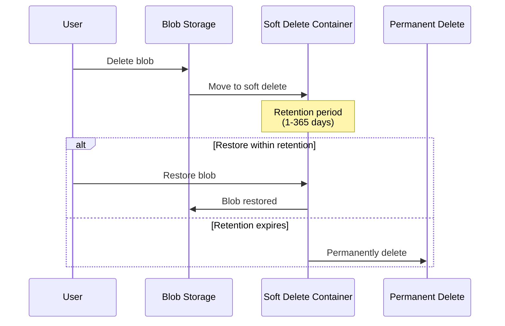

## Security & Access Control

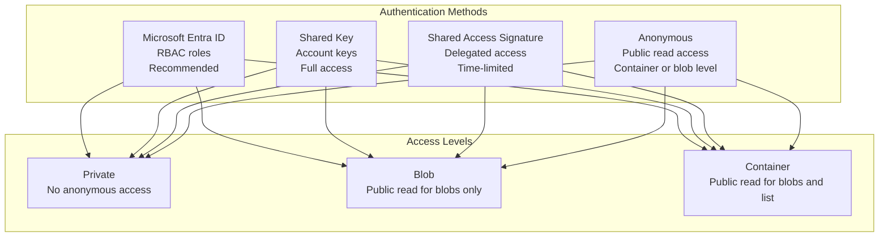

## Shared Access Signature (SAS)

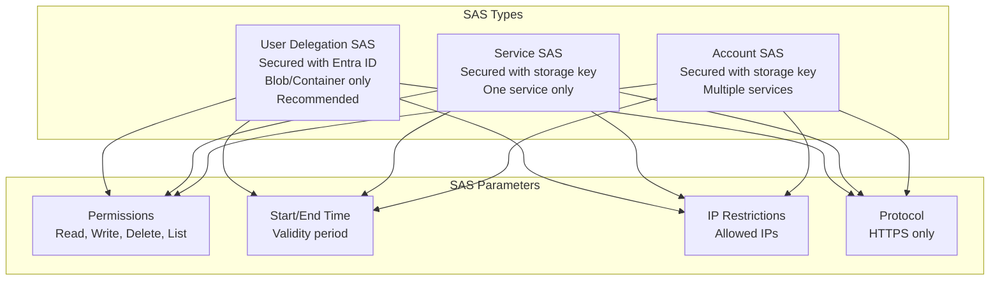

## Data Transfer Methods

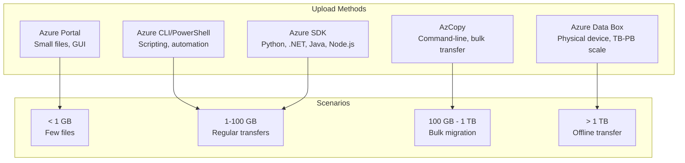

## Blob Operations Workflow

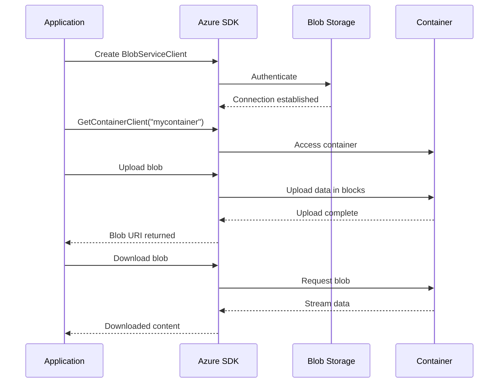

## Block Blob Upload Strategies

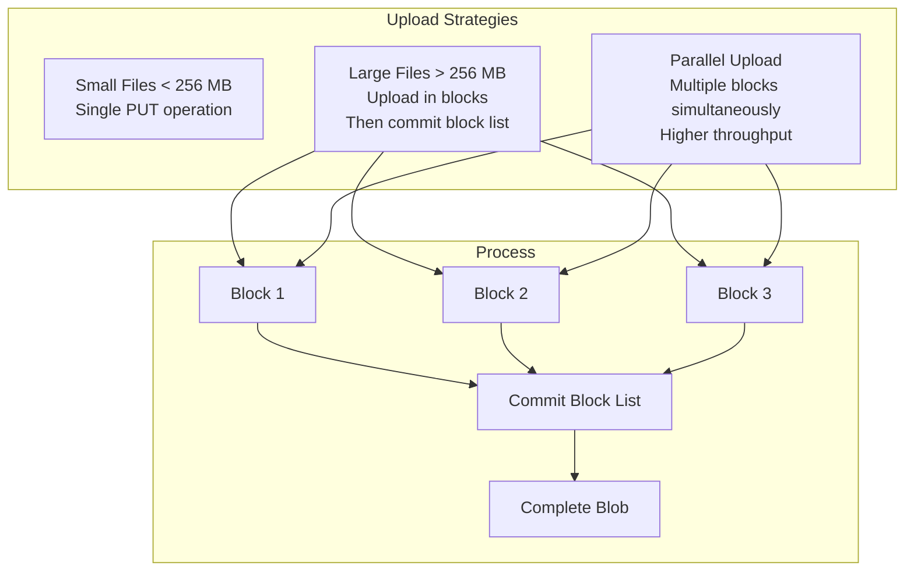

## Blob Indexing & Metadata

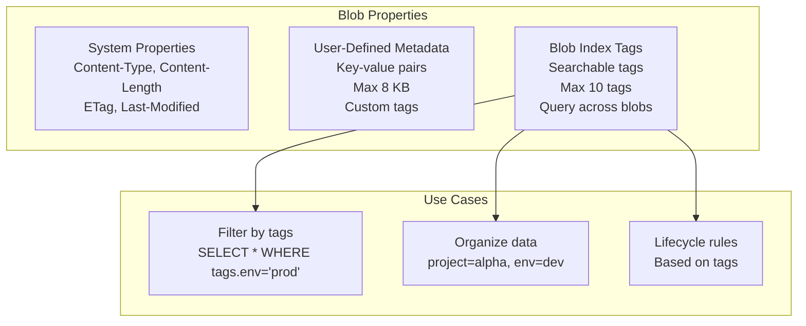

## Storage Redundancy Options

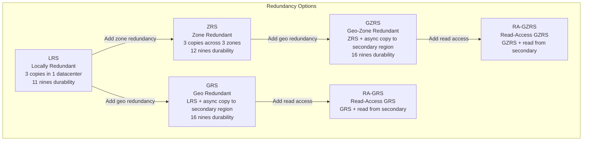

## Change Feed

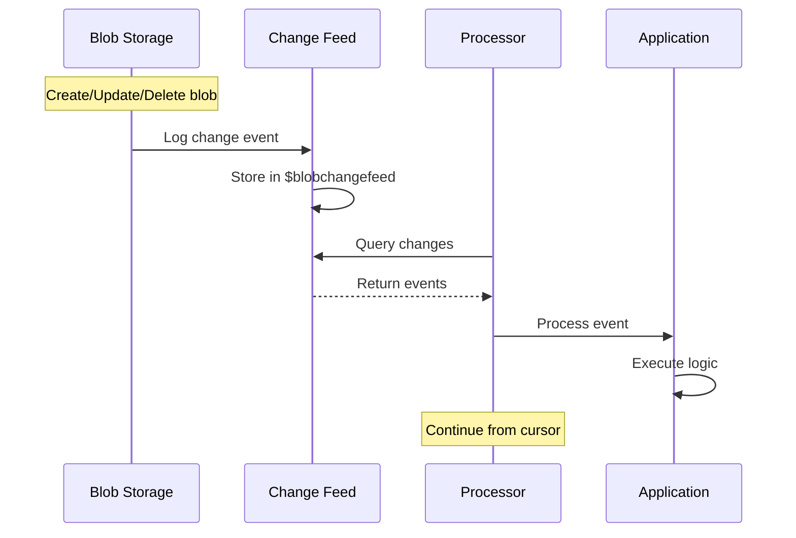

## Static Website Hosting

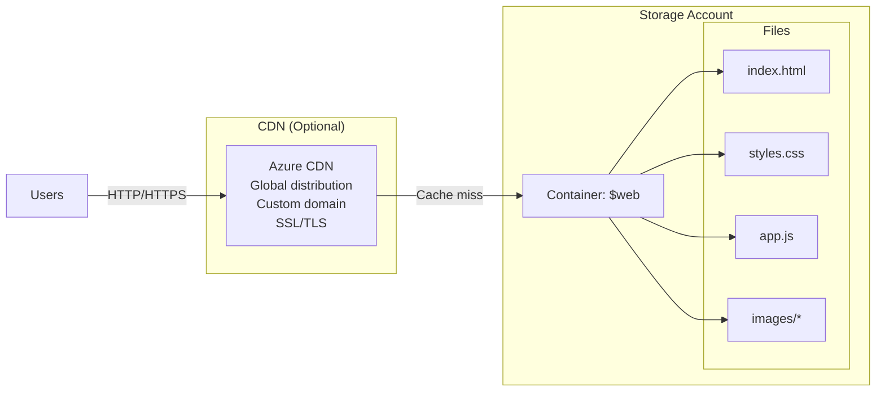

## Blob Leasing

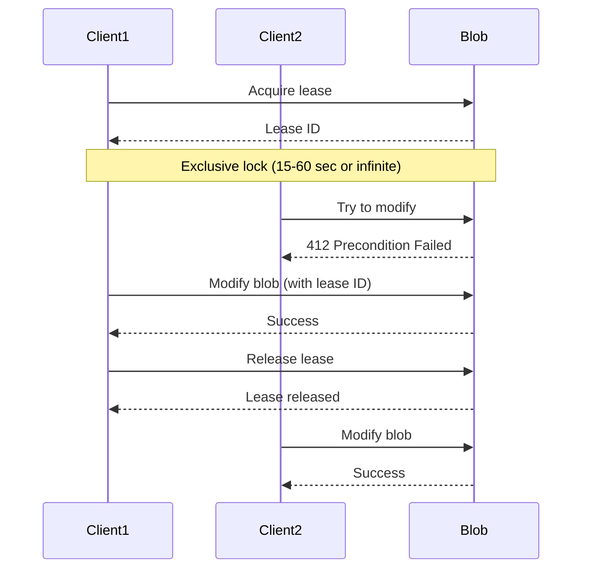

## Encryption & Security

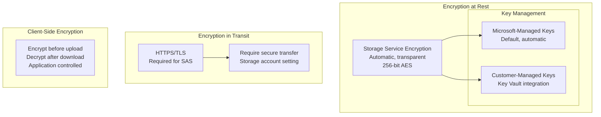

## Performance Optimization

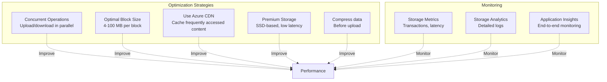

## Key Concepts Summary

### Storage Account Types
- **General Purpose v2**: Most scenarios, all services
- **Premium Block Blobs**: High transaction rates, low latency
- **Premium Page Blobs**: VMs and disks
- **Blob Storage**: Legacy, use GPv2 instead

### Blob Types
- **Block Blobs**: General purpose, up to 190.7 TiB
- **Append Blobs**: Append operations, logs, up to 195 GiB
- **Page Blobs**: Random read/write, VHDs, up to 8 TiB

### Access Tiers
- **Hot**: Frequent access, highest storage cost
- **Cool**: Infrequent access, 30-day minimum
- **Cold**: Rare access, 90-day minimum  
- **Archive**: Offline storage, 180-day minimum, hours to rehydrate

### Security Features
- **Entra ID (RBAC)**: Recommended authentication
- **Shared Access Signature**: Delegated access with constraints
- **Account Keys**: Full access, rotate regularly
- **Encryption**: Automatic at rest, TLS in transit

### Data Protection
- **Soft Delete**: Recover deleted blobs (1-365 days)
- **Versioning**: Automatic version tracking
- **Snapshots**: Point-in-time copies
- **Immutable Storage**: WORM compliance

### Lifecycle Management
- **Automatic Tiering**: Move blobs between tiers
- **Automatic Deletion**: Delete old blobs
- **Filters**: Prefix, blob type, tags
- **Actions**: Tier, delete, based on age

### Redundancy
- **LRS**: 3 copies, 1 datacenter
- **ZRS**: 3 copies, 3 zones
- **GRS/RA-GRS**: Geo-redundant with optional read access
- **GZRS/RA-GZRS**: Zone + Geo redundant

### Best Practices
1. **Use Microsoft Entra ID** for authentication instead of account keys
2. **Enable soft delete** to protect against accidental deletion
3. **Use lifecycle policies** to automatically manage blob tiers
4. **Implement SAS** with minimal permissions and expiration
5. **Enable versioning** for critical data
6. **Use Premium storage** for low-latency requirements
7. **Upload large files in blocks** with parallelism
8. **Enable blob index tags** for searchable metadata
9. **Use Azure CDN** for frequently accessed public content
10. **Monitor with Storage Analytics** and set up alerts
