# Azure API Management - Concepts Cheatsheet

## Overview
Azure API Management (APIM) is a fully managed service that enables organizations to publish, secure, transform, maintain, and monitor APIs at scale.

## API Management Architecture

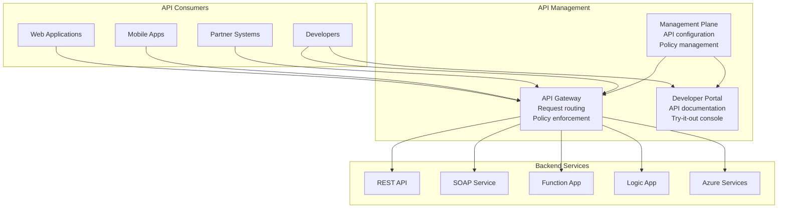

## API Management Components

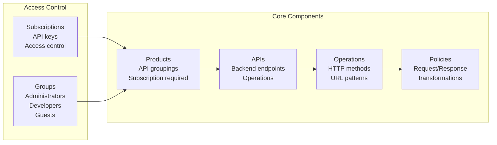

## Service Tiers

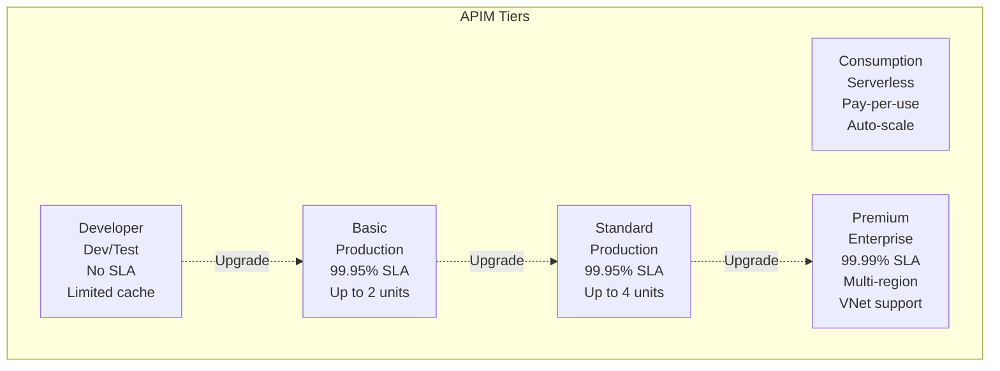

## Policy Structure

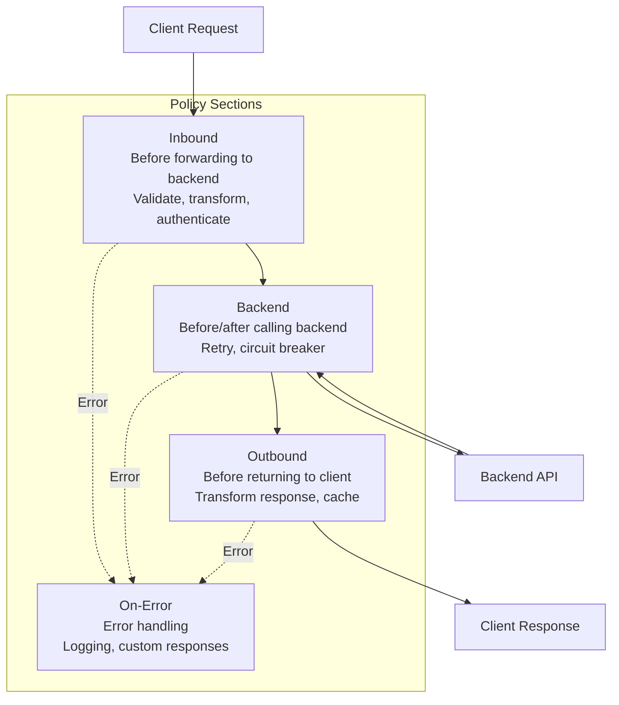

## Common Policies Flow

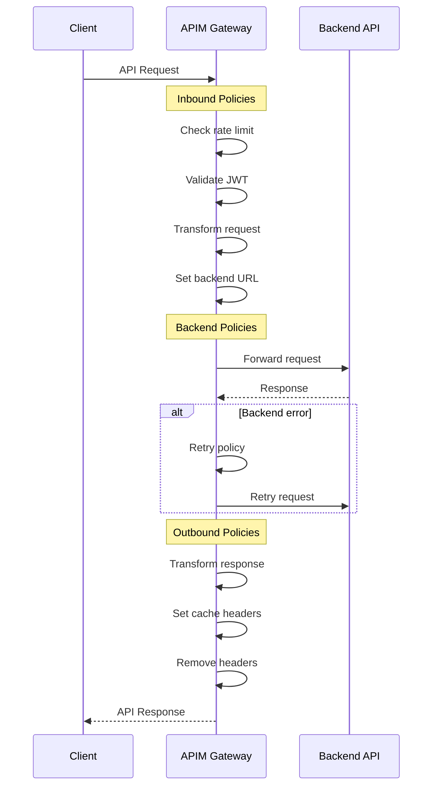

## Authentication Policies

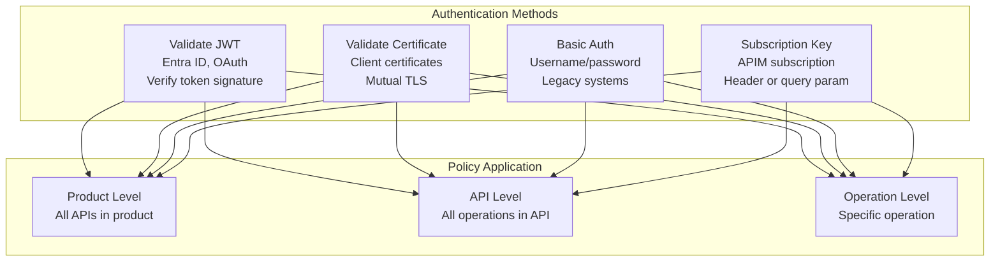

## Rate Limiting Strategies

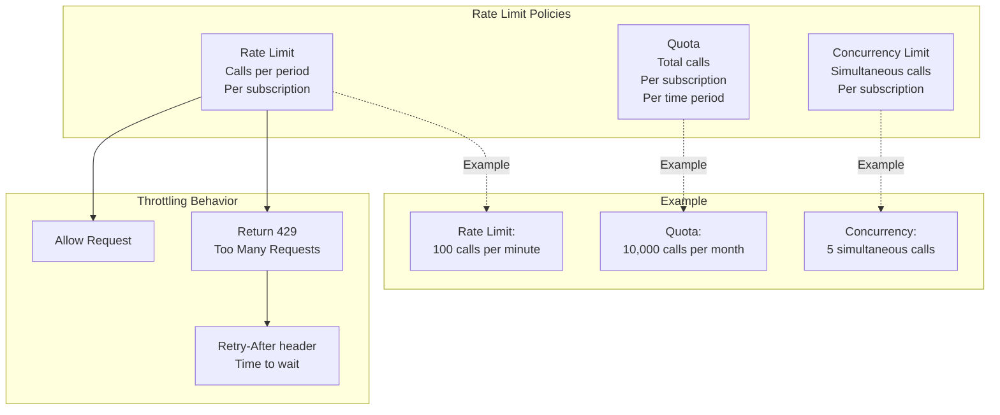

## Subscription Keys

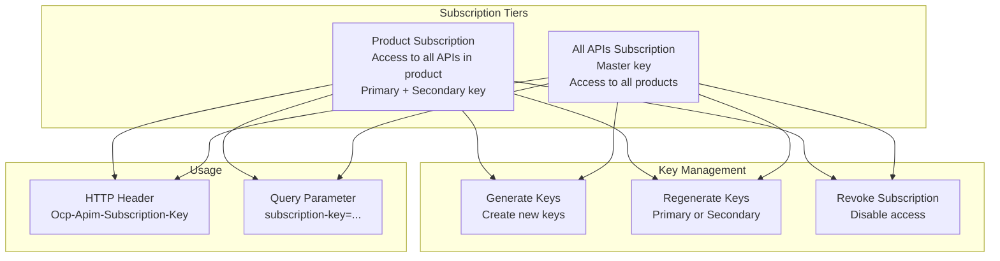

## Caching Strategy

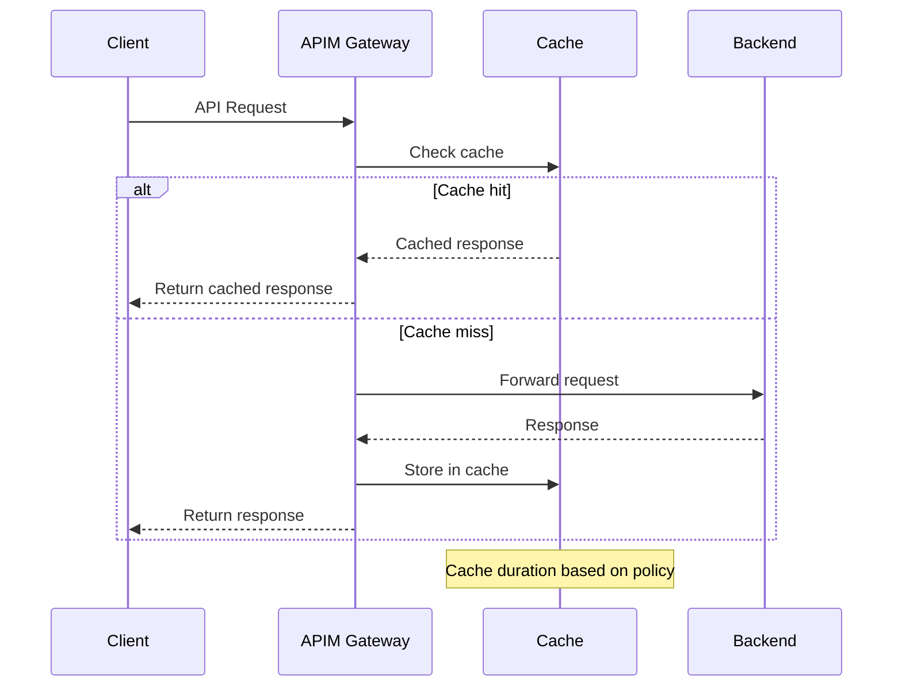

## Caching Policies

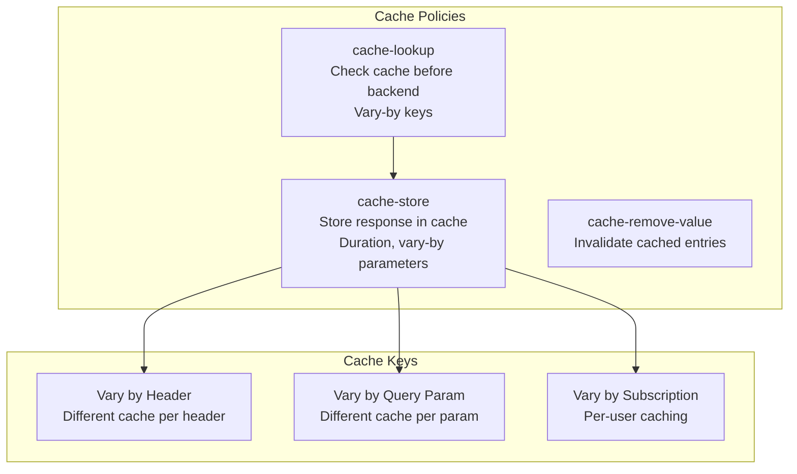

## Transformation Policies

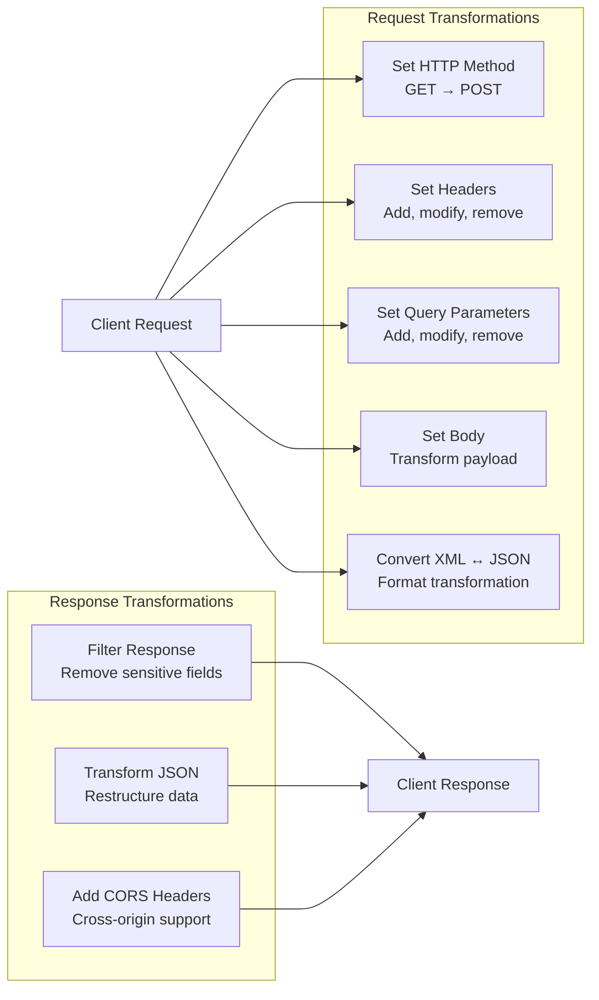

## Named Values & Backends

```mermaid
graph TB
    subgraph "Named Values"
        NV[Named Values<br/>Key-value pairs<br/>Configuration settings]
        
        subgraph "Types"
            Plain[Plain Text<br/>Non-sensitive]
            Secret[Secret<br/>Encrypted values]
            KeyVault[Key Vault<br/>Reference secrets]
        end
        
        Usage[Use in Policies<br/>{{named-value-key}}]
    end
    
    subgraph "Backends"
        Backend[Backend Entity<br/>Centralized backend config<br/>URL, authentication]
        
        BackendPolicy[set-backend-service<br/>Route to specific backend]
    end
    
    NV --> Plain & Secret & KeyVault
    Plain & Secret & KeyVault --> Usage
    Usage --> BackendPolicy
```

## Developer Portal

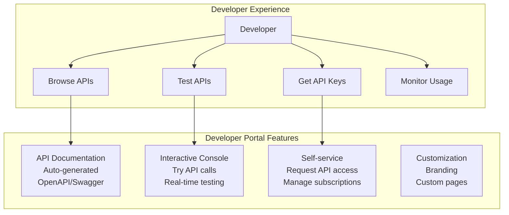

## Products and Groups

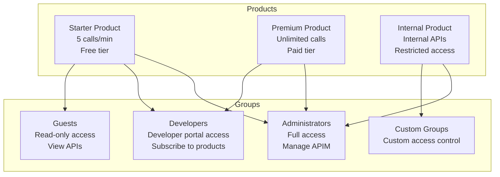

## API Versioning Strategies

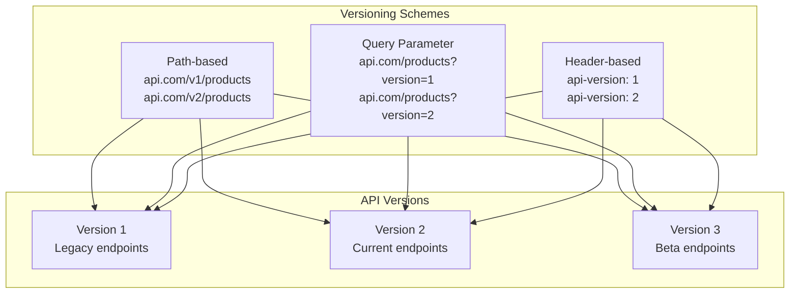

## Revisions vs Versions

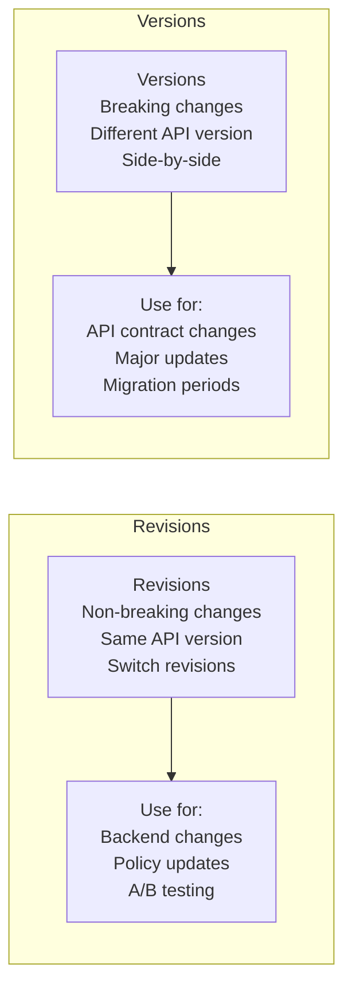

## Virtual Network Integration

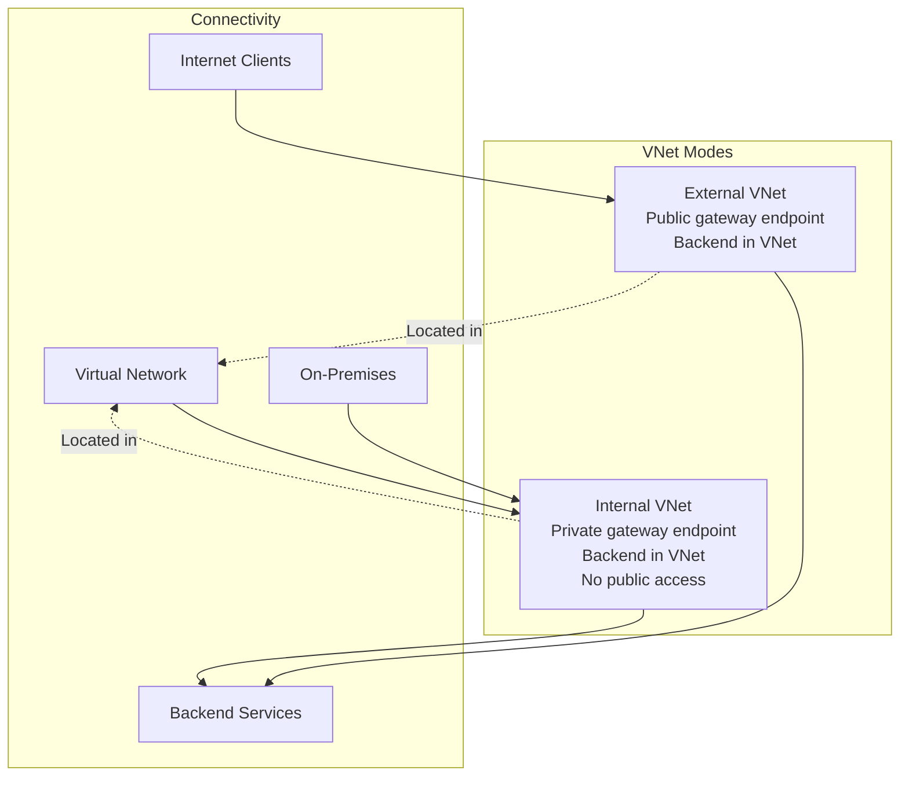

## Monitoring and Analytics

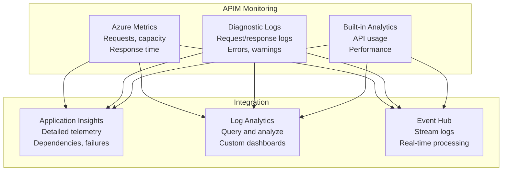

## Circuit Breaker Pattern

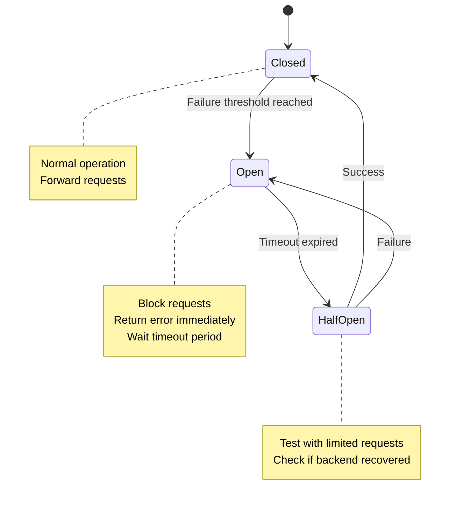

## Retry Policy

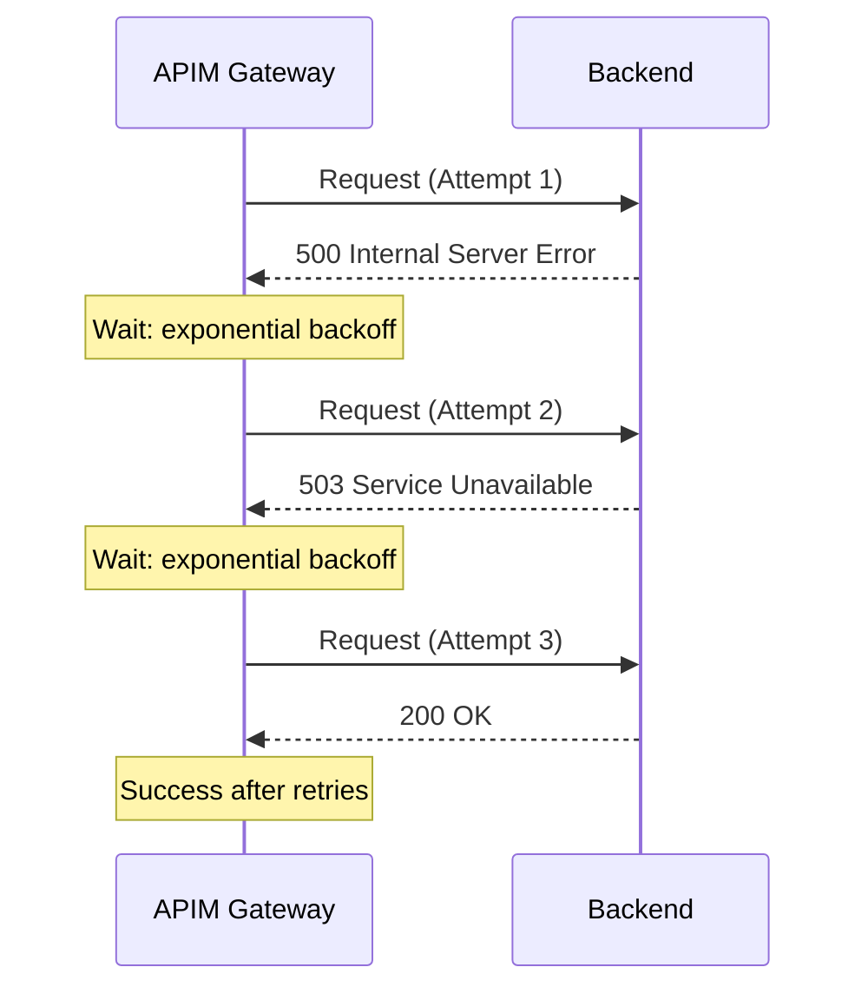

## Security Features

```mermaid
graph TB
    subgraph "API Security"
        OAuth[OAuth 2.0<br/>Validate JWT tokens<br/>Entra ID integration]
        
        Certificate[Client Certificates<br/>Mutual TLS<br/>Certificate validation]
        
        IP[IP Filtering<br/>Whitelist/Blacklist<br/>IP restrictions]
        
        CORS[CORS Policy<br/>Cross-origin requests<br/>Allowed origins]
    end
    
    subgraph "Advanced Security"
        WAF[Web Application Firewall<br/>OWASP protection<br/>Premium tier]
        
        Throttling[Throttling<br/>Rate limiting<br/>DDoS protection]
        
        VNet[Virtual Network<br/>Network isolation<br/>Private endpoints]
    end
    
    OAuth & Certificate & IP & CORS --> BasicSecurity[API Protection]
    WAF & Throttling & VNet --> AdvancedSecurity[Enterprise Security]
```

## Key Concepts Summary

### Components
- **Products**: Grouping of APIs with terms of use
- **APIs**: Backend service definitions
- **Operations**: HTTP methods and paths
- **Policies**: Request/response processing rules

### Service Tiers
- **Consumption**: Serverless, pay-per-use
- **Developer**: Dev/test, no SLA
- **Basic/Standard**: Production, 99.95% SLA
- **Premium**: Enterprise, 99.99% SLA, multi-region

### Policies
- **Inbound**: Before backend call (auth, transform)
- **Backend**: Before/after backend (retry, circuit breaker)
- **Outbound**: Before client response (transform, cache)
- **On-Error**: Error handling and logging

### Authentication
- **Subscription Keys**: Primary/secondary keys per product
- **JWT Validation**: OAuth 2.0 token validation
- **Client Certificates**: Mutual TLS authentication
- **Basic Auth**: Username/password (legacy)

### Rate Limiting
- **Rate Limit**: Calls per time period
- **Quota**: Total calls per period
- **Concurrency**: Simultaneous calls limit

### Caching
- **Duration**: Time to cache responses
- **Vary-by**: Cache key variations (header, query, subscription)
- **Internal Cache**: In-memory cache in gateway
- **External Cache**: Redis cache for Premium tier

### Versioning
- **Versions**: Breaking changes, side-by-side APIs
- **Revisions**: Non-breaking changes, switchable within version
- **Schemes**: Path, query parameter, header

### Developer Portal
- **Documentation**: Auto-generated API docs
- **Try-it-out**: Interactive API testing
- **Self-service**: Subscribe to products
- **Customization**: Branded portal

### Best Practices
1. **Use subscription keys** for basic API protection
2. **Implement JWT validation** for OAuth 2.0 APIs
3. **Apply rate limiting** to prevent abuse
4. **Cache responses** to reduce backend load
5. **Use named values** for configuration management
6. **Enable CORS** for browser-based clients
7. **Implement retry policies** for resilience
8. **Monitor with Application Insights** for visibility
9. **Use Premium tier** for production multi-region
10. **Version APIs** for backward compatibility
