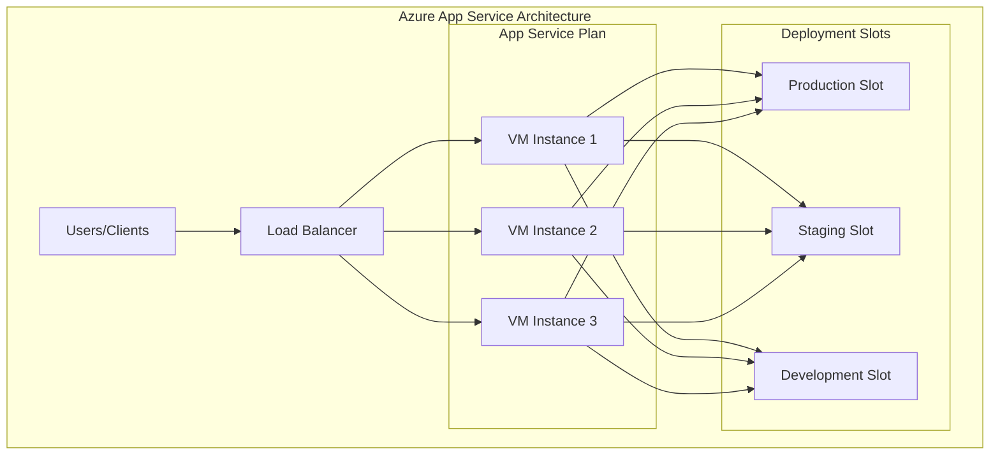
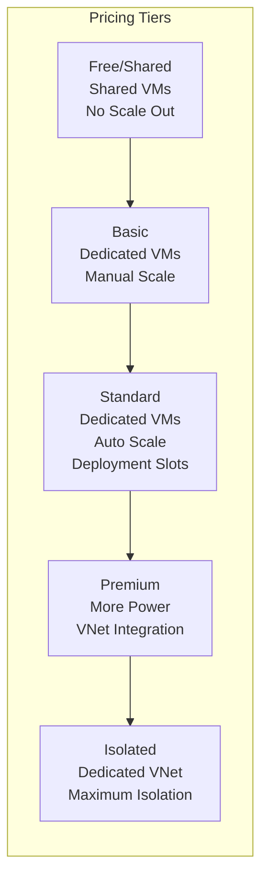
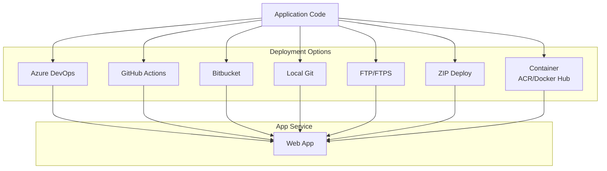
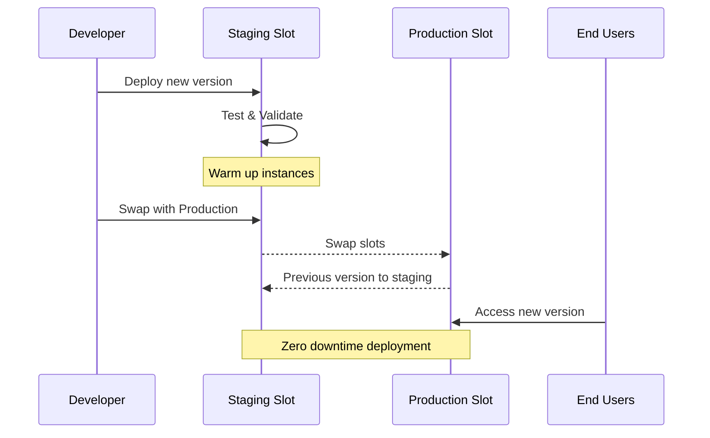
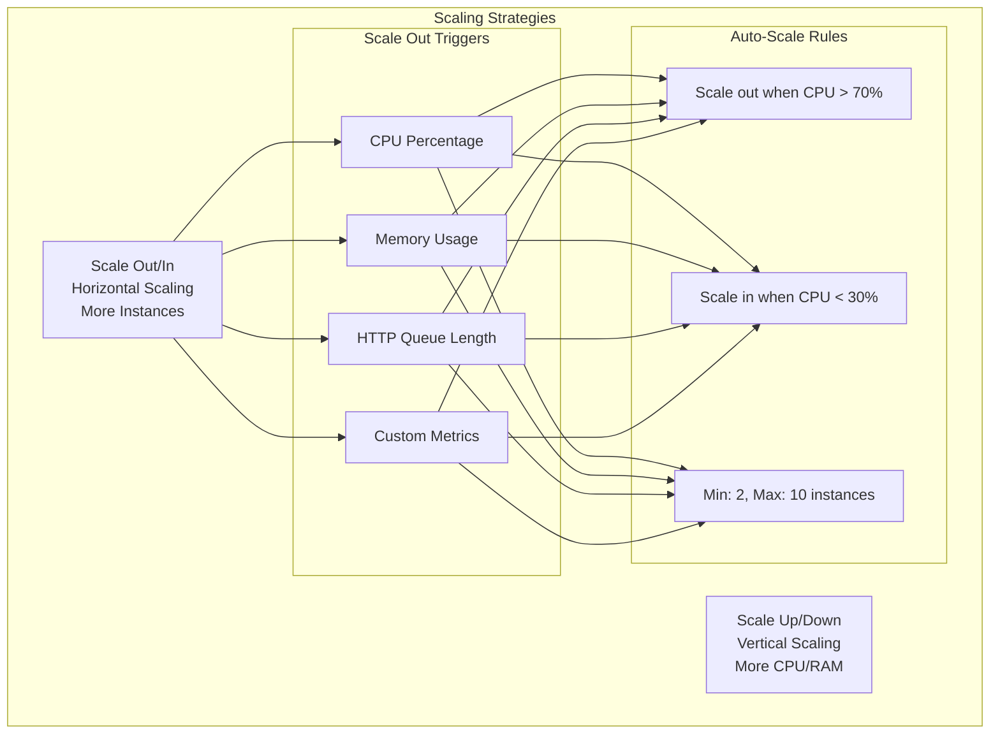
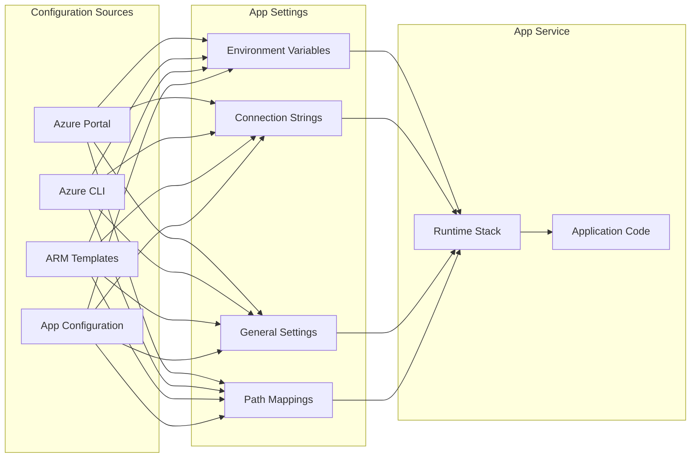
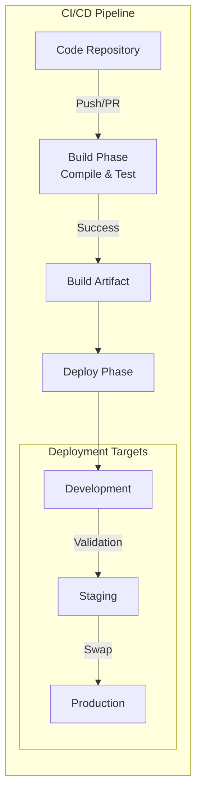
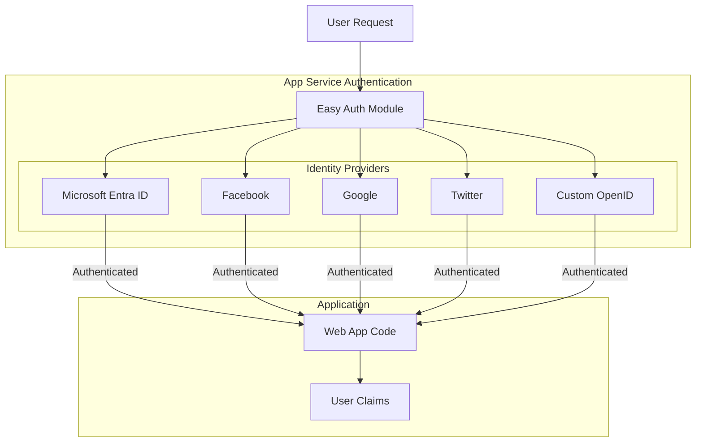
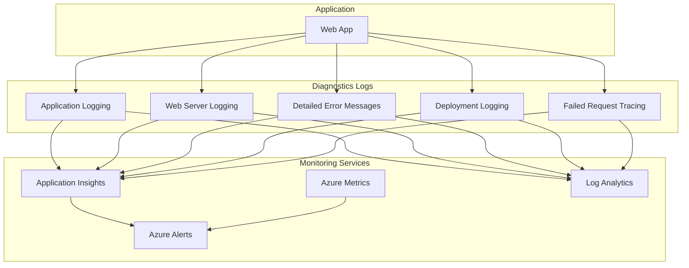
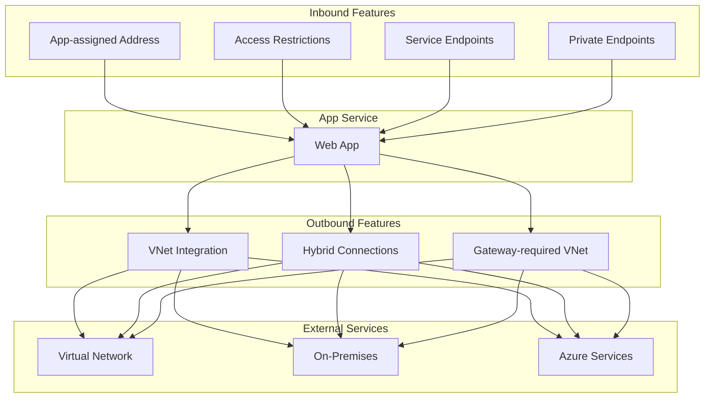

# Azure App Service Web Apps - Concepts Cheatsheet

## Overview
Azure App Service is an HTTP-based PaaS service for hosting web applications, REST APIs, and mobile backends with built-in auto-scaling, CI/CD, and deployment slots.

## Core Architecture

## App Service Plans & Pricing Tiers

## Deployment Methods

## Deployment Slots Workflow

## Scaling Options

## Application Settings & Configuration

## Continuous Deployment Pipeline

## Authentication & Authorization

## Monitoring & Diagnostics

## Networking Features

## Key Concepts Summary

### App Service Plans
- **Definition**: Compute resources container for web apps
- **Pricing Tiers**: Free, Shared, Basic, Standard, Premium, Isolated
- **Scale Unit**: All apps in plan scale together

### Deployment Slots
- **Purpose**: Zero-downtime deployments
- **Features**: Separate hostnames, swap functionality, traffic routing
- **Requirement**: Standard tier or higher

### Auto-Scaling
- **Scale Up/Down**: Change VM size (vertical)
- **Scale Out/In**: Change instance count (horizontal)
- **Triggers**: CPU, Memory, HTTP queue, Custom metrics

### Networking
- **Inbound**: Access restrictions, Private endpoints, Service endpoints
- **Outbound**: VNet integration, Hybrid connections
- **Isolation**: App Service Environment (ASE)

### Configuration
- **App Settings**: Environment variables
- **Connection Strings**: Database connections
- **Slot Settings**: Stick to slot or swap with app

### Monitoring
- **Application Insights**: APM and analytics
- **Diagnostic Logs**: Application and web server logs
- **Metrics**: CPU, Memory, HTTP requests
- **Alerts**: Proactive monitoring

### Security
- **Authentication**: Easy Auth with multiple providers
- **Managed Identity**: Access Azure resources without credentials
- **SSL/TLS**: Custom domains with certificates
- **Key Vault**: Store secrets securely

## Best Practices

1. **Use Deployment Slots** for staging and testing
2. **Enable Auto-Scale** for production workloads
3. **Configure Health Checks** for instance monitoring
4. **Use VNet Integration** for secure backend access
5. **Implement Application Insights** for monitoring
6. **Store secrets in Key Vault** via Managed Identity
7. **Use Slot Settings** for environment-specific config
8. **Enable Diagnostic Logs** for troubleshooting
