# Azure Functions - Concepts Cheatsheet

## Overview
Azure Functions is a serverless compute service that enables event-driven code execution without managing infrastructure. Pay only for the compute time you consume.

## Azure Functions Architecture

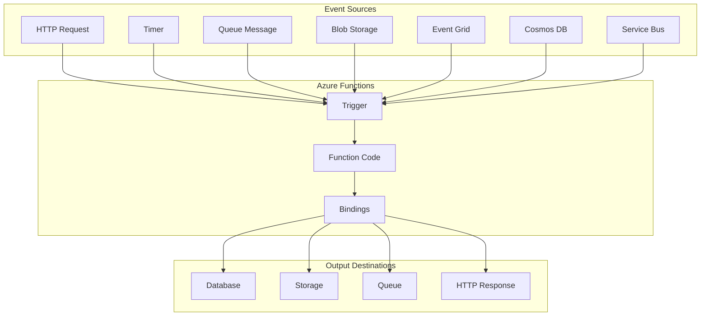

## Hosting Plans Comparison

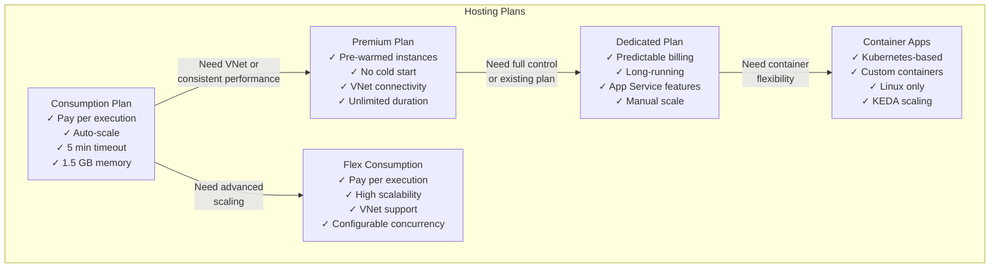

## Triggers and Bindings

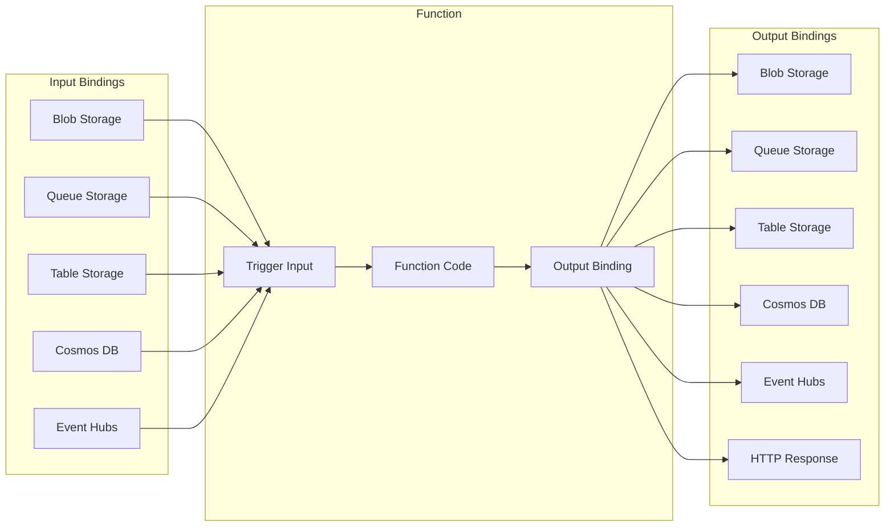

## Common Trigger Types

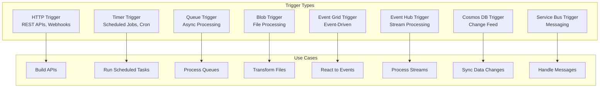

## Function App Execution Flow

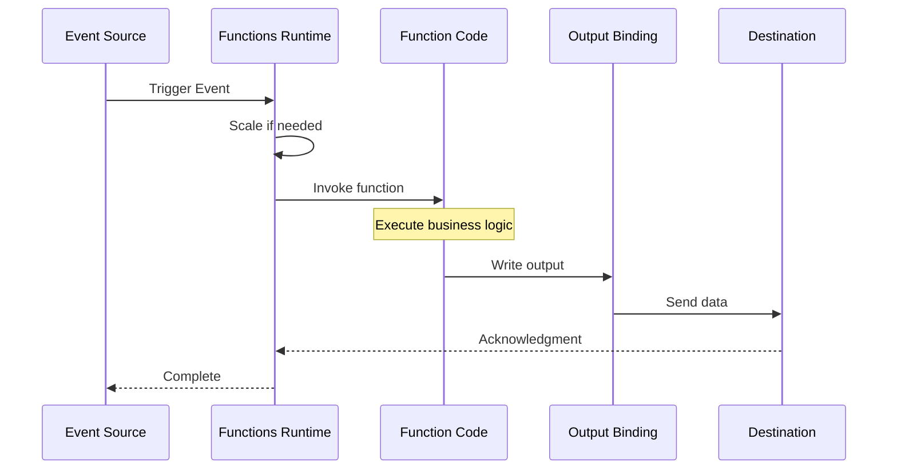

## Durable Functions Patterns

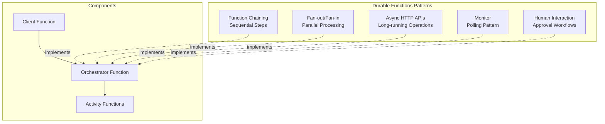

## Function Chaining Pattern

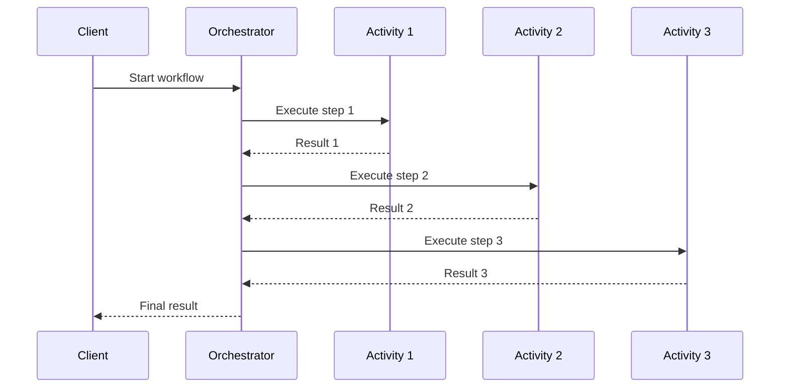

## Fan-out/Fan-in Pattern

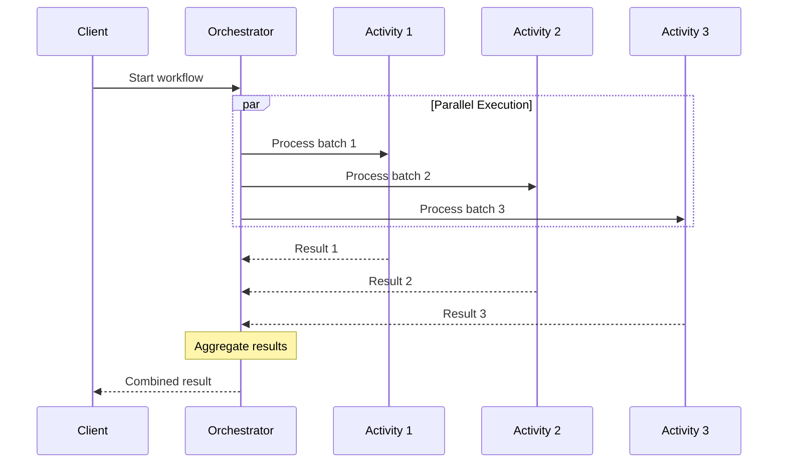

## Cold Start vs Warm Start

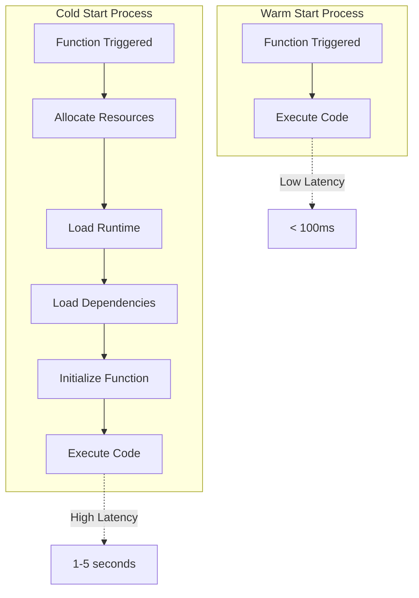

## Scaling Behavior

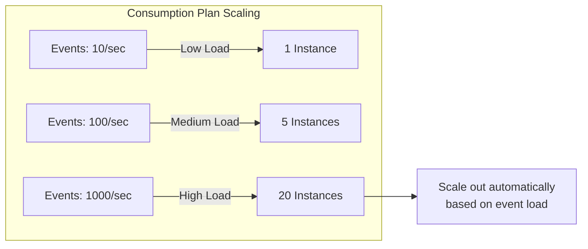

## Configuration & Settings

```mermaid
graph TB
    subgraph "Function Configuration"
        Host[host.json<br/>Global Settings]
        Local[local.settings.json<br/>Local Development]
        AppSettings[Application Settings<br/>Azure Portal/CLI]
    end
    
    subgraph "Settings Types"
        Runtime[Runtime Version]
        Timeout[Function Timeout]
        Concurrency[Concurrency Limits]
        Extensions[Extension Bundles]
        Logging[Logging Level]
    end
    
    subgraph "Storage"
        Storage[Storage Account<br/>Required for state]
    end
    
    Host & Local & AppSettings --> Runtime & Timeout & Concurrency & Extensions & Logging
    Runtime & Timeout & Concurrency & Extensions & Logging --> Storage
```

## Function App Lifecycle

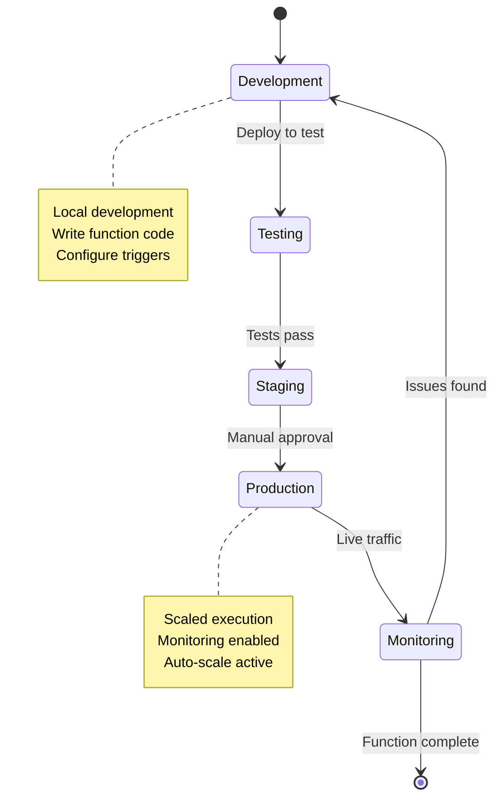

## Bindings Configuration Example

```mermaid
graph LR
    subgraph "function.json"
        Config[{<br/>'bindings': [<br/>  {<br/>    'type': 'queueTrigger',<br/>    'name': 'msg',<br/>    'queueName': 'orders'<br/>  },<br/>  {<br/>    'type': 'table',<br/>    'name': 'outputTable',<br/>    'tableName': 'Orders',<br/>    'direction': 'out'<br/>  }<br/>]<br/>}]
    end
    
    QueueTrigger[Queue Trigger<br/>Input] --> FunctionCode[Function Code]
    FunctionCode --> TableOutput[Table Storage<br/>Output]
```

## Authentication & Security

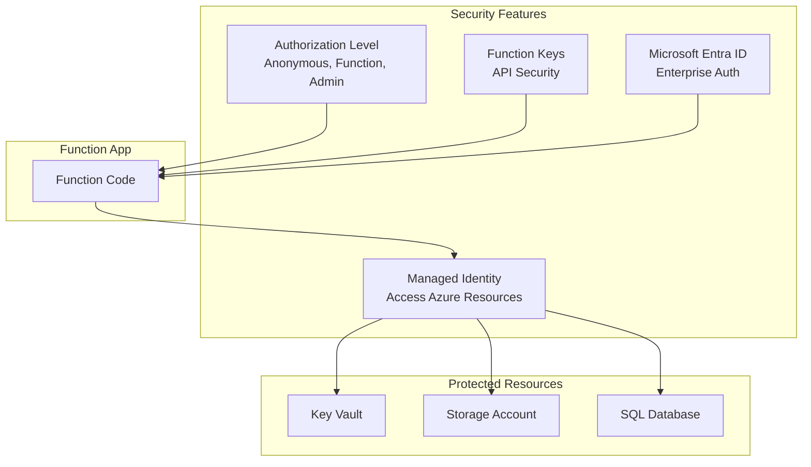

## Monitoring & Diagnostics

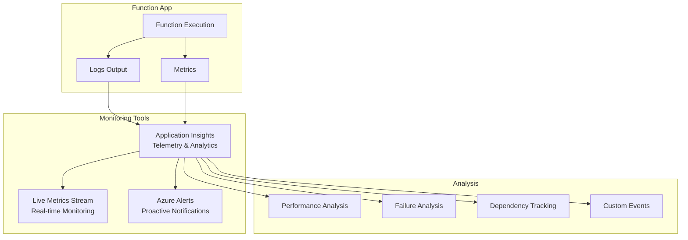

## Key Concepts Summary

### Triggers
- **Definition**: What causes a function to run
- **Types**: HTTP, Timer, Queue, Blob, Event Grid, Event Hub, Cosmos DB, Service Bus
- **Limit**: One trigger per function

### Bindings
- **Input Bindings**: Read data from external sources
- **Output Bindings**: Write data to external destinations
- **Declarative**: Configured in function.json or attributes
- **No Connection Code**: Framework handles connections

### Hosting Plans
- **Consumption**: Pay-per-execution, auto-scale
- **Flex Consumption**: Enhanced scaling with VNet support
- **Premium**: Pre-warmed, VNet, no cold start
- **Dedicated**: App Service plan, predictable billing
- **Container Apps**: Kubernetes-based, custom containers

### Durable Functions
- **Orchestration**: Coordinate multiple functions
- **State Management**: Automatic state persistence
- **Patterns**: Chaining, Fan-out/Fan-in, Async HTTP, Monitor
- **Use Cases**: Long-running workflows, human interaction

### Scaling
- **Automatic**: Based on event rate (Consumption/Premium)
- **Manual**: Fixed instances (Dedicated)
- **Per-function**: HTTP scales independently
- **Concurrent Executions**: Configurable per trigger type

### Configuration
- **host.json**: Global function app settings
- **local.settings.json**: Local development settings
- **Application Settings**: Environment variables in Azure
- **Connection Strings**: Stored in app settings or Key Vault

### Security
- **Authorization Levels**: Anonymous, Function, Admin
- **Function Keys**: Secure API access
- **Managed Identity**: Access Azure resources without credentials
- **API Management**: Enterprise API gateway

### Best Practices
1. **Use Consumption Plan** for event-driven, variable workloads
2. **Use Premium Plan** to avoid cold starts
3. **Keep functions small** and single-purpose
4. **Use Durable Functions** for complex workflows
5. **Configure timeouts** appropriately
6. **Implement retry logic** for resilience
7. **Use Application Insights** for monitoring
8. **Store secrets in Key Vault** via Managed Identity
9. **Use async/await** for I/O operations
10. **Optimize dependencies** to reduce cold start time
