# Azure Container Solutions - Concepts Cheatsheet

## Overview
Azure provides multiple container services: Container Registry (ACR) for storing images, Container Instances (ACI) for simple deployments, and Container Apps for microservices.

## Azure Container Services Landscape

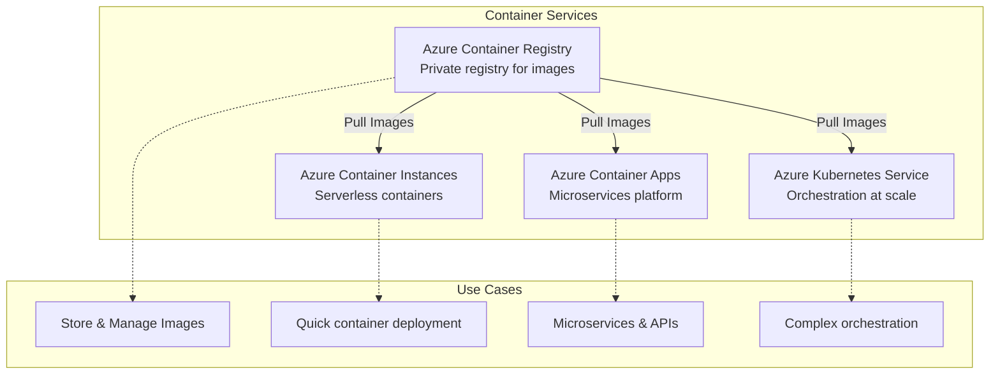

## Azure Container Registry Architecture

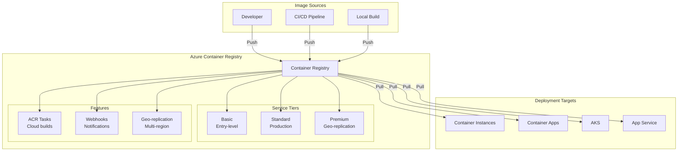

## ACR Tasks Workflow

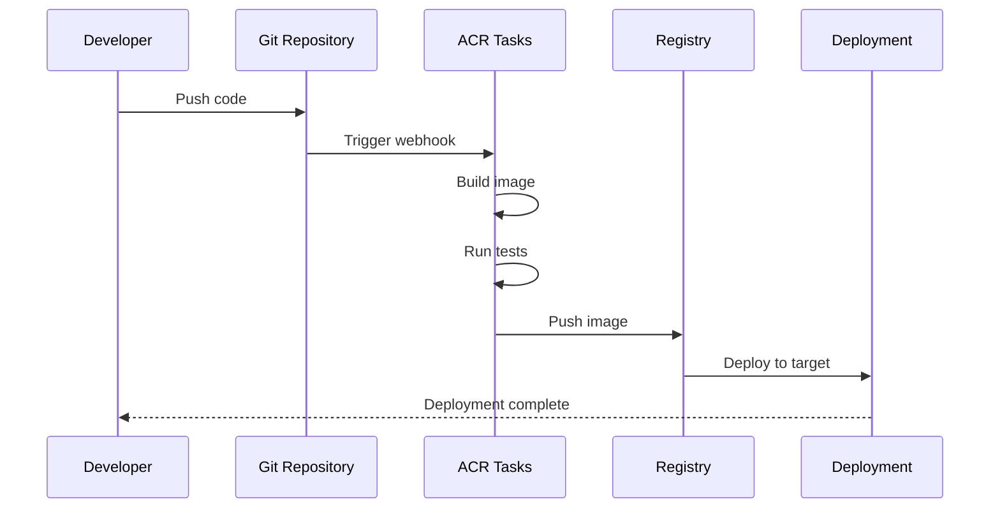

## ACR Task Triggers

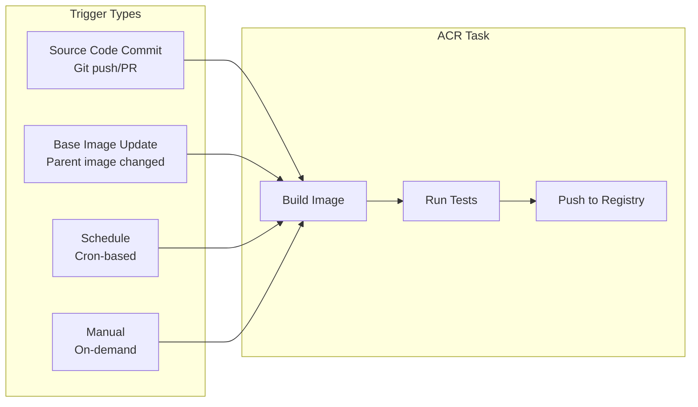

## Azure Container Instances Architecture

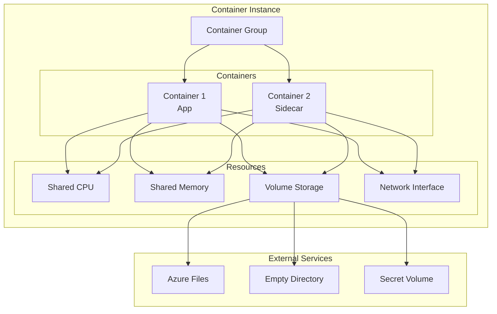

## Container Groups

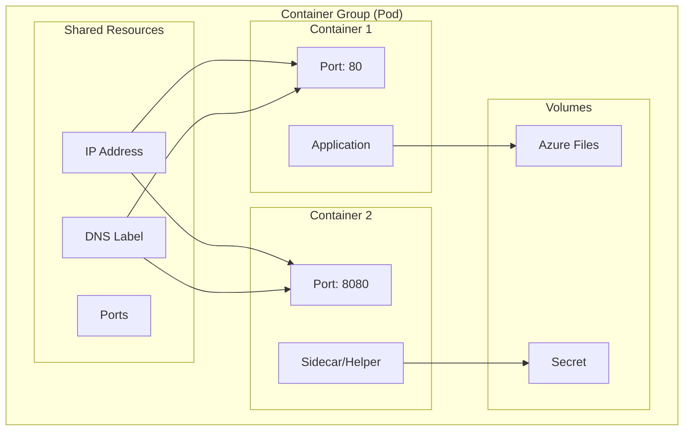

## Azure Container Apps Architecture

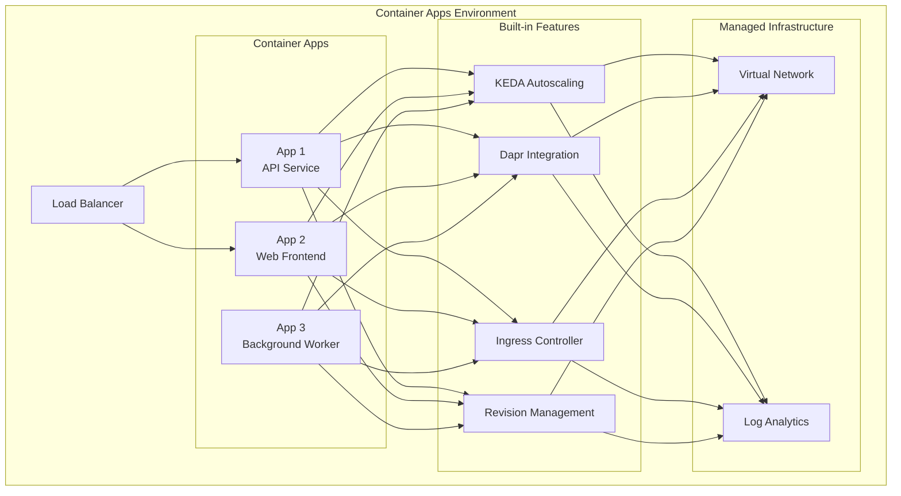

## Container Apps Scaling

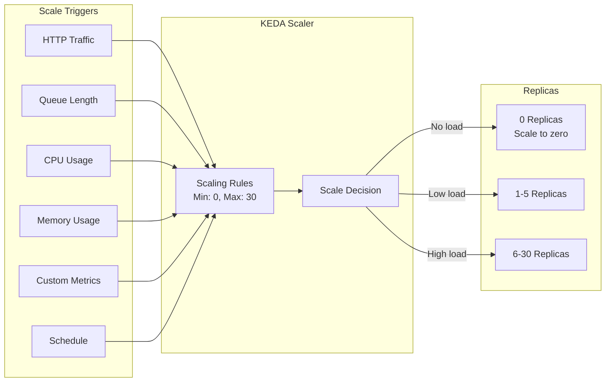

## Container Apps Revisions

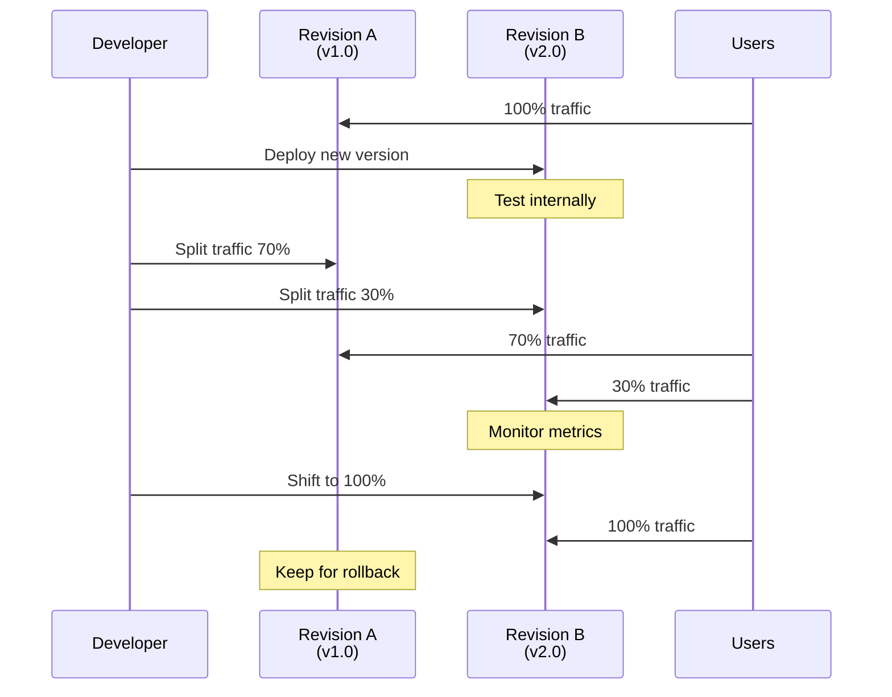

## Container Deployment Workflow

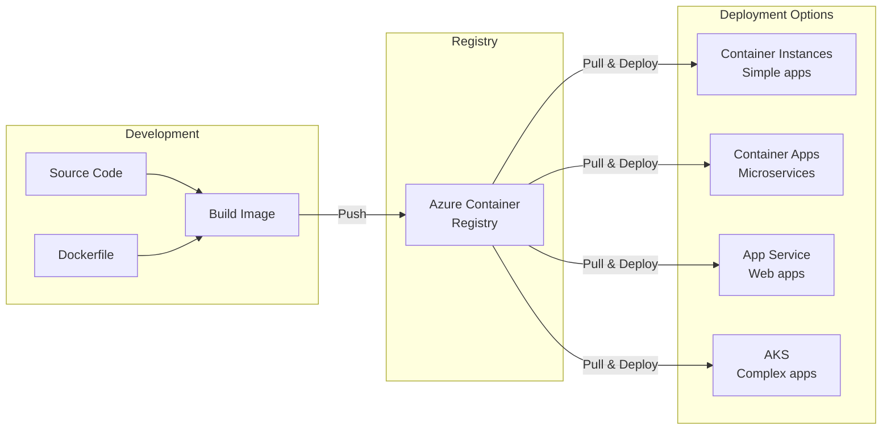

## Multi-Container Deployment

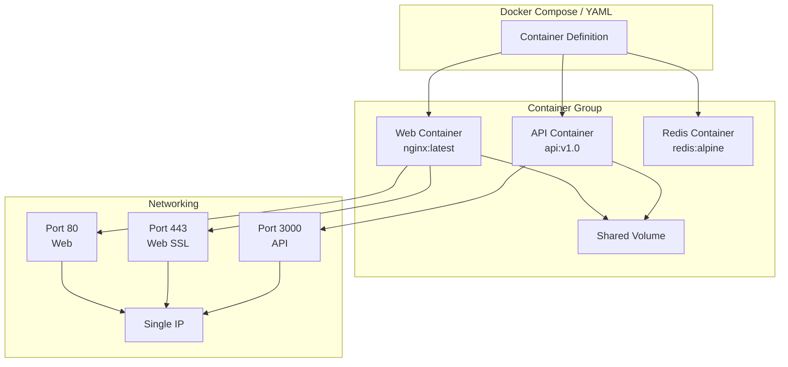

## Container Apps with Dapr

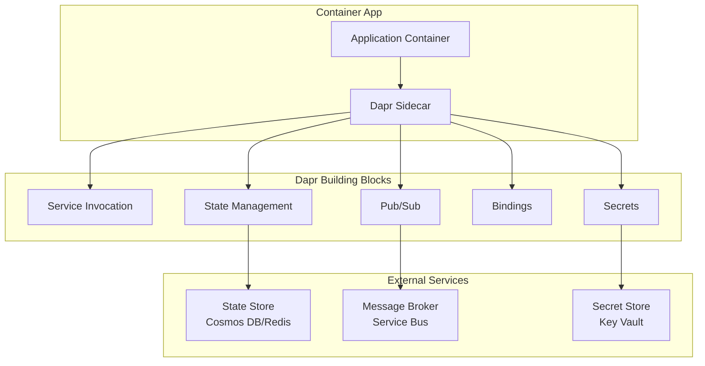

## Container Networking

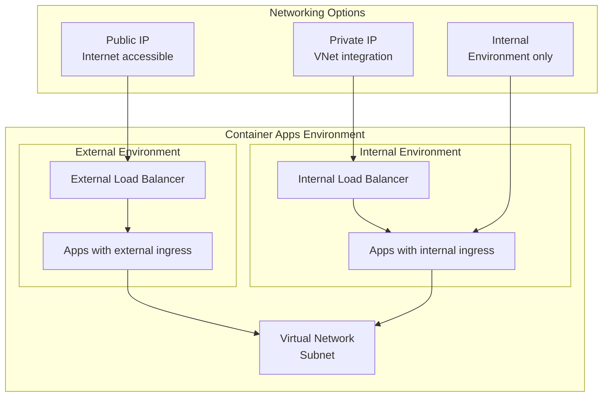

## Container Security

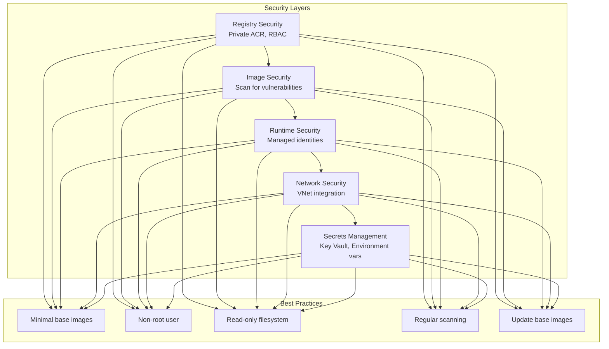

## Monitoring & Logging

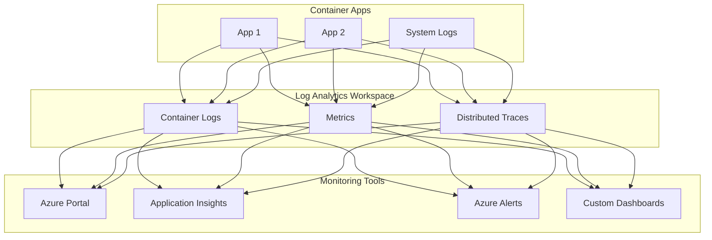

## Key Concepts Summary

### Azure Container Registry (ACR)
- **Purpose**: Private Docker registry
- **Tiers**: Basic, Standard, Premium
- **Features**: Tasks, Webhooks, Geo-replication
- **Use Cases**: Store images, build in cloud, automate workflows

### Azure Container Instances (ACI)
- **Purpose**: Serverless container deployment
- **Features**: Fast startup, per-second billing, container groups
- **Networking**: Public IP, VNet integration, DNS labels
- **Use Cases**: Batch jobs, task automation, CI/CD build agents

### Azure Container Apps
- **Purpose**: Microservices platform
- **Features**: KEDA scaling, Dapr, revisions, ingress
- **Scaling**: Scale to zero, event-driven, HTTP autoscaling
- **Use Cases**: Microservices, APIs, background workers, event processing

### Container Groups (ACI)
- **Definition**: Collection of containers on same host
- **Sharing**: IP address, ports, storage volumes
- **Scheduling**: Co-located and co-scheduled
- **Networking**: External and internal connectivity

### ACR Tasks
- **Quick Task**: Build and push on-demand
- **Auto Triggered**: Source commit, base image update, schedule
- **Multi-step**: Complex workflows with multiple steps
- **Platform**: Linux, Windows, ARM builds

### Container Apps Environment
- **Boundary**: Logical boundary for container apps
- **Networking**: VNet integration, custom domains
- **Monitoring**: Log Analytics workspace
- **Dapr**: Distributed application runtime

### Scaling Strategies
- **ACI**: Manual scaling (instance count)
- **Container Apps**: Auto-scale with KEDA (0-N replicas)
- **Triggers**: HTTP, Queue, CPU, Memory, Custom, Cron
- **Scale to Zero**: Container Apps only

### Storage Options
- **Azure Files**: Persistent SMB share
- **Empty Directory**: Temporary storage
- **Secret**: Secure credential storage
- **Container Apps Storage**: Persistent volumes

### Best Practices
1. **Use ACR Premium** for geo-replication and VNet
2. **Implement health checks** for container readiness
3. **Use minimal base images** (Alpine, Distroless)
4. **Scan images** for vulnerabilities regularly
5. **Use managed identities** instead of credentials
6. **Store secrets in Key Vault** not environment vars
7. **Implement retry logic** for resilience
8. **Use Container Apps** for microservices over ACI
9. **Enable logging** to Log Analytics
10. **Set resource limits** (CPU, Memory) appropriately
