# Azure Secure Solutions - Concepts Cheatsheet

## Overview
Azure provides comprehensive security services including Key Vault for secrets management, Managed Identities for passwordless authentication, and App Configuration for centralized settings management.

## Azure Security Services Landscape

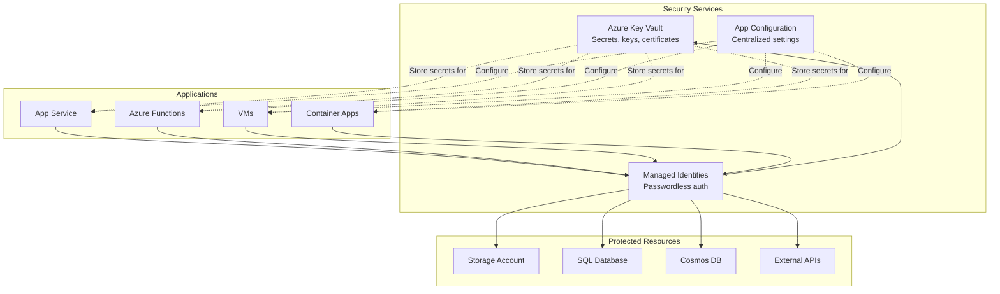
```mermaid
graph TB
    subgraph "Security Services"
        KeyVault[Azure Key Vault<br/>Secrets, keys, certificates]
        ManagedID[Managed Identities<br/>Passwordless auth]
        AppConfig[App Configuration<br/>Centralized settings]
    end
    
    subgraph "Applications"
        App1[App Service]
        App2[Azure Functions]
        App3[VMs]
        App4[Container Apps]
    end
    
    subgraph "Protected Resources"
        Storage[Storage Account]
        SQL[SQL Database]
        CosmosDB[Cosmos DB]
        APIs[External APIs]
    end
    
    App1 & App2 & App3 & App4 --> ManagedID
    ManagedID --> KeyVault & Storage & SQL & CosmosDB & APIs
    KeyVault -.Store secrets for.-> App1 & App2 & App3 & App4
    AppConfig -.Configure.-> App1 & App2 & App3 & App4
```

## Azure Key Vault Architecture

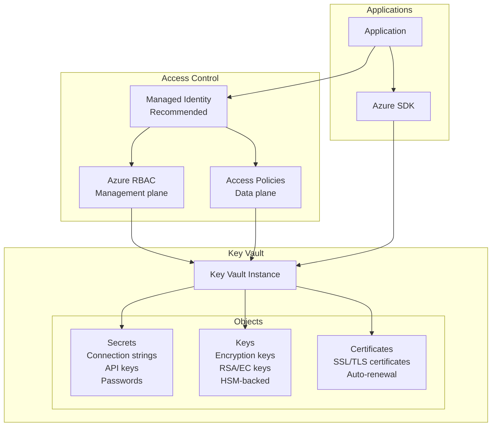
```mermaid
graph TB
    subgraph "Key Vault"
        Vault[Key Vault Instance]
        
        subgraph "Objects"
            Secrets[Secrets<br/>Connection strings<br/>API keys<br/>Passwords]
            
            Keys[Keys<br/>Encryption keys<br/>RSA/EC keys<br/>HSM-backed]
            
            Certificates[Certificates<br/>SSL/TLS certificates<br/>Auto-renewal]
        end
    end
    
    subgraph "Access Control"
        RBAC[Azure RBAC<br/>Management plane]
        AccessPolicy[Access Policies<br/>Data plane]
        ManagedID[Managed Identity<br/>Recommended]
    end
    
    subgraph "Applications"
        App[Application]
        SDK[Azure SDK]
    end
    
    Vault --> Secrets & Keys & Certificates
    App --> ManagedID
    ManagedID --> RBAC & AccessPolicy
    RBAC & AccessPolicy --> Vault
    App --> SDK --> Vault
```

## Key Vault Tiers

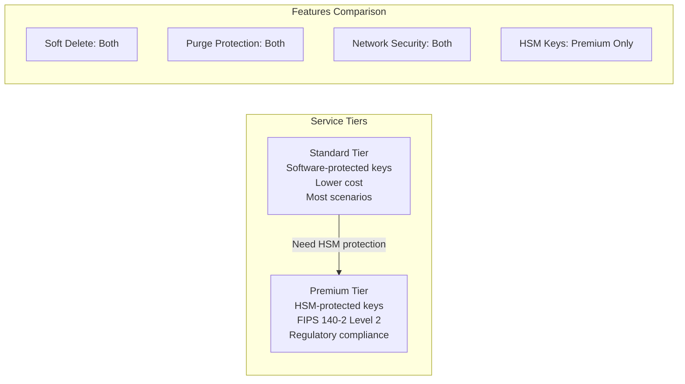
```mermaid
graph LR
    subgraph "Service Tiers"
        Standard[Standard Tier<br/>Software-protected keys<br/>Lower cost<br/>Most scenarios]
        
        Premium[Premium Tier<br/>HSM-protected keys<br/>FIPS 140-2 Level 2<br/>Regulatory compliance]
    end
    
    Standard -->|Need HSM protection| Premium
    
    subgraph "Features Comparison"
        Soft[Soft Delete: Both]
        Purge[Purge Protection: Both]
        Network[Network Security: Both]
        HSM[HSM Keys: Premium Only]
    end
```

## Managed Identities Types

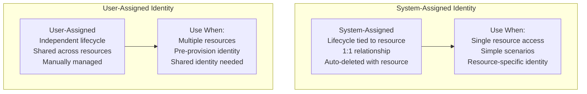
```mermaid
graph TB
    subgraph "System-Assigned Identity"
        SA[System-Assigned<br/>Lifecycle tied to resource<br/>1:1 relationship<br/>Auto-deleted with resource]
        
        SAUse[Use When:<br/>Single resource access<br/>Simple scenarios<br/>Resource-specific identity]
    end
    
    subgraph "User-Assigned Identity"
        UA[User-Assigned<br/>Independent lifecycle<br/>Shared across resources<br/>Manually managed]
        
        UAUse[Use When:<br/>Multiple resources<br/>Pre-provision identity<br/>Shared identity needed]
    end
    
    SA --> SAUse
    UA --> UAUse
```

## Managed Identity Authentication Flow

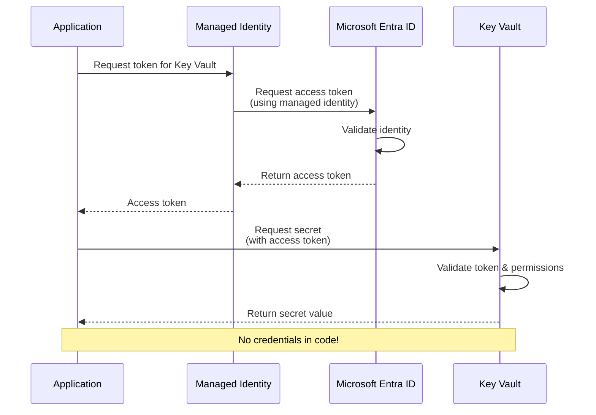
```mermaid
sequenceDiagram
    participant App as Application
    participant MI as Managed Identity
    participant EntraID as Microsoft Entra ID
    participant KV as Key Vault
    
    App->>MI: Request token for Key Vault
    MI->>EntraID: Request access token<br/>(using managed identity)
    EntraID->>EntraID: Validate identity
    EntraID-->>MI: Return access token
    MI-->>App: Access token
    App->>KV: Request secret<br/>(with access token)
    KV->>KV: Validate token & permissions
    KV-->>App: Return secret value
    
    Note over App,KV: No credentials in code!
```

## Key Vault Access Patterns

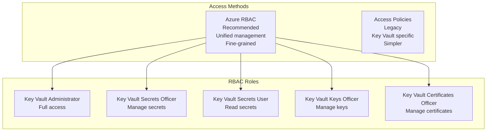
```mermaid
graph TB
    subgraph "Access Methods"
        RBAC[Azure RBAC<br/>Recommended<br/>Unified management<br/>Fine-grained]
        
        Policy[Access Policies<br/>Legacy<br/>Key Vault specific<br/>Simpler]
    end
    
    subgraph "RBAC Roles"
        Admin[Key Vault Administrator<br/>Full access]
        SecretOfficer[Key Vault Secrets Officer<br/>Manage secrets]
        SecretUser[Key Vault Secrets User<br/>Read secrets]
        KeysOfficer[Key Vault Keys Officer<br/>Manage keys]
        CertsOfficer[Key Vault Certificates Officer<br/>Manage certificates]
    end
    
    RBAC --> Admin & SecretOfficer & SecretUser & KeysOfficer & CertsOfficer
```

## Key Vault Secrets Management

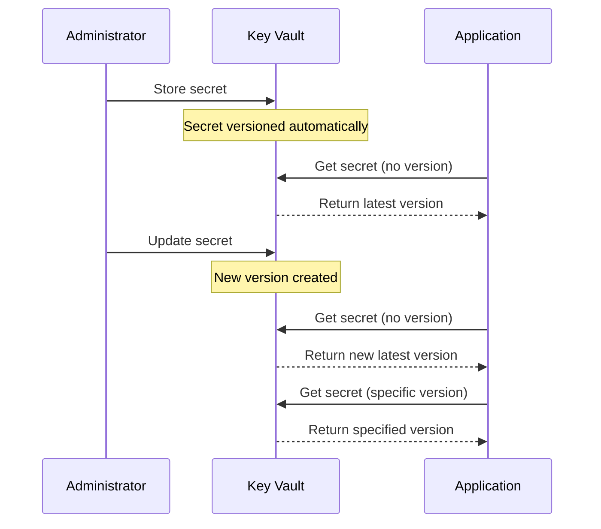
```mermaid
sequenceDiagram
    participant Admin as Administrator
    participant KV as Key Vault
    participant App as Application
    
    Admin->>KV: Store secret
    Note over KV: Secret versioned automatically
    
    App->>KV: Get secret (no version)
    KV-->>App: Return latest version
    
    Admin->>KV: Update secret
    Note over KV: New version created
    
    App->>KV: Get secret (no version)
    KV-->>App: Return new latest version
    
    App->>KV: Get secret (specific version)
    KV-->>App: Return specified version
```

## Secret Versioning

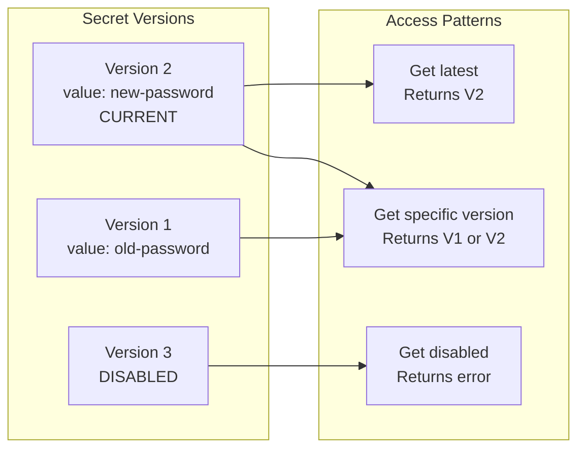
```mermaid
graph LR
    subgraph "Secret Versions"
        V1[Version 1<br/>value: old-password]
        V2[Version 2<br/>value: new-password<br/>CURRENT]
        V3[Version 3<br/>DISABLED]
    end
    
    subgraph "Access Patterns"
        Latest[Get latest<br/>Returns V2]
        Specific[Get specific version<br/>Returns V1 or V2]
        Disabled[Get disabled<br/>Returns error]
    end
    
    V2 --> Latest
    V1 & V2 --> Specific
    V3 --> Disabled
```

## Key Vault Networking

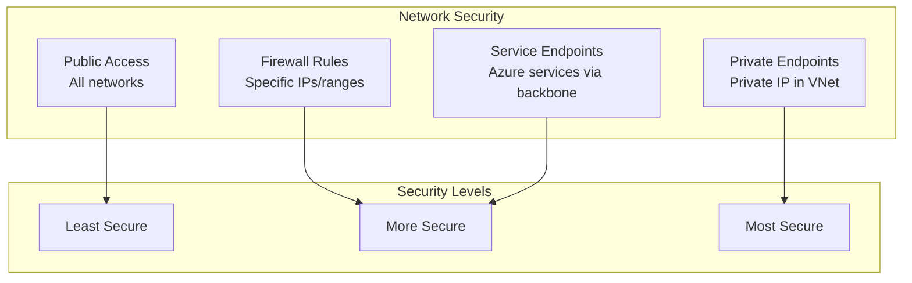
```mermaid
graph TB
    subgraph "Network Security"
        Public[Public Access<br/>All networks]
        
        Firewall[Firewall Rules<br/>Specific IPs/ranges]
        
        ServiceEndpoint[Service Endpoints<br/>Azure services via backbone]
        
        PrivateEndpoint[Private Endpoints<br/>Private IP in VNet]
    end
    
    subgraph "Security Levels"
        L1[Least Secure]
        L2[More Secure]
        L3[Most Secure]
    end
    
    Public --> L1
    Firewall & ServiceEndpoint --> L2
    PrivateEndpoint --> L3
```

## Azure App Configuration Architecture

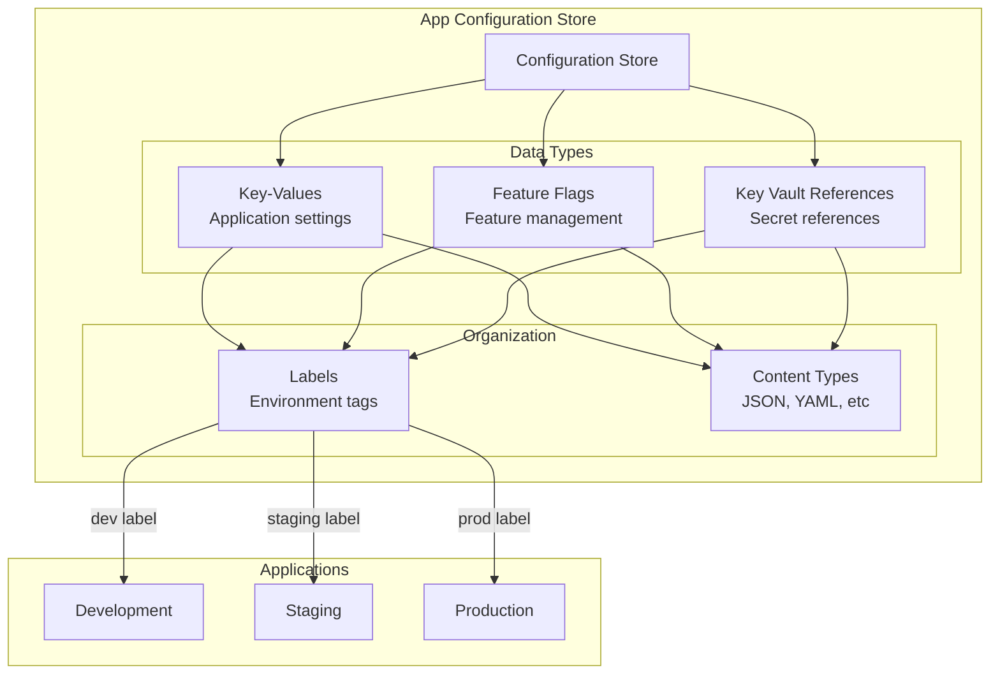
```mermaid
graph TB
    subgraph "App Configuration Store"
        Store[Configuration Store]
        
        subgraph "Data Types"
            KV[Key-Values<br/>Application settings]
            FF[Feature Flags<br/>Feature management]
            KVRef[Key Vault References<br/>Secret references]
        end
        
        subgraph "Organization"
            Labels[Labels<br/>Environment tags]
            ContentType[Content Types<br/>JSON, YAML, etc]
        end
    end
    
    subgraph "Applications"
        Dev[Development]
        Stage[Staging]
        Prod[Production]
    end
    
    Store --> KV & FF & KVRef
    KV & FF & KVRef --> Labels & ContentType
    Labels -->|dev label| Dev
    Labels -->|staging label| Stage
    Labels -->|prod label| Prod
```

## App Configuration vs Key Vault

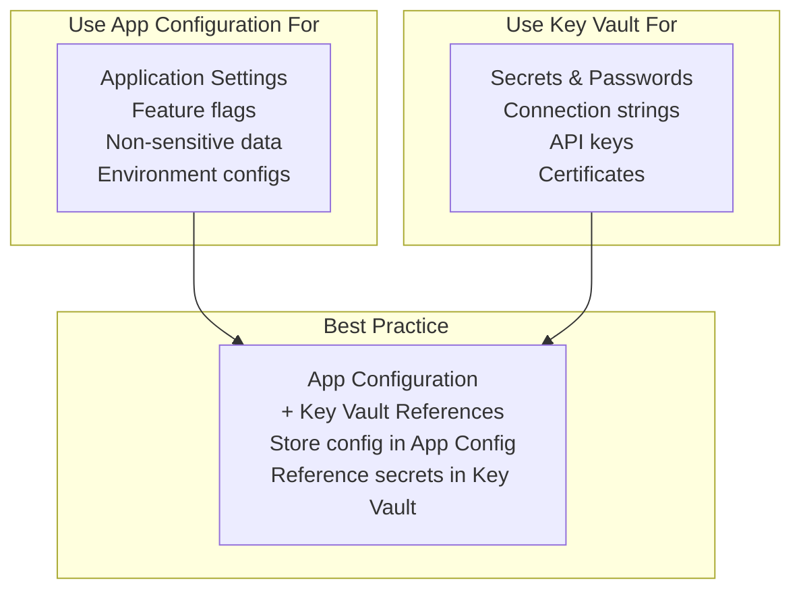
```mermaid
graph TB
    subgraph "Use App Configuration For"
        AppSettings[Application Settings<br/>Feature flags<br/>Non-sensitive data<br/>Environment configs]
    end
    
    subgraph "Use Key Vault For"
        Secrets[Secrets & Passwords<br/>Connection strings<br/>API keys<br/>Certificates]
    end
    
    subgraph "Best Practice"
        Combined[App Configuration<br/>+ Key Vault References<br/>Store config in App Config<br/>Reference secrets in Key Vault]
    end
    
    AppSettings & Secrets --> Combined
```

## Feature Flags

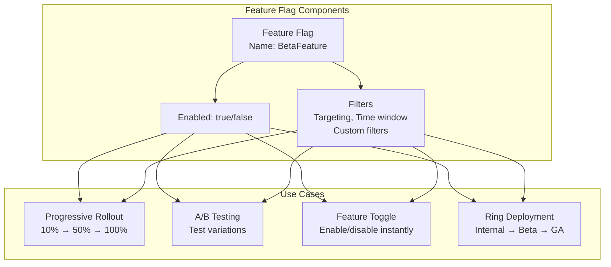
```mermaid
graph TB
    subgraph "Feature Flag Components"
        Flag[Feature Flag<br/>Name: BetaFeature]
        
        Enabled[Enabled: true/false]
        
        Filters[Filters<br/>Targeting, Time window<br/>Custom filters]
    end
    
    subgraph "Use Cases"
        Rollout[Progressive Rollout<br/>10% → 50% → 100%]
        
        ABTest[A/B Testing<br/>Test variations]
        
        Toggle[Feature Toggle<br/>Enable/disable instantly]
        
        Ring[Ring Deployment<br/>Internal → Beta → GA]
    end
    
    Flag --> Enabled & Filters
    Enabled & Filters --> Rollout & ABTest & Toggle & Ring
```

## Feature Flag Workflow

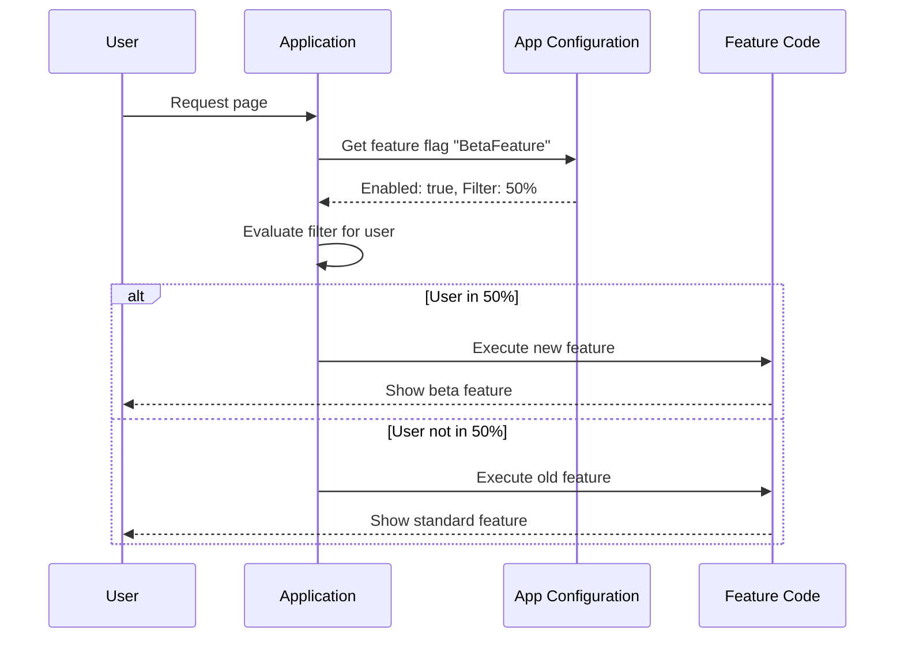
```mermaid
sequenceDiagram
    participant User
    participant App as Application
    participant AppConfig as App Configuration
    participant Feature as Feature Code
    
    User->>App: Request page
    App->>AppConfig: Get feature flag "BetaFeature"
    AppConfig-->>App: Enabled: true, Filter: 50%
    App->>App: Evaluate filter for user
    
    alt User in 50%
        App->>Feature: Execute new feature
        Feature-->>User: Show beta feature
    else User not in 50%
        App->>Feature: Execute old feature
        Feature-->>User: Show standard feature
    end
```

## Configuration Refresh Strategies

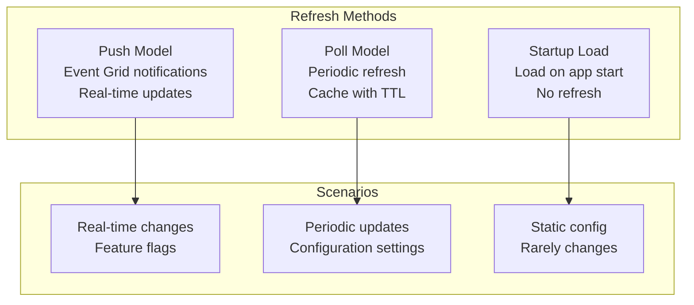
```mermaid
graph TB
    subgraph "Refresh Methods"
        Push[Push Model<br/>Event Grid notifications<br/>Real-time updates]
        
        Poll[Poll Model<br/>Periodic refresh<br/>Cache with TTL]
        
        Startup[Startup Load<br/>Load on app start<br/>No refresh]
    end
    
    subgraph "Scenarios"
        RealTime[Real-time changes<br/>Feature flags]
        
        Periodic[Periodic updates<br/>Configuration settings]
        
        Static[Static config<br/>Rarely changes]
    end
    
    Push --> RealTime
    Poll --> Periodic
    Startup --> Static
```

## Secrets Rotation Strategy

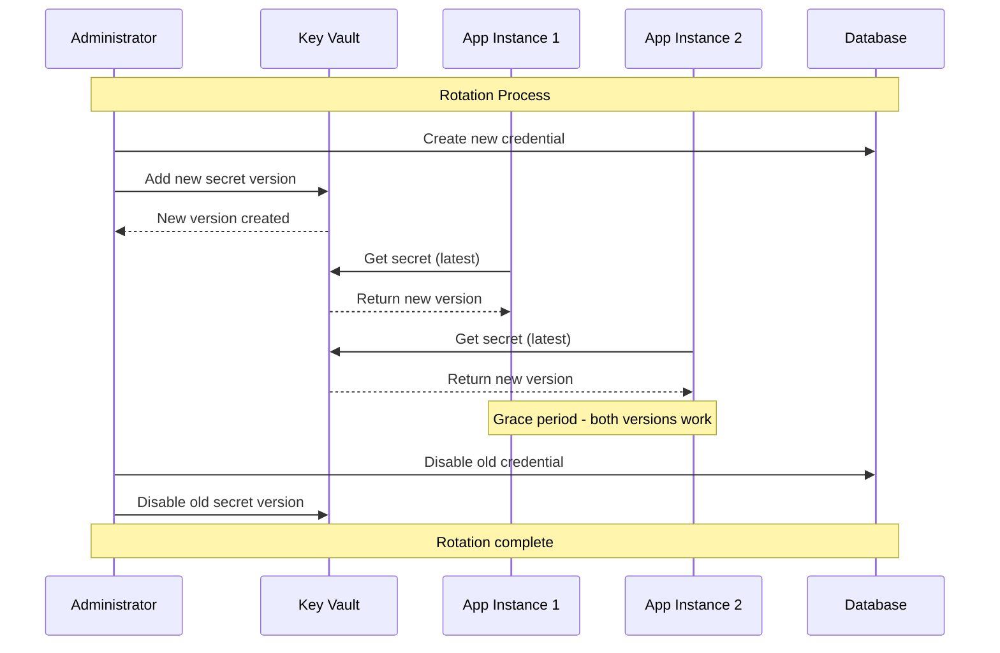
```mermaid
sequenceDiagram
    participant Admin as Administrator
    participant KV as Key Vault
    participant App1 as App Instance 1
    participant App2 as App Instance 2
    participant DB as Database
    
    Note over Admin,DB: Rotation Process
    
    Admin->>DB: Create new credential
    Admin->>KV: Add new secret version
    KV-->>Admin: New version created
    
    App1->>KV: Get secret (latest)
    KV-->>App1: Return new version
    
    App2->>KV: Get secret (latest)
    KV-->>App2: Return new version
    
    Note over App1,App2: Grace period - both versions work
    
    Admin->>DB: Disable old credential
    Admin->>KV: Disable old secret version
    
    Note over Admin,DB: Rotation complete
```

## Security Best Practices Flow

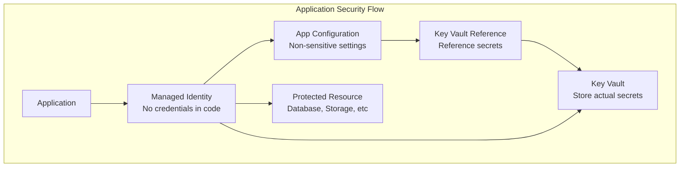
```mermaid
graph TB
    subgraph "Application Security Flow"
        App[Application]
        
        MI[Managed Identity<br/>No credentials in code]
        
        AppConfig[App Configuration<br/>Non-sensitive settings]
        
        KVRef[Key Vault Reference<br/>Reference secrets]
        
        KeyVault[Key Vault<br/>Store actual secrets]
        
        Resource[Protected Resource<br/>Database, Storage, etc]
    end
    
    App --> MI
    MI --> AppConfig
    AppConfig --> KVRef
    KVRef --> KeyVault
    MI --> KeyVault
    MI --> Resource
```

## Encryption Key Hierarchy

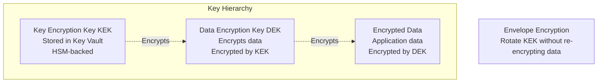
```mermaid
graph TB
    subgraph "Key Hierarchy"
        KEK[Key Encryption Key KEK<br/>Stored in Key Vault<br/>HSM-backed]
        
        DEK[Data Encryption Key DEK<br/>Encrypts data<br/>Encrypted by KEK]
        
        Data[Encrypted Data<br/>Application data<br/>Encrypted by DEK]
    end
    
    KEK -.Encrypts.-> DEK
    DEK -.Encrypts.-> Data
    
    Note[Envelope Encryption<br/>Rotate KEK without re-encrypting data]
```

## Soft Delete and Purge Protection

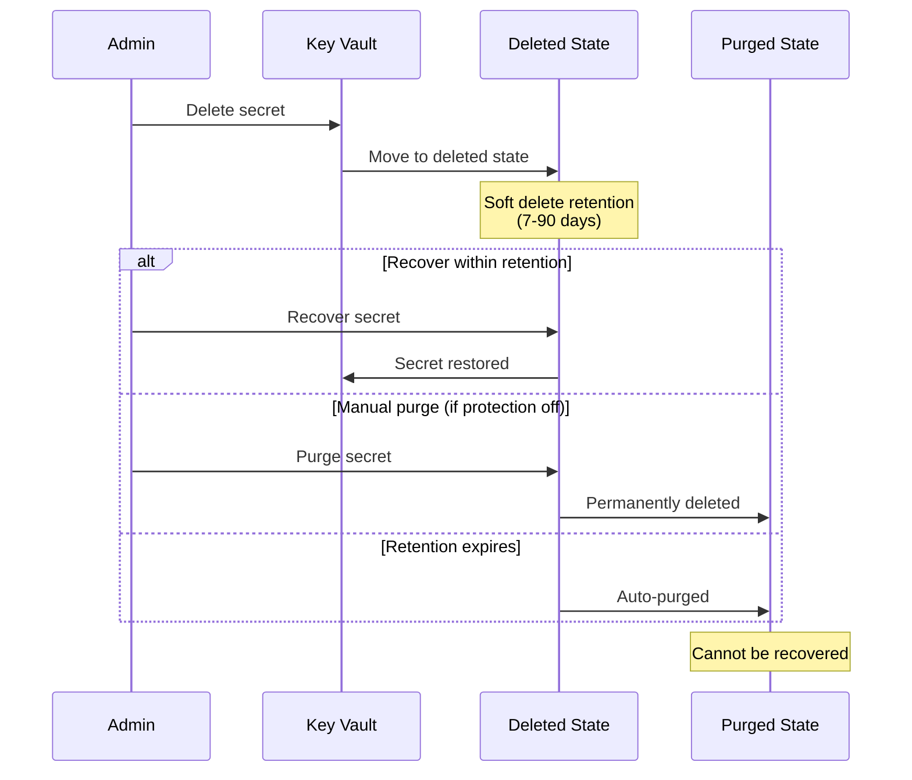
```mermaid
sequenceDiagram
    participant Admin
    participant KV as Key Vault
    participant Deleted as Deleted State
    participant Purged as Purged State
    
    Admin->>KV: Delete secret
    KV->>Deleted: Move to deleted state
    Note over Deleted: Soft delete retention<br/>(7-90 days)
    
    alt Recover within retention
        Admin->>Deleted: Recover secret
        Deleted->>KV: Secret restored
    else Manual purge (if protection off)
        Admin->>Deleted: Purge secret
        Deleted->>Purged: Permanently deleted
    else Retention expires
        Deleted->>Purged: Auto-purged
    end
    
    Note over Purged: Cannot be recovered
```

## App Configuration with Key Vault

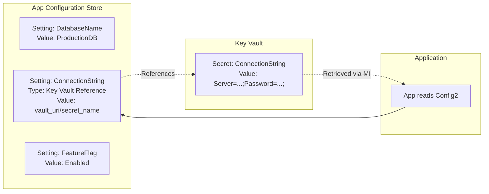
```mermaid
graph LR
    subgraph "App Configuration Store"
        Config1[Setting: DatabaseName<br/>Value: ProductionDB]
        
        Config2[Setting: ConnectionString<br/>Type: Key Vault Reference<br/>Value: vault_uri/secret_name]
        
        Config3[Setting: FeatureFlag<br/>Value: Enabled]
    end
    
    subgraph "Key Vault"
        Secret[Secret: ConnectionString<br/>Value: Server=...;Password=...;]
    end
    
    subgraph "Application"
        App[App reads Config2]
    end
    
    App --> Config2
    Config2 -.References.-> Secret
    Secret -.Retrieved via MI.-> App
```

## Monitoring & Auditing

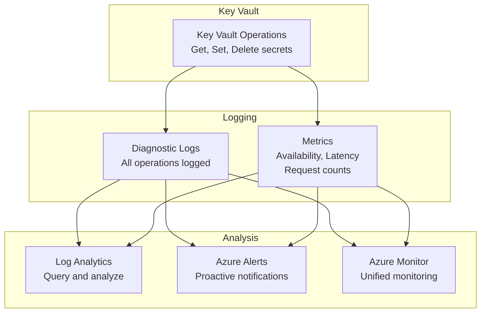
```mermaid
graph TB
    subgraph "Key Vault"
        Operations[Key Vault Operations<br/>Get, Set, Delete secrets]
    end
    
    subgraph "Logging"
        Diagnostic[Diagnostic Logs<br/>All operations logged]
        
        Metrics[Metrics<br/>Availability, Latency<br/>Request counts]
    end
    
    subgraph "Analysis"
        LogAnalytics[Log Analytics<br/>Query and analyze]
        
        Alerts[Azure Alerts<br/>Proactive notifications]
        
        Monitor[Azure Monitor<br/>Unified monitoring]
    end
    
    Operations --> Diagnostic & Metrics
    Diagnostic & Metrics --> LogAnalytics & Alerts & Monitor
```

## Key Concepts Summary

### Azure Key Vault
- **Purpose**: Secure storage for secrets, keys, certificates
- **Tiers**: Standard (software), Premium (HSM)
- **Objects**: Secrets, Keys, Certificates
- **Access**: RBAC (recommended) or Access Policies

### Managed Identities
- **System-Assigned**: Tied to resource lifecycle
- **User-Assigned**: Independent, reusable identity
- **Authentication**: Automatic token acquisition
- **Use Cases**: Passwordless auth to Azure services

### Azure App Configuration
- **Purpose**: Centralized configuration management
- **Features**: Key-values, Feature flags, Labels
- **Integration**: Key Vault references for secrets
- **Refresh**: Push (Event Grid) or Poll (periodic)

### Security Features
- **Soft Delete**: Recover deleted objects (7-90 days)
- **Purge Protection**: Prevent permanent deletion
- **Network Security**: Firewall, Service/Private endpoints
- **Encryption**: At rest (automatic), customer-managed keys

### Feature Flags
- **Components**: Name, Enabled state, Filters
- **Filters**: Targeting, Percentage, Time window, Custom
- **Use Cases**: Progressive rollout, A/B testing, toggles
- **Management**: Dynamic enable/disable without deployment

### Key Vault Best Practices
- **Access**: Use RBAC and Managed Identities
- **Secrets**: Version automatically, rotate regularly
- **Networking**: Use Private Endpoints for production
- **Monitoring**: Enable diagnostic logs
- **Backup**: Enable soft delete and purge protection

### App Configuration Best Practices
- **Organization**: Use labels for environments (dev/staging/prod)
- **Secrets**: Store in Key Vault, reference from App Config
- **Refresh**: Use sentinel keys to trigger refresh
- **Feature Flags**: Use filters for progressive rollout
- **Caching**: Implement caching with appropriate TTL

### Secrets Management
- **Storage**: Always use Key Vault, never hard-code
- **Access**: Managed Identity over connection strings
- **Rotation**: Implement automated rotation
- **Versioning**: Leverage automatic versioning
- **References**: Use App Config Key Vault references

### Best Practices
1. **Use Managed Identities** instead of connection strings/keys
2. **Store secrets in Key Vault** not environment variables
3. **Enable soft delete** and purge protection
4. **Use Private Endpoints** for production workloads
5. **Implement secret rotation** with grace periods
6. **Use RBAC** over access policies
7. **Enable diagnostic logging** for audit trails
8. **Use App Configuration** for non-sensitive settings
9. **Leverage feature flags** for controlled rollouts
10. **Monitor Key Vault access** with Azure Monitor alerts
