# Authentication & Authorization - Concepts Cheatsheet

## Overview
Microsoft identity platform provides authentication and authorization services using Microsoft Entra ID (formerly Azure AD), OAuth 2.0, OpenID Connect, and Shared Access Signatures for Azure Storage.

## Microsoft Identity Platform Architecture

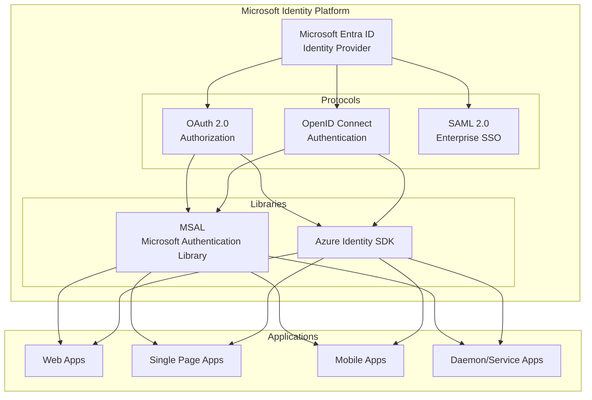

## OAuth 2.0 Flow Types

```mermaid
graph TB
    subgraph "OAuth 2.0 Flows"
        AuthCode[Authorization Code Flow<br/>Web apps with backend<br/>Most secure<br/>Refresh tokens]
        
        PKCE[Auth Code + PKCE<br/>Mobile & SPAs<br/>Public clients<br/>No client secret]
        
        Implicit[Implicit Flow<br/>DEPRECATED<br/>SPAs (legacy)<br/>Tokens in URL]
        
        ClientCreds[Client Credentials<br/>Service-to-service<br/>No user context<br/>App identity]
        
        OnBehalfOf[On-Behalf-Of<br/>Middle tier calls API<br/>User context preserved<br/>Token exchange]
        
        DeviceCode[Device Code Flow<br/>Input-constrained devices<br/>TV, IoT<br/>Browser on phone]
    end
    
    AuthCode -.Best for.-> WebApp[Web Applications]
    PKCE -.Best for.-> SPAMobile[SPAs & Mobile]
    ClientCreds -.Best for.-> Daemon[Background Services]
```

## Authorization Code Flow

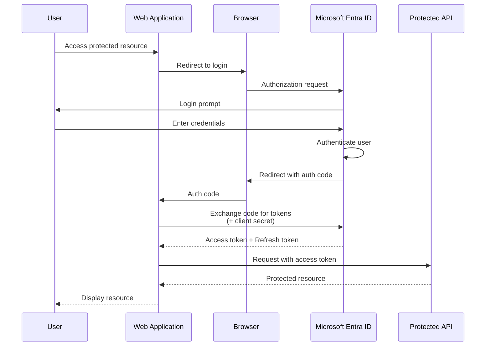

## Client Credentials Flow

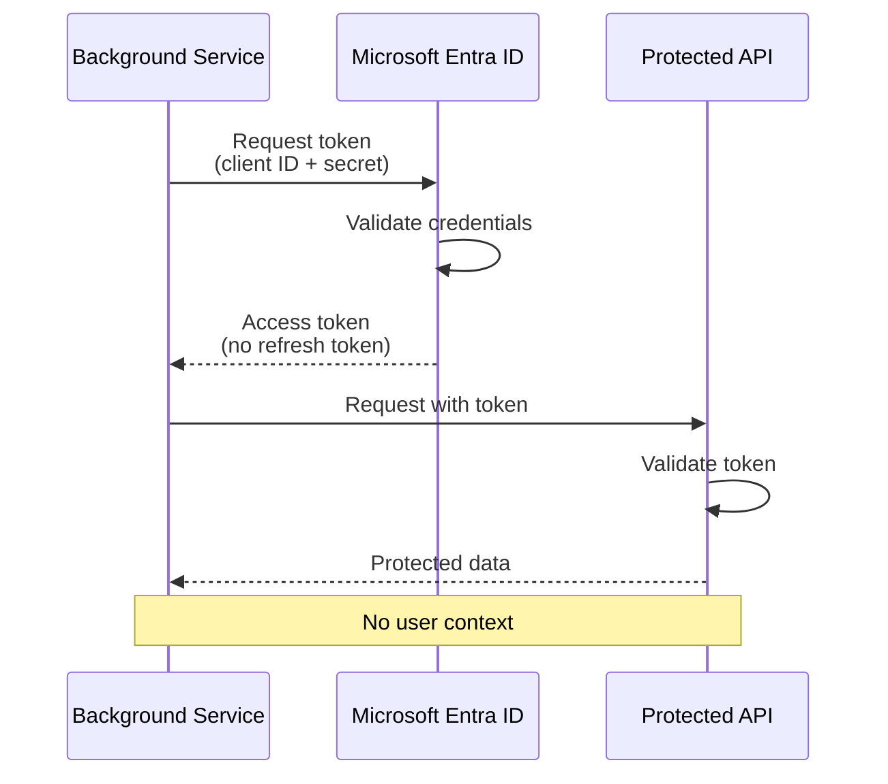

## Token Types

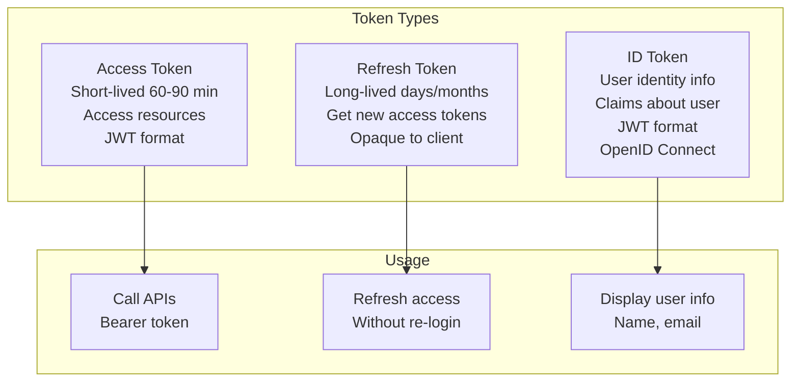

## JWT Token Structure

```mermaid
graph LR
    subgraph "JWT Token"
        Header[Header<br/>Algorithm: RS256<br/>Type: JWT]
        
        Payload[Payload Claims<br/>aud: audience<br/>iss: issuer<br/>exp: expiration<br/>sub: subject<br/>roles: [roles]]
        
        Signature[Signature<br/>Verify integrity<br/>HMAC/RSA]
    end
    
    Header -->|Base64| Encoded1[eyJ...]
    Payload -->|Base64| Encoded2[eyJ...]
    Signature -->|Encoded| Encoded3[SflK...]
    
    Encoded1 & Encoded2 & Encoded3 -->|Join with .| JWT[eyJ....eyJ....SflK]
```

## App Registration Components

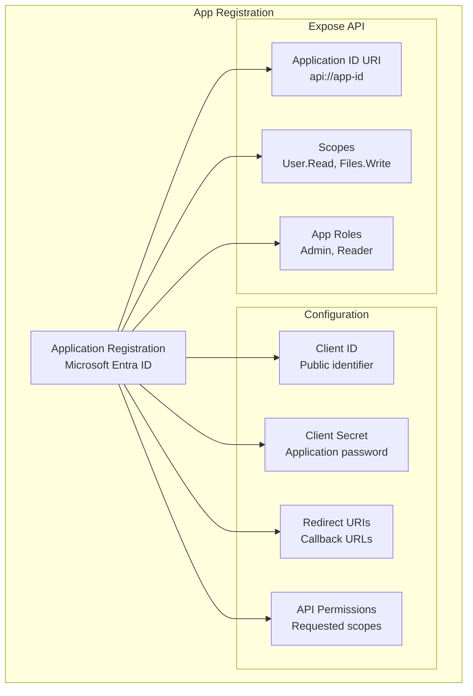

## Permission Types

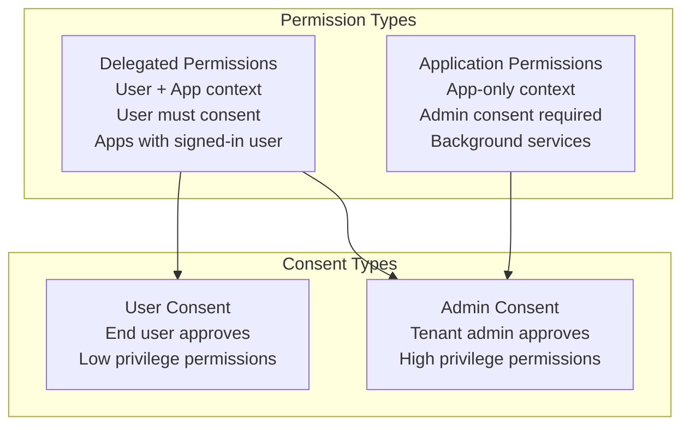

## MSAL Library Usage

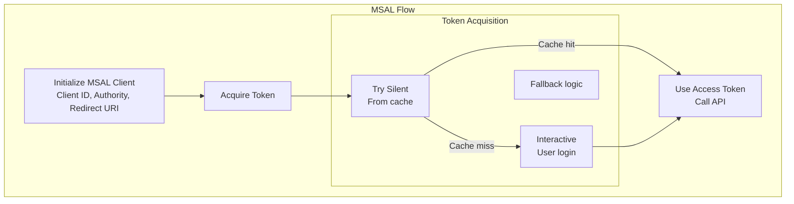

## Token Caching Strategy

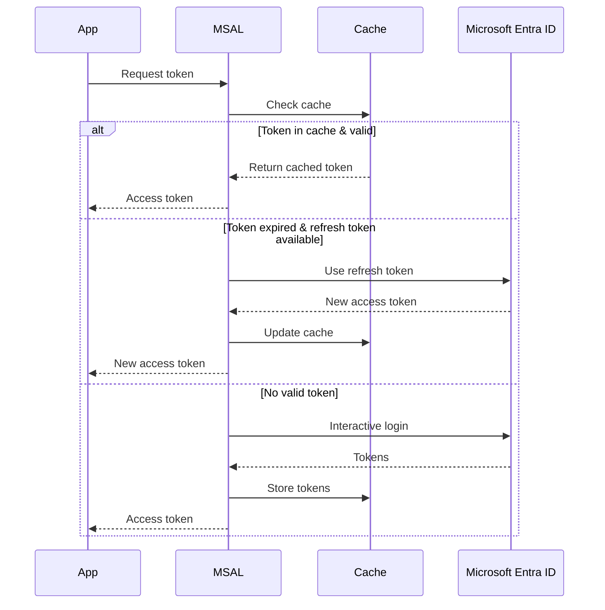

## Conditional Access Integration

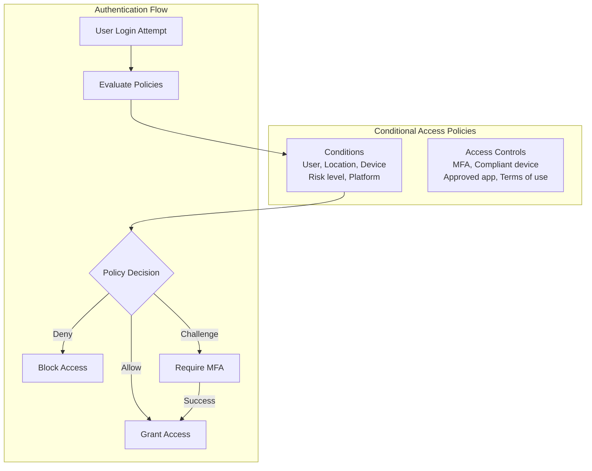

## Shared Access Signatures (SAS)

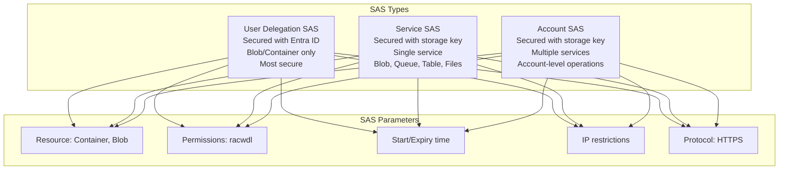

## SAS Generation Flow

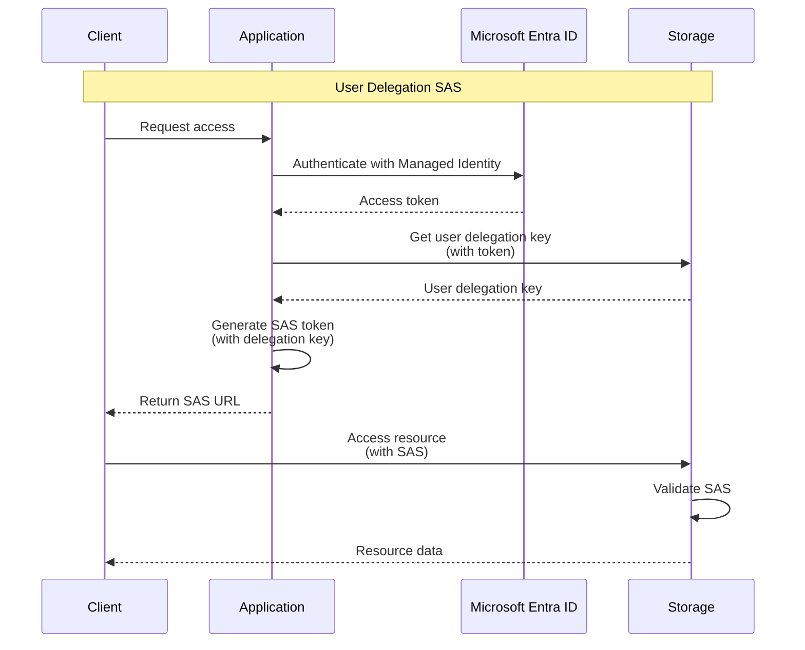

## SAS Best Practices

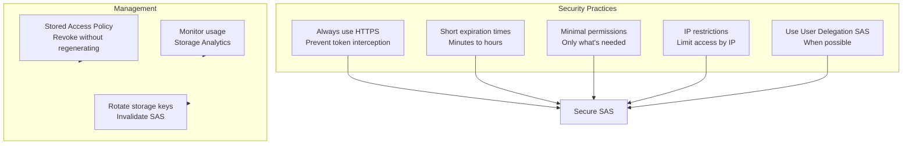

## Authentication in Web Apps

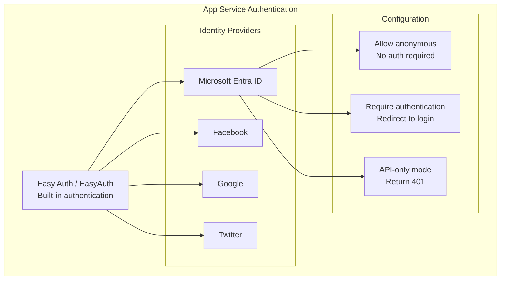

## API Protection Patterns

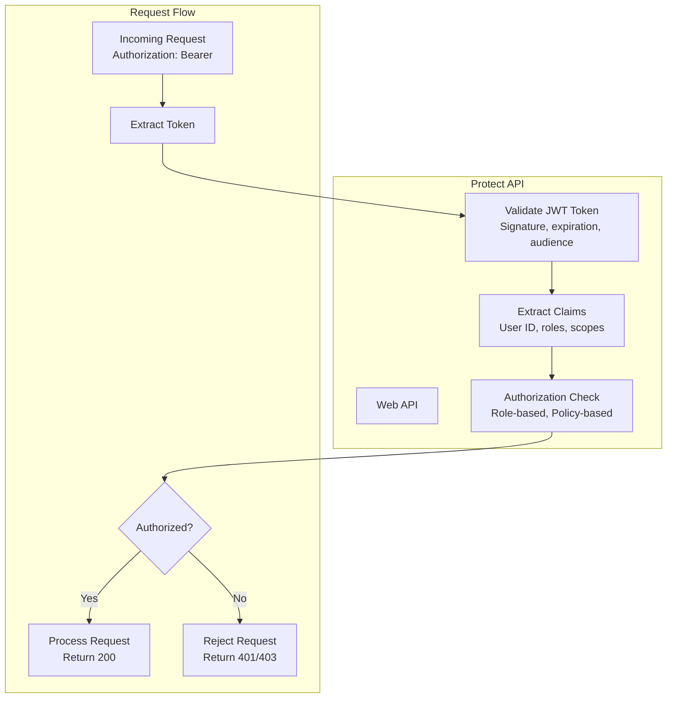

## Scopes vs Roles

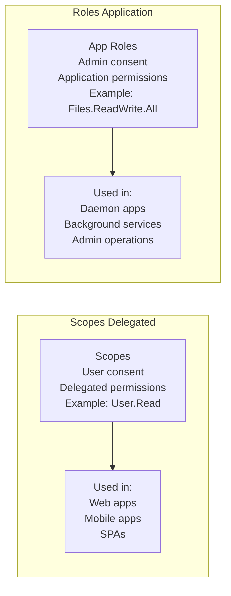

## Multi-Tenant Applications

```mermaid
graph TB
    subgraph "Tenancy Models"
        Single[Single-Tenant<br/>One organization<br/>Authority: login.microsoftonline.com/{tenant}]
        
        Multi[Multi-Tenant<br/>Any Entra ID org<br/>Authority: login.microsoftonline.com/common]
        
        Personal[Personal Accounts<br/>Microsoft accounts<br/>Authority: login.microsoftonline.com/consumers]
    end
    
    subgraph "Considerations"
        Consent[Admin consent<br/>for each tenant]
        
        Data[Data isolation<br/>per tenant]
        
        Branding[Per-tenant branding<br/>customization]
    end
    
    Multi --> Consent & Data & Branding
```

## Token Validation Steps

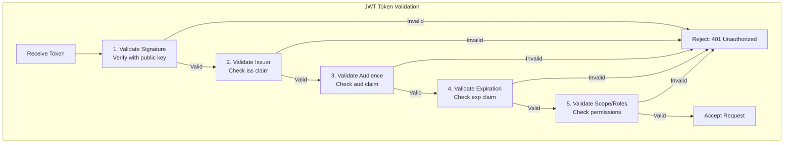

## Managed Identity with Entra ID

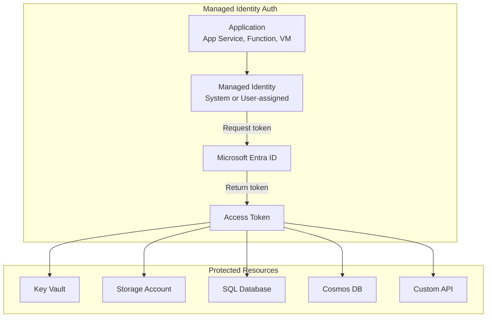

## Key Concepts Summary

### Microsoft Identity Platform
- **Identity Provider**: Microsoft Entra ID (formerly Azure AD)
- **Protocols**: OAuth 2.0, OpenID Connect, SAML 2.0
- **Libraries**: MSAL (Microsoft Authentication Library)
- **Multi-tenant**: Support for multiple organizations

### OAuth 2.0 Flows
- **Authorization Code**: Web apps with backend (most secure)
- **PKCE**: Mobile and SPAs (public clients)
- **Client Credentials**: Service-to-service (no user)
- **On-Behalf-Of**: Middle tier preserves user context

### Token Types
- **Access Token**: Bearer token for API access (1 hour)
- **Refresh Token**: Long-lived, get new access tokens
- **ID Token**: User identity information (OpenID Connect)

### MSAL Features
- **Token Caching**: Automatic caching and refresh
- **Silent Authentication**: Try cache first
- **Interactive Fallback**: User login when needed
- **Account Management**: Multiple account support

### App Registration
- **Client ID**: Public identifier
- **Client Secret**: Confidential apps only
- **Redirect URIs**: Callback URLs after login
- **Permissions**: Delegated and application permissions

### Permissions & Consent
- **Delegated**: User + app context (user consent)
- **Application**: App-only context (admin consent)
- **Scopes**: Granular permissions
- **Roles**: App-level permissions

### Shared Access Signatures (SAS)
- **User Delegation SAS**: Secured with Entra ID (recommended)
- **Service SAS**: Single service access
- **Account SAS**: Multiple services access
- **Parameters**: Permissions, time, IP, protocol

### Token Validation
- **Signature**: Verify with public key
- **Issuer**: Check trusted issuer
- **Audience**: Validate intended recipient
- **Expiration**: Check not expired
- **Claims**: Validate roles/scopes

### Security Best Practices
1. **Use MSAL** instead of raw HTTP requests
2. **Implement token caching** to reduce token requests
3. **Validate all token claims** on API side
4. **Use HTTPS** for all authentication flows
5. **Prefer User Delegation SAS** over account key SAS
6. **Store secrets** in Key Vault, not code
7. **Use Managed Identities** when possible
8. **Implement token refresh** logic
9. **Set short SAS expiration** times
10. **Enable Conditional Access** policies

### Best Practices
1. **Use authorization code flow with PKCE** for SPAs
2. **Never expose client secrets** in public clients
3. **Implement proper error handling** for auth failures
4. **Cache tokens appropriately** based on expiration
5. **Use scopes** to request minimum required permissions
6. **Implement refresh token rotation** for security
7. **Validate JWT tokens** on every API request
8. **Use HTTPS-only** SAS tokens
9. **Monitor authentication** with Azure AD logs
10. **Implement least privilege** access
