# Application Insights - Concepts Cheatsheet

## Overview
Application Insights is an Application Performance Management (APM) service that provides deep insights into application performance, usage, and diagnostics with automatic instrumentation and powerful analytics.

## Application Insights Architecture

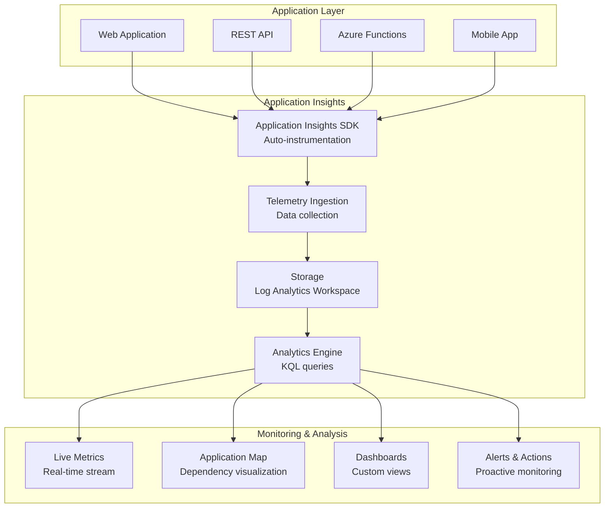
```mermaid
graph TB
    subgraph "Application Layer"
        WebApp[Web Application]
        API[REST API]
        Functions[Azure Functions]
        Mobile[Mobile App]
    end
    
    subgraph "Application Insights"
        SDK[Application Insights SDK<br/>Auto-instrumentation]
        
        Ingestion[Telemetry Ingestion<br/>Data collection]
        
        Storage[Storage<br/>Log Analytics Workspace]
        
        Analytics[Analytics Engine<br/>KQL queries]
    end
    
    subgraph "Monitoring & Analysis"
        LiveMetrics[Live Metrics<br/>Real-time stream]
        
        AppMap[Application Map<br/>Dependency visualization]
        
        Dashboard[Dashboards<br/>Custom views]
        
        Alerts[Alerts & Actions<br/>Proactive monitoring]
    end
    
    WebApp & API & Functions & Mobile --> SDK
    SDK --> Ingestion
    Ingestion --> Storage
    Storage --> Analytics
    Analytics --> LiveMetrics & AppMap & Dashboard & Alerts
```

## Telemetry Types

```mermaid
graph TB
    subgraph "Telemetry Types"
        Requests[Requests<br/>HTTP requests<br/>Response times<br/>Status codes]
        
        Dependencies[Dependencies<br/>External calls<br/>SQL, HTTP, Redis<br/>Duration]
        
        Exceptions[Exceptions<br/>Caught/Uncaught<br/>Stack traces<br/>Error details]
        
        Traces[Traces/Logs<br/>Custom logging<br/>Diagnostic logs<br/>ILogger integration]
        
        Metrics[Metrics<br/>Custom metrics<br/>Performance counters<br/>Numeric values]
        
        Events[Custom Events<br/>Business events<br/>User actions<br/>Custom tracking]
        
        PageViews[Page Views<br/>Page loads<br/>Browser timing<br/>Client-side]
    end
    
    subgraph "Auto-Collected"
        Auto[Automatically tracked:<br/>Requests, Dependencies<br/>Exceptions, Performance]
    end
    
    subgraph "Custom"
        Custom[Manual tracking:<br/>Events, Metrics<br/>Custom traces]
    end
```

## Auto-Instrumentation

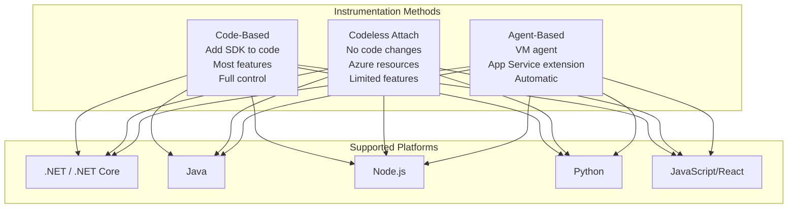
```mermaid
graph TB
    subgraph "Instrumentation Methods"
        CodeBased[Code-Based<br/>Add SDK to code<br/>Most features<br/>Full control]
        
        Codeless[Codeless Attach<br/>No code changes<br/>Azure resources<br/>Limited features]
        
        Agent[Agent-Based<br/>VM agent<br/>App Service extension<br/>Automatic]
    end
    
    subgraph "Supported Platforms"
        DotNet[.NET / .NET Core]
        Java[Java]
        NodeJS[Node.js]
        Python[Python]
        JavaScript[JavaScript/React]
    end
    
    CodeBased & Codeless & Agent --> DotNet & Java & NodeJS & Python & JavaScript
```

## Distributed Tracing

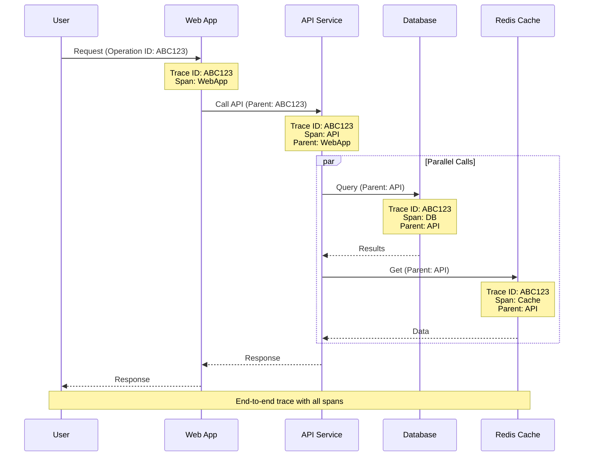
```mermaid
sequenceDiagram
    participant User
    participant WebApp as Web App
    participant API as API Service
    participant DB as Database
    participant Cache as Redis Cache
    
    User->>WebApp: Request (Operation ID: ABC123)
    Note over WebApp: Trace ID: ABC123<br/>Span: WebApp
    
    WebApp->>API: Call API (Parent: ABC123)
    Note over API: Trace ID: ABC123<br/>Span: API<br/>Parent: WebApp
    
    par Parallel Calls
        API->>DB: Query (Parent: API)
        Note over DB: Trace ID: ABC123<br/>Span: DB<br/>Parent: API
        DB-->>API: Results
        
        API->>Cache: Get (Parent: API)
        Note over Cache: Trace ID: ABC123<br/>Span: Cache<br/>Parent: API
        Cache-->>API: Data
    end
    
    API-->>WebApp: Response
    WebApp-->>User: Response
    
    Note over User,Cache: End-to-end trace with all spans
```

## Application Map

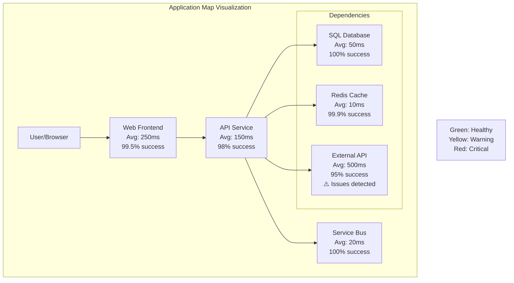
```mermaid
graph TB
    subgraph "Application Map Visualization"
        User[User/Browser]
        
        Frontend[Web Frontend<br/>Avg: 250ms<br/>99.5% success]
        
        API[API Service<br/>Avg: 150ms<br/>98% success]
        
        subgraph "Dependencies"
            SQL[SQL Database<br/>Avg: 50ms<br/>100% success]
            
            Redis[Redis Cache<br/>Avg: 10ms<br/>99.9% success]
            
            External[External API<br/>Avg: 500ms<br/>95% success<br/>⚠️ Issues detected]
        end
        
        ServiceBus[Service Bus<br/>Avg: 20ms<br/>100% success]
    end
    
    User --> Frontend
    Frontend --> API
    API --> SQL & Redis & External
    API --> ServiceBus
    
    Note[Green: Healthy<br/>Yellow: Warning<br/>Red: Critical]
```

## Performance Monitoring

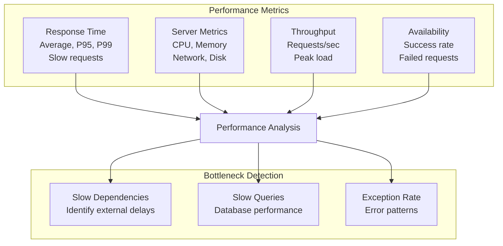
```mermaid
graph TB
    subgraph "Performance Metrics"
        ResponseTime[Response Time<br/>Average, P95, P99<br/>Slow requests]
        
        ServerMetrics[Server Metrics<br/>CPU, Memory<br/>Network, Disk]
        
        Throughput[Throughput<br/>Requests/sec<br/>Peak load]
        
        Availability[Availability<br/>Success rate<br/>Failed requests]
    end
    
    subgraph "Bottleneck Detection"
        SlowDeps[Slow Dependencies<br/>Identify external delays]
        
        SlowQueries[Slow Queries<br/>Database performance]
        
        ExceptionRate[Exception Rate<br/>Error patterns]
    end
    
    ResponseTime & ServerMetrics & Throughput & Availability --> Analysis[Performance Analysis]
    Analysis --> SlowDeps & SlowQueries & ExceptionRate
```

## Live Metrics Stream

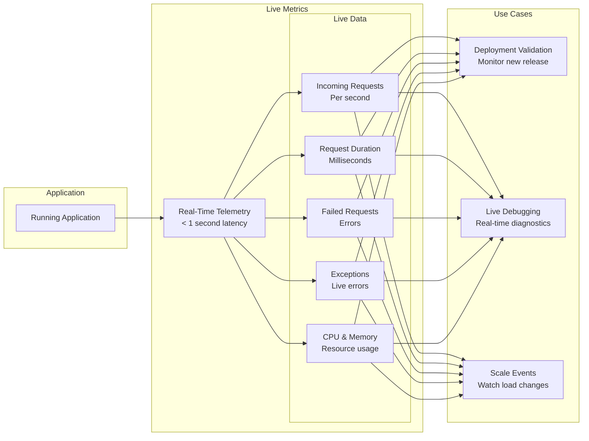
```mermaid
graph LR
    subgraph "Application"
        App[Running Application]
    end
    
    subgraph "Live Metrics"
        RealTime[Real-Time Telemetry<br/>< 1 second latency]
        
        subgraph "Live Data"
            Requests[Incoming Requests<br/>Per second]
            Duration[Request Duration<br/>Milliseconds]
            Failed[Failed Requests<br/>Errors]
            Exceptions[Exceptions<br/>Live errors]
            CPUMemory[CPU & Memory<br/>Resource usage]
        end
    end
    
    subgraph "Use Cases"
        Deploy[Deployment Validation<br/>Monitor new release]
        Debug[Live Debugging<br/>Real-time diagnostics]
        Scale[Scale Events<br/>Watch load changes]
    end
    
    App --> RealTime
    RealTime --> Requests & Duration & Failed & Exceptions & CPUMemory
    Requests & Duration & Failed & Exceptions & CPUMemory --> Deploy & Debug & Scale
```

## Availability Tests

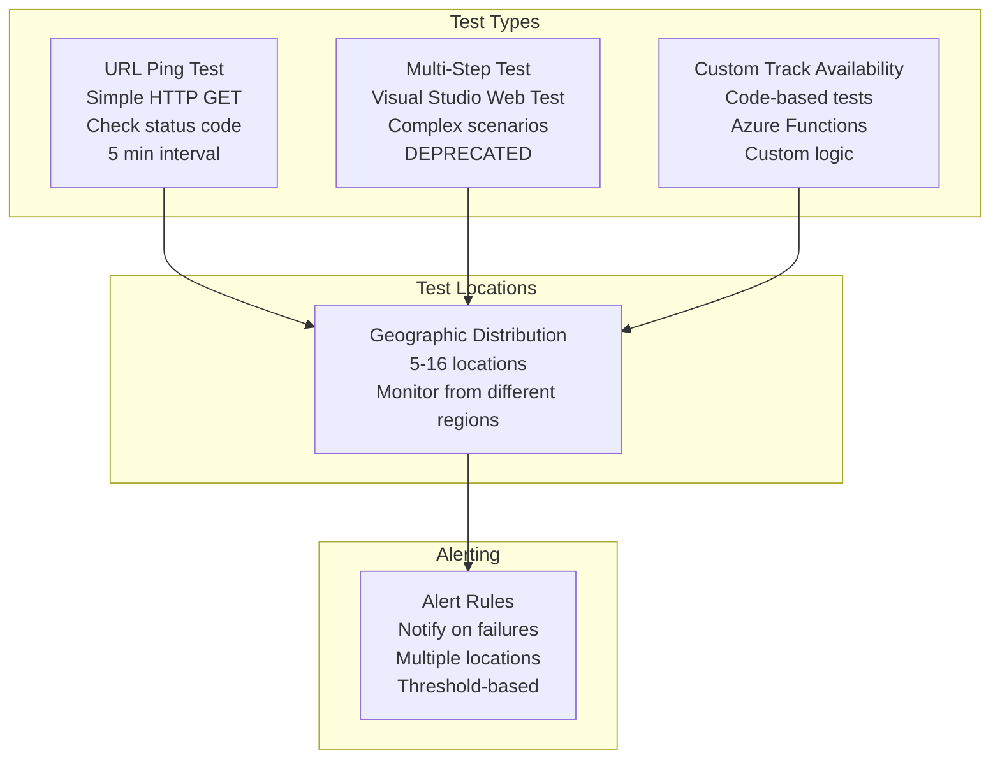
```mermaid
graph TB
    subgraph "Test Types"
        URL[URL Ping Test<br/>Simple HTTP GET<br/>Check status code<br/>5 min interval]
        
        MultiStep[Multi-Step Test<br/>Visual Studio Web Test<br/>Complex scenarios<br/>DEPRECATED]
        
        Custom[Custom Track Availability<br/>Code-based tests<br/>Azure Functions<br/>Custom logic]
    end
    
    subgraph "Test Locations"
        Geo[Geographic Distribution<br/>5-16 locations<br/>Monitor from different regions]
    end
    
    subgraph "Alerting"
        Alert[Alert Rules<br/>Notify on failures<br/>Multiple locations<br/>Threshold-based]
    end
    
    URL & MultiStep & Custom --> Geo
    Geo --> Alert
```

## Availability Test Workflow

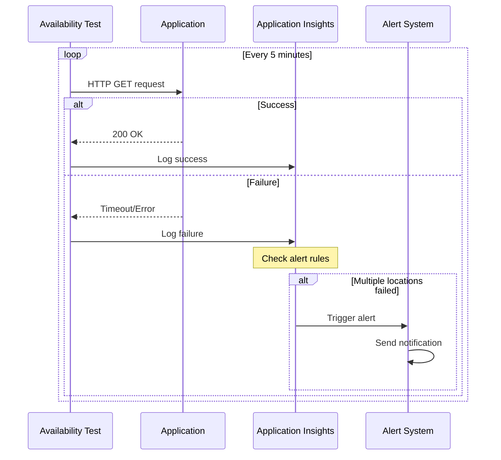
```mermaid
sequenceDiagram
    participant Test as Availability Test
    participant App as Application
    participant AppInsights as Application Insights
    participant Alert as Alert System
    
    loop Every 5 minutes
        Test->>App: HTTP GET request
        
        alt Success
            App-->>Test: 200 OK
            Test->>AppInsights: Log success
        else Failure
            App-->>Test: Timeout/Error
            Test->>AppInsights: Log failure
            
            Note over AppInsights: Check alert rules
            
            alt Multiple locations failed
                AppInsights->>Alert: Trigger alert
                Alert->>Alert: Send notification
            end
        end
    end
```

## Smart Detection

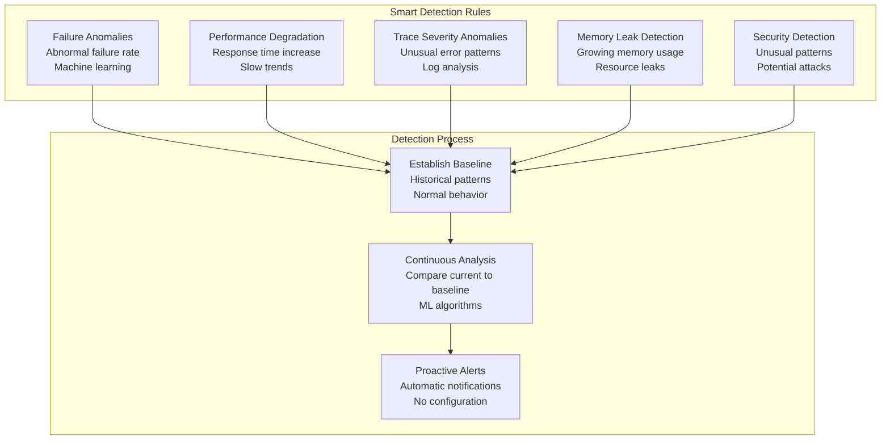
```mermaid
graph TB
    subgraph "Smart Detection Rules"
        FailureAnomalies[Failure Anomalies<br/>Abnormal failure rate<br/>Machine learning]
        
        PerfDegradation[Performance Degradation<br/>Response time increase<br/>Slow trends]
        
        TraceAnomalies[Trace Severity Anomalies<br/>Unusual error patterns<br/>Log analysis]
        
        MemoryLeak[Memory Leak Detection<br/>Growing memory usage<br/>Resource leaks]
        
        SecurityIssues[Security Detection<br/>Unusual patterns<br/>Potential attacks]
    end
    
    subgraph "Detection Process"
        Baseline[Establish Baseline<br/>Historical patterns<br/>Normal behavior]
        
        Analyze[Continuous Analysis<br/>Compare current to baseline<br/>ML algorithms]
        
        Alert[Proactive Alerts<br/>Automatic notifications<br/>No configuration]
    end
    
    FailureAnomalies & PerfDegradation & TraceAnomalies & MemoryLeak & SecurityIssues --> Baseline
    Baseline --> Analyze --> Alert
```

## Custom Metrics and Events

```mermaid
graph TB
    subgraph "Custom Tracking"
        Event[Track Event<br/>telemetry.TrackEvent()<br/>Business events<br/>User actions]
        
        Metric[Track Metric<br/>telemetry.TrackMetric()<br/>Numeric values<br/>Performance data]
        
        Trace[Track Trace<br/>telemetry.TrackTrace()<br/>Diagnostic logs<br/>Custom messages]
        
        Dependency[Track Dependency<br/>telemetry.TrackDependency()<br/>External calls<br/>Custom dependencies]
    end
    
    subgraph "Properties & Dimensions"
        Props[Custom Properties<br/>Key-value pairs<br/>Additional context<br/>Filtering & grouping]
    end
    
    Event & Metric & Trace & Dependency --> Props
```

## Sampling Strategies

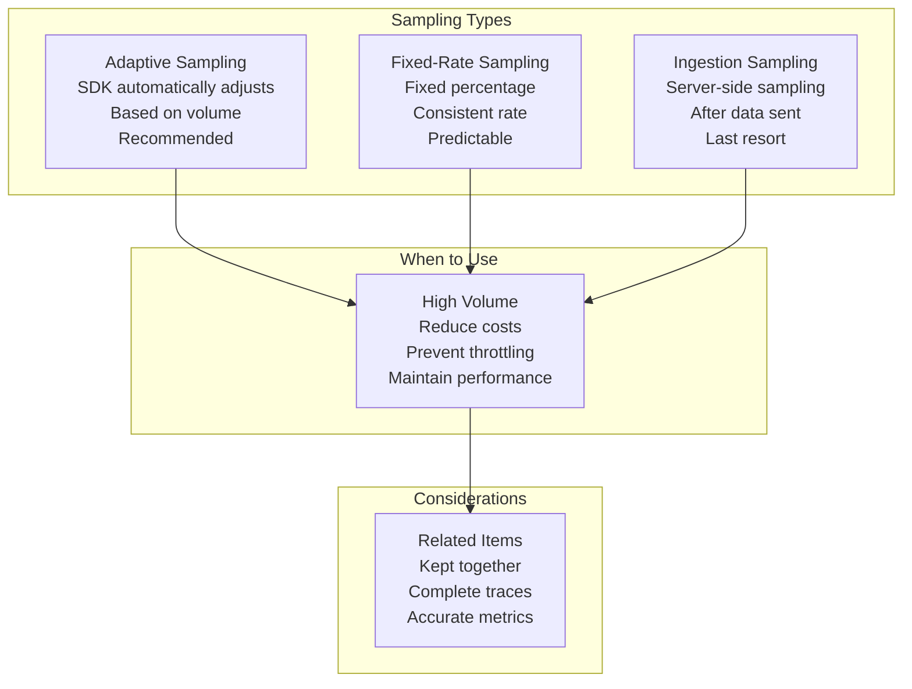
```mermaid
graph TB
    subgraph "Sampling Types"
        Adaptive[Adaptive Sampling<br/>SDK automatically adjusts<br/>Based on volume<br/>Recommended]
        
        Fixed[Fixed-Rate Sampling<br/>Fixed percentage<br/>Consistent rate<br/>Predictable]
        
        Ingestion[Ingestion Sampling<br/>Server-side sampling<br/>After data sent<br/>Last resort]
    end
    
    subgraph "When to Use"
        HighVolume[High Volume<br/>Reduce costs<br/>Prevent throttling<br/>Maintain performance]
    end
    
    subgraph "Considerations"
        Related[Related Items<br/>Kept together<br/>Complete traces<br/>Accurate metrics]
    end
    
    Adaptive & Fixed & Ingestion --> HighVolume
    HighVolume --> Related
```

## Kusto Query Language (KQL)

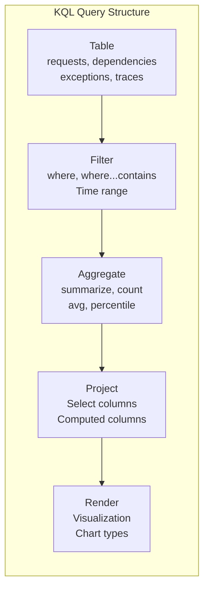
```mermaid
graph LR
    subgraph "KQL Query Structure"
        Table[Table<br/>requests, dependencies<br/>exceptions, traces]
        
        Filter[Filter<br/>where, where...contains<br/>Time range]
        
        Aggregate[Aggregate<br/>summarize, count<br/>avg, percentile]
        
        Project[Project<br/>Select columns<br/>Computed columns]
        
        Render[Render<br/>Visualization<br/>Chart types]
    end
    
    Table --> Filter
    Filter --> Aggregate
    Aggregate --> Project
    Project --> Render
```

## Common KQL Queries

```mermaid
graph TB
    subgraph "Query Examples"
        SlowRequests[Slow Requests<br/>requests<br/>| where duration > 5000<br/>| order by duration desc]
        
        FailedDeps[Failed Dependencies<br/>dependencies<br/>| where success == false<br/>| summarize count by name]
        
        ExceptionTrend[Exception Trend<br/>exceptions<br/>| summarize count by bin time, 1h<br/>| render timechart]
        
        TopOperations[Top Operations<br/>requests<br/>| summarize count by operation_Name<br/>| top 10 by count]
    end
    
    subgraph "Use Cases"
        Troubleshoot[Troubleshooting<br/>Find issues]
        Monitor[Monitoring<br/>Track metrics]
        Report[Reporting<br/>Usage analysis]
    end
    
    SlowRequests & FailedDeps --> Troubleshoot
    ExceptionTrend --> Monitor
    TopOperations --> Report
```

## Alerting Rules

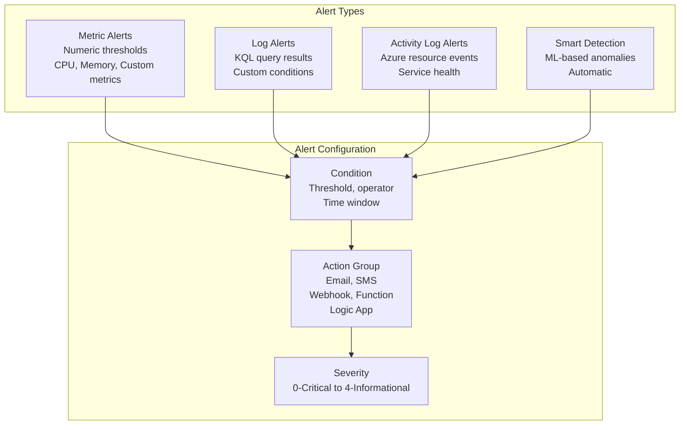
```mermaid
graph TB
    subgraph "Alert Types"
        Metric[Metric Alerts<br/>Numeric thresholds<br/>CPU, Memory, Custom metrics]
        
        Log[Log Alerts<br/>KQL query results<br/>Custom conditions]
        
        Activity[Activity Log Alerts<br/>Azure resource events<br/>Service health]
        
        SmartDetection[Smart Detection<br/>ML-based anomalies<br/>Automatic]
    end
    
    subgraph "Alert Configuration"
        Condition[Condition<br/>Threshold, operator<br/>Time window]
        
        ActionGroup[Action Group<br/>Email, SMS<br/>Webhook, Function<br/>Logic App]
        
        Severity[Severity<br/>0-Critical to 4-Informational]
    end
    
    Metric & Log & Activity & SmartDetection --> Condition
    Condition --> ActionGroup
    ActionGroup --> Severity
```

## Alert Workflow

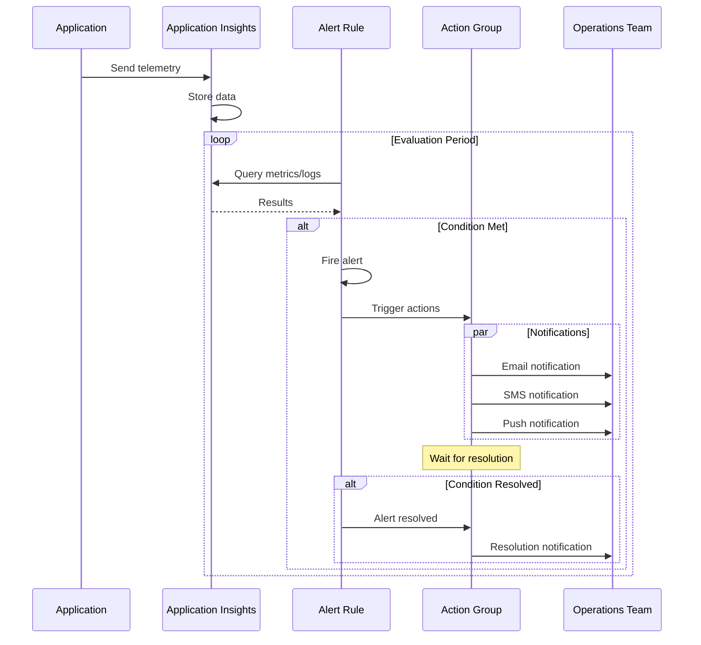
```mermaid
sequenceDiagram
    participant App as Application
    participant AppInsights as Application Insights
    participant Alert as Alert Rule
    participant Action as Action Group
    participant User as Operations Team
    
    App->>AppInsights: Send telemetry
    AppInsights->>AppInsights: Store data
    
    loop Evaluation Period
        Alert->>AppInsights: Query metrics/logs
        AppInsights-->>Alert: Results
        
        alt Condition Met
            Alert->>Alert: Fire alert
            Alert->>Action: Trigger actions
            
            par Notifications
                Action->>User: Email notification
                Action->>User: SMS notification
                Action->>User: Push notification
            end
            
            Note over Action: Wait for resolution
            
            alt Condition Resolved
                Alert->>Action: Alert resolved
                Action->>User: Resolution notification
            end
        end
    end
```

## Workbooks

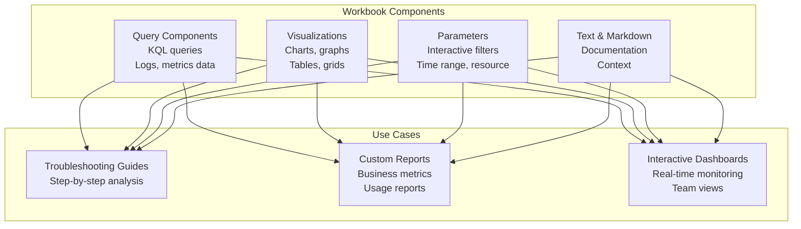
```mermaid
graph TB
    subgraph "Workbook Components"
        Query[Query Components<br/>KQL queries<br/>Logs, metrics data]
        
        Viz[Visualizations<br/>Charts, graphs<br/>Tables, grids]
        
        Param[Parameters<br/>Interactive filters<br/>Time range, resource]
        
        Text[Text & Markdown<br/>Documentation<br/>Context]
    end
    
    subgraph "Use Cases"
        Troubleshoot[Troubleshooting Guides<br/>Step-by-step analysis]
        
        Report[Custom Reports<br/>Business metrics<br/>Usage reports]
        
        Dashboard[Interactive Dashboards<br/>Real-time monitoring<br/>Team views]
    end
    
    Query & Viz & Param & Text --> Troubleshoot & Report & Dashboard
```

## Continuous Export & Integration

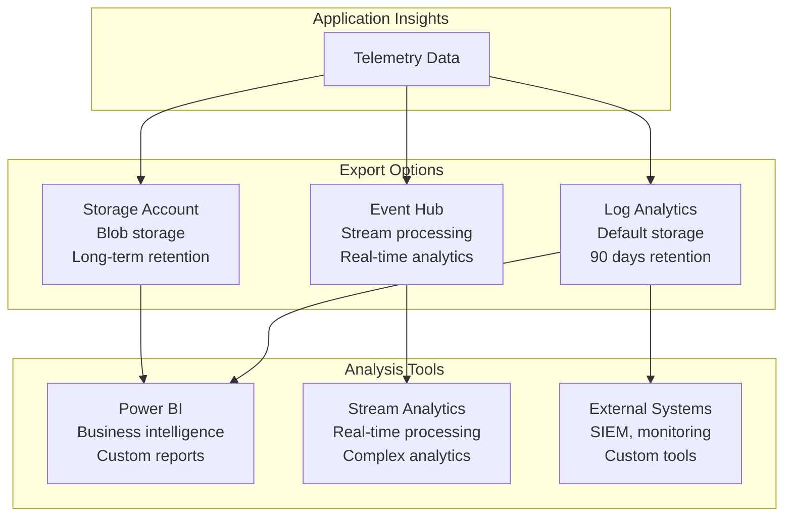
```mermaid
graph TB
    subgraph "Application Insights"
        Telemetry[Telemetry Data]
    end
    
    subgraph "Export Options"
        Storage[Storage Account<br/>Blob storage<br/>Long-term retention]
        
        EventHub[Event Hub<br/>Stream processing<br/>Real-time analytics]
        
        LogAnalytics[Log Analytics<br/>Default storage<br/>90 days retention]
    end
    
    subgraph "Analysis Tools"
        PowerBI[Power BI<br/>Business intelligence<br/>Custom reports]
        
        StreamAnalytics[Stream Analytics<br/>Real-time processing<br/>Complex analytics]
        
        External[External Systems<br/>SIEM, monitoring<br/>Custom tools]
    end
    
    Telemetry --> Storage & EventHub & LogAnalytics
    Storage --> PowerBI
    EventHub --> StreamAnalytics
    LogAnalytics --> PowerBI & External
```

## Snapshot Debugger

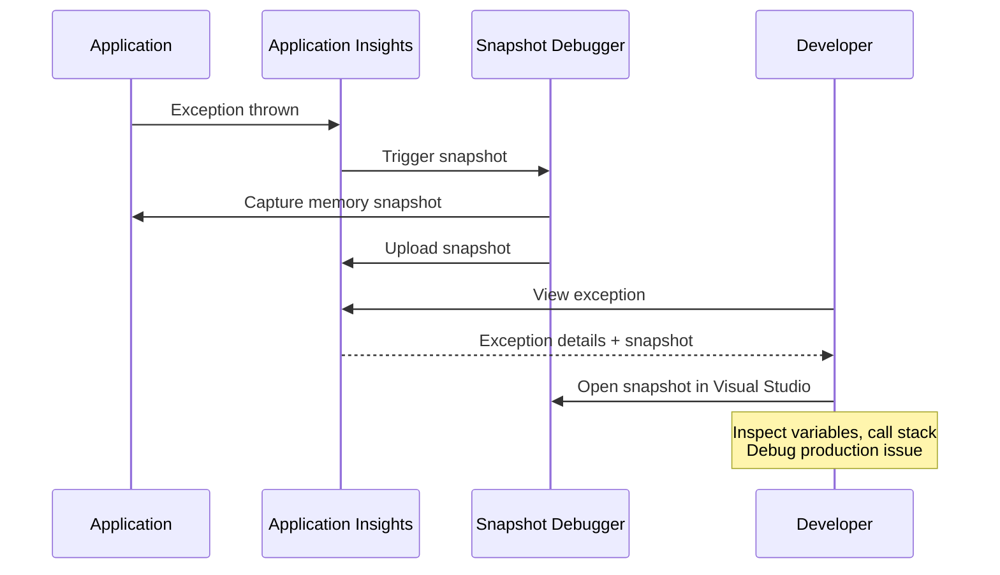
```mermaid
sequenceDiagram
    participant App as Application
    participant AppInsights as Application Insights
    participant Debugger as Snapshot Debugger
    participant Dev as Developer
    
    App->>AppInsights: Exception thrown
    AppInsights->>Debugger: Trigger snapshot
    Debugger->>App: Capture memory snapshot
    Debugger->>AppInsights: Upload snapshot
    
    Dev->>AppInsights: View exception
    AppInsights-->>Dev: Exception details + snapshot
    Dev->>Debugger: Open snapshot in Visual Studio
    
    Note over Dev: Inspect variables, call stack<br/>Debug production issue
```

## Profiler

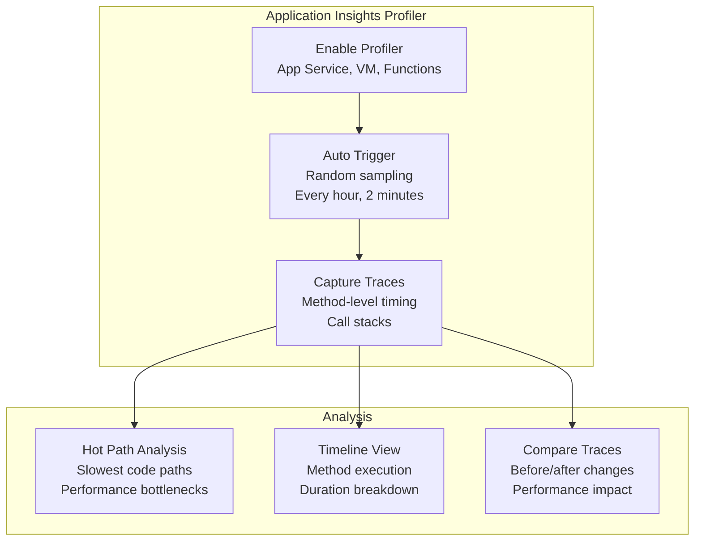
```mermaid
graph TB
    subgraph "Application Insights Profiler"
        Enable[Enable Profiler<br/>App Service, VM, Functions]
        
        Trigger[Auto Trigger<br/>Random sampling<br/>Every hour, 2 minutes]
        
        Capture[Capture Traces<br/>Method-level timing<br/>Call stacks]
    end
    
    subgraph "Analysis"
        HotPath[Hot Path Analysis<br/>Slowest code paths<br/>Performance bottlenecks]
        
        Timeline[Timeline View<br/>Method execution<br/>Duration breakdown]
        
        Compare[Compare Traces<br/>Before/after changes<br/>Performance impact]
    end
    
    Enable --> Trigger
    Trigger --> Capture
    Capture --> HotPath & Timeline & Compare
```

## Data Retention and Costs

```mermaid
graph TB
    subgraph "Retention"
        Default[Default: 90 days<br/>Workspace-based<br/>Free tier]
        
        Extended[Extended Retention<br/>Up to 730 days<br/>Additional cost]
        
        Export[Continuous Export<br/>Unlimited retention<br/>Storage account cost]
    end
    
    subgraph "Cost Factors"
        Volume[Data Volume<br/>GB ingested per day<br/>Sampling reduces cost]
        
        Retention2[Data Retention<br/>Beyond 90 days<br/>Per GB per month]
        
        Tests[Availability Tests<br/>Per test per location<br/>Multi-step tests]
    end
    
    Default --> Extended --> Export
    Volume & Retention2 & Tests --> TotalCost[Total Cost]
```

## Key Concepts Summary

### Telemetry Types
- **Requests**: HTTP requests, duration, response codes
- **Dependencies**: External calls (SQL, HTTP, Redis)
- **Exceptions**: Errors with stack traces
- **Traces**: Custom logging and diagnostics
- **Metrics**: Numeric values, performance counters
- **Events**: Custom business events

### Auto-Instrumentation
- **Code-Based**: SDK in application code
- **Codeless**: Azure resource integration
- **Agent-Based**: VM/App Service extension
- **Platforms**: .NET, Java, Node.js, Python, JavaScript

### Distributed Tracing
- **Operation ID**: Unique request identifier
- **Parent-Child**: Trace relationships
- **End-to-End**: Complete request flow
- **Application Map**: Visual dependency graph

### Availability Monitoring
- **URL Ping Tests**: Simple endpoint checks
- **Custom Tests**: Code-based availability
- **Geographic Distribution**: Test from multiple regions
- **Alerting**: Notify on failures

### Smart Detection
- **Failure Anomalies**: ML-based failure detection
- **Performance Degradation**: Response time increases
- **Memory Leaks**: Resource leak detection
- **Automatic**: No configuration required

### Query & Analysis
- **KQL**: Kusto Query Language for log analysis
- **Workbooks**: Interactive reports and dashboards
- **Custom Queries**: Ad-hoc analysis
- **Saved Queries**: Reusable queries

### Alerting
- **Metric Alerts**: Numeric thresholds
- **Log Alerts**: KQL query-based
- **Action Groups**: Notification channels
- **Severity Levels**: 0 (Critical) to 4 (Informational)

### Advanced Features
- **Snapshot Debugger**: Production debugging
- **Profiler**: Performance profiling
- **Live Metrics**: Real-time monitoring
- **Sampling**: Reduce data volume

### Best Practices
1. **Enable auto-instrumentation** for comprehensive monitoring
2. **Use distributed tracing** for microservices
3. **Implement custom events** for business metrics
4. **Set up availability tests** for critical endpoints
5. **Create workbooks** for team dashboards
6. **Configure sampling** for high-volume apps
7. **Use smart detection** for proactive alerts
8. **Query with KQL** for deep analysis
9. **Enable Profiler** to identify performance bottlenecks
10. **Export to storage** for long-term retention
